# 2025.02.06
### 1. Open-WebUI/Docker/Ollama
Fetch new models:     

```
ollama run deepseek-r1:32b
ollama run huihui_ai/deepseek-r1-abliterated:32b
```
Configuration for ollama:    

```
root@ai:/home/dash# cat /etc/systemd/system/ollama.service 
[Unit]
Description=Ollama Service
After=network-online.target

[Service]
+ Environment="OLLAMA_HOST=0.0.0.0"
ExecStart=/usr/local/bin/ollama serve
User=ollama
Group=ollama
# systemctl daemon-reload
# systemctl restart ollama
```
Run docker based open-webui:     

```
sudo docker run -d -p 3000:8080 --add-host=host.docker.internal:host-gateway -v  /opt/openwebui:/app/backend/data --name openwebui --restart always  ghcr.io/open-webui/open-webui:main
```
Then you could use the webui for calling deepseeker:    

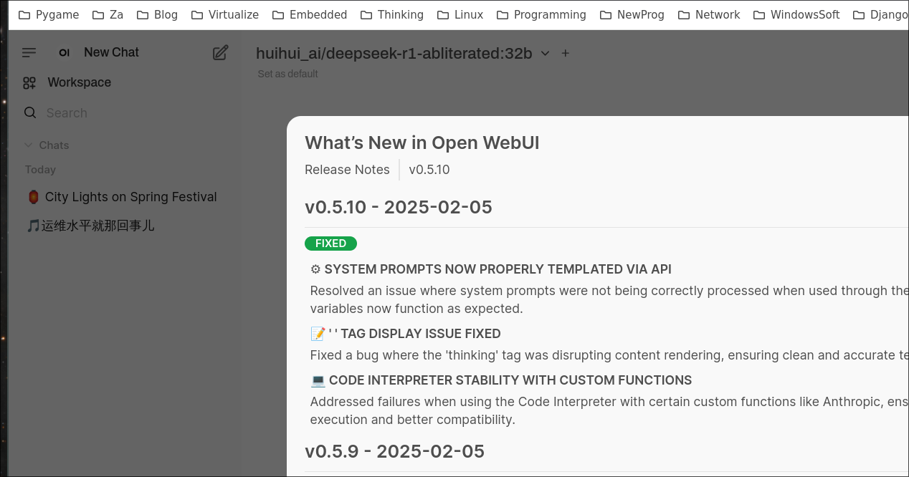

### 2. deepin lxc image
Download the iso and create the vm disk:     

```
# ls /media/big/iso/deepin-desktop-community-23-amd64.iso
# qemu-img create -f raw deepin23.img 30G
Formatting 'deepin23.img', fmt=raw size=32212254720
```
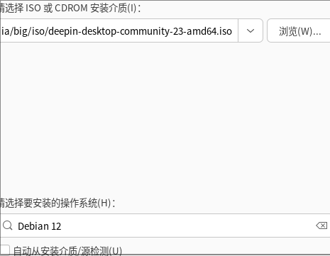

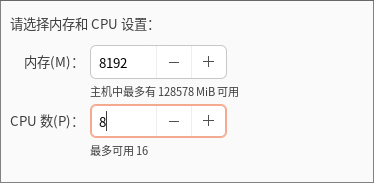


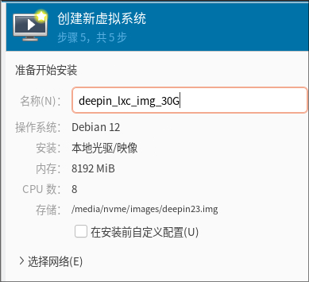

Install with 6.6 based kernel.   


Customization:   

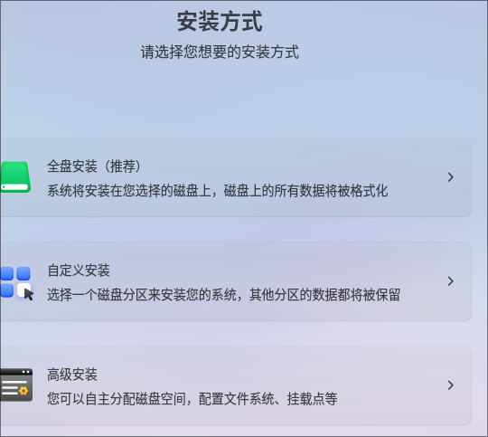

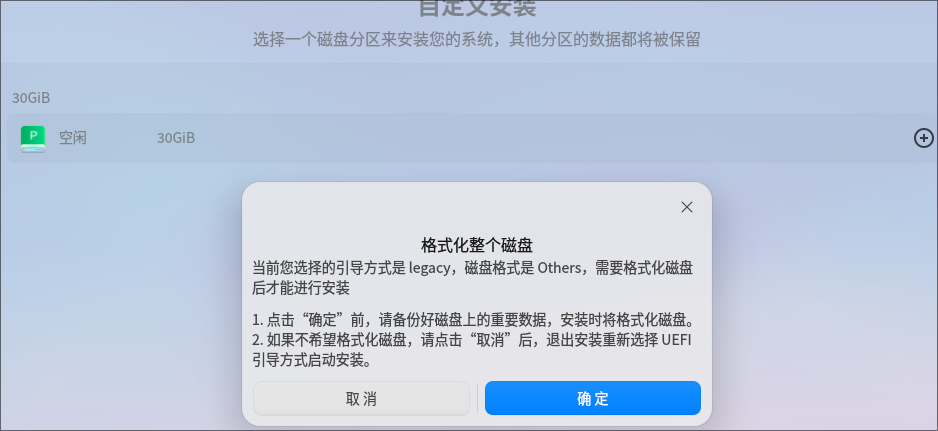

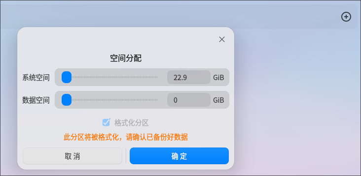

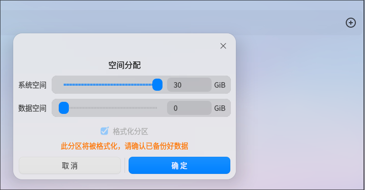

Choose "高级安装":    

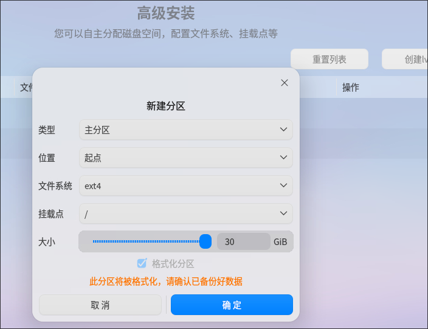

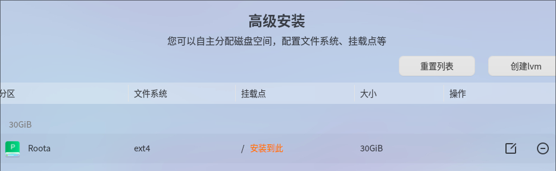

Ignore the swap:    

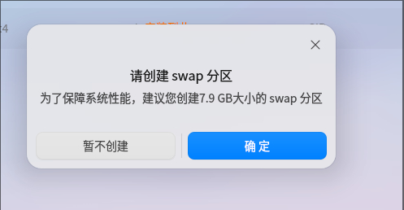


After installation:    


Configuration:    


password-less login:    

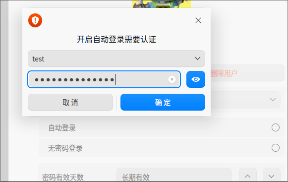

`sudo visudo` for use the passworld-less sudo .  

```
sudo apt install -y openssh-server
sudo vim /etc/default/grub
Change to : GRUB_CMDLINE_LINUX_DEFAULT="quiet net.ifnames=0 biosdevname=0"
Change to : GRUB_CMDLINE_LINUX="net.ifnames=0 biosdevname=0"
sudo update-grub2
sudo update-grub
sudo apt update -y
sudo apt install -y xserver-xorg-input-evdev glmark2 smplayer
sudo reboot
``` 
Fetch the image to the folder:    

```
sudo mount -o loop,offset=$((2048*512)) deepin23.img /mnt-resource/
sudo mkdir /media/nvme/deepinlxc
sudo rsync -av /mnt-resource/* /media/nvme/deepinlxc/
```
tar the file:    

```
$ cd /media/nvme/deepinlxc
$ sudo rm -rf dev/*
$ sudo tar -cpvf deepinlxc.tar * && sudo xz -T16 deepinlxc.tar
$ ls -l -h *.tar.xz
-rw-r--r-- 1 root root 5.2G  2月  6 10:46 deepinlxc.tar.xz
```
### 3. deepin lxc instance
Create the instance via:    

```
lxc-create -t local -n deepinlxc -- -m  /root/meta.tar.xz -f /root/deepinlxc.tar.xz && cat added.conf >> /var/lib/lxc/deepinlxc/config  && mkdir -p /var/lib/lxc/deepinlxc/rootfs/usr/local/bin/ && cp preX-populate-input.sh /var/lib/lxc/deepinlxc/rootfs/usr/local/bin/ && mkdir -p /var/lib/lxc/deepinlxc/rootfs/etc/X11/xorg.conf.d/ &&  mkdir -p /var/lib/lxc/deepinlxc/rootfs/etc/systemd/system/lightdm.service.d && cp override.conf  /var/lib/lxc/deepinlxc/rootfs/etc/systemd/system/lightdm.service.d
```
The content of `added.conf` is listed as:     

```
lxc.mount.entry = /dev/fb0 dev/fb0 none bind,optional,create=file
lxc.mount.entry = /dev/dri dev/dri none bind,optional,create=dir
lxc.mount.entry = /dev/dri/renderD128 dev/dri/renderD128 none bind,optional,create=file
### allow tty8
lxc.mount.entry = /dev/tty7 dev/tty7 none bind,optional,create=file
lxc.mount.entry = /dev/tty8 dev/tty8 none bind,optional,create=file
lxc.mount.entry = /dev/tty0 dev/tty0 none bind,optional,create=file
### allow all of the input
lxc.mount.entry = /dev/input dev/input none bind,optional,create=dir
### allow all of the snd
lxc.mount.entry = /dev/snd dev/snd none bind,optional,create=dir
```
Edit file:     

```
# vim /var/lib/lxc/deepinlxc/rootfs/etc/lightdm/lightdm.conf
......
minimum-vt=8
......
# vim /var/lib/lxc/deepinlxc/config
......
lxc.apparmor.profile = unconfined
......
```
Or globally change the lxc config file:     

```
$ sudo vim /etc/lxc/default.conf
......
lxc.apparmor.profile = unconfined
......
```
Now start the lxc instance via:     

```
lxc-start -n deepinlxc -F
```

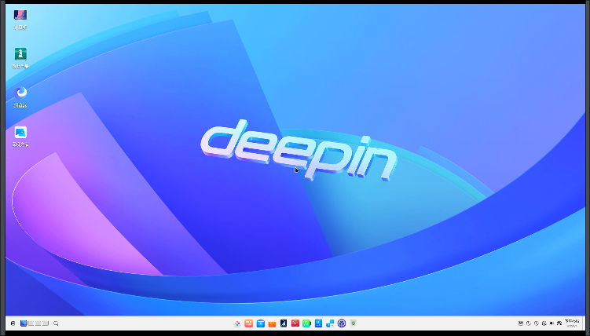

run glmarks:     

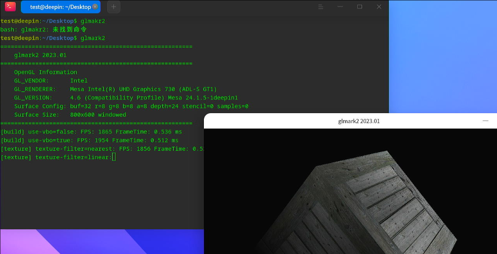

glmark2 score:   

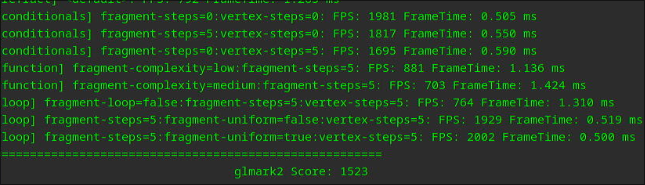

webgl fish:    


### 4. deepinlxc sound 
Test video file:    

```
cp /home/test/Desktop/wind.mp4 /var/lib/lxc/deepinlxc/rootfs/home/test/Desktop/
```
Default sound is null:      

```
test@deepin:/root$ export DISPLAY=:0
test@deepin:/root$ pactl list sinks short
0	auto_null	module-null-sink.c	s16le 2ch 44100Hz	SUSPENDED
```
Added an autostart desktop file under user `test`:     

```
$ cat ~/.config/autostart/pactl.desktop 
[Desktop Entry]
0=p
1=a
2=c
3=t
4=l
Name=pactl
Exec=sh -c '/usr/bin/pactl load-module module-alsa-card device_id=1 ; /usr/bin/pactl load-module module-alsa-card device_id=0'
Terminal=false
Type=Application
Icon=pactl
StartupWMClass=pactl
Comment=pactl
Categories=Utility
```
After reboot, examine the output:      

```
test@deepin:~$ DISPLAY=:0 pactl list sinks short
1	alsa_output.0.analog-stereo	module-alsa-card.c	s16le 2ch 44100Hz	RUNNING
```
### 5. using libvirt
Define the lxc xml:     

```
<domain type='lxc'>
  <name>deepinlxc</name>
  <memory unit='KiB'>4276800</memory>
  <currentMemory unit='KiB'>4276800</currentMemory>
  <vcpu placement='static'>1</vcpu>
  <resource>
    <partition>/machine</partition>
  </resource>
  <os>
    <type arch='x86_64'>exe</type>
    <init>/lib/systemd/systemd</init>
  </os>
  <clock offset='utc'/>
  <on_poweroff>destroy</on_poweroff>
  <on_reboot>restart</on_reboot>
  <on_crash>destroy</on_crash>
  <devices>
    <emulator>/usr/lib/libvirt/libvirt_lxc</emulator>
    <filesystem type='mount' accessmode='passthrough'>
      <source dir='/var/lib/lxc/deepinlxc/rootfs'/>
      <target dir='/'/>
    </filesystem>
    <filesystem type='mount' accessmode='passthrough'>
      <source dir='/dev/snd'/>
      <target dir='/dev/snd'/>
    </filesystem>
    <filesystem type='mount' accessmode='passthrough'>
      <source dir='/dev/input'/>
      <target dir='/dev/input'/>
    </filesystem>
    <filesystem type='mount' accessmode='passthrough'>
      <source dir='/dev/dri'/>
      <target dir='/dev/dri'/>
    </filesystem>
    <interface type='network'>
      <mac address='52:54:00:5f:0b:a8'/>
      <source network='default'/>
    </interface>
    <console type='pty'>
      <target type='lxc' port='0'/>
    </console>
    <hostdev mode='capabilities' type='misc'>
      <source>
        <char>/dev/dri/renderD128</char>
      </source>
    </hostdev>
    <hostdev mode='capabilities' type='misc'>
      <source>
        <char>/dev/fb0</char>
      </source>
    </hostdev>
    <hostdev mode='capabilities' type='misc'>
      <source>
        <char>/dev/tty8</char>
      </source>
    </hostdev>
    <hostdev mode='capabilities' type='misc'>
      <source>
        <char>/dev/tty0</char>
      </source>
    </hostdev>
    <hostdev mode='capabilities' type='misc'>
      <source>
        <char>/dev/dri/card0</char>
      </source>
    </hostdev>
    <hostdev mode='capabilities' type='misc'>
      <source>
        <char>/dev/input/event0</char>
      </source>
    </hostdev>
    <hostdev mode='capabilities' type='misc'>
      <source>
        <char>/dev/input/event1</char>
      </source>
    </hostdev>
    <hostdev mode='capabilities' type='misc'>
      <source>
        <char>/dev/input/event2</char>
      </source>
    </hostdev>
    <hostdev mode='capabilities' type='misc'>
      <source>
        <char>/dev/input/event3</char>
      </source>
    </hostdev>
    <hostdev mode='capabilities' type='misc'>
      <source>
        <char>/dev/input/event4</char>
      </source>
    </hostdev>
    <hostdev mode='capabilities' type='misc'>
      <source>
        <char>/dev/input/event5</char>
      </source>
    </hostdev>
    <hostdev mode='capabilities' type='misc'>
      <source>
        <char>/dev/input/event6</char>
      </source>
    </hostdev>
    <hostdev mode='capabilities' type='misc'>
      <source>
        <char>/dev/input/event7</char>
      </source>
    </hostdev>
    <hostdev mode='capabilities' type='misc'>
      <source>
        <char>/dev/input/event8</char>
      </source>
    </hostdev>
    <hostdev mode='capabilities' type='misc'>
      <source>
        <char>/dev/input/event9</char>
      </source>
    </hostdev>
    <hostdev mode='capabilities' type='misc'>
      <source>
        <char>/dev/input/event10</char>
      </source>
    </hostdev>
    <hostdev mode='capabilities' type='misc'>
      <source>
        <char>/dev/input/event11</char>
      </source>
    </hostdev>
        <hostdev mode='capabilities' type='misc'>
      <source>
        <char>/dev/snd/controlC0</char>
      </source>
    </hostdev>
    <hostdev mode='capabilities' type='misc'>
      <source>
        <char>/dev/snd/hwC0D0</char>
      </source>
    </hostdev>
    <hostdev mode='capabilities' type='misc'>
      <source>
        <char>/dev/snd/hwC0D2</char>
      </source>
    </hostdev>
    <hostdev mode='capabilities' type='misc'>
      <source>
        <char>/dev/snd/pcmC0D0c</char>
      </source>
    </hostdev>
    <hostdev mode='capabilities' type='misc'>
      <source>
        <char>/dev/snd/pcmC0D0p</char>
      </source>
    </hostdev>
    <hostdev mode='capabilities' type='misc'>
      <source>
        <char>/dev/snd/pcmC0D3p</char>
      </source>
    </hostdev>
    <hostdev mode='capabilities' type='misc'>
      <source>
        <char>/dev/snd/pcmC0D7p</char>
      </source>
    </hostdev>
    <hostdev mode='capabilities' type='misc'>
      <source>
        <char>/dev/snd/pcmC0D8p</char>
      </source>
    </hostdev>
    <hostdev mode='capabilities' type='misc'>
      <source>
        <char>/dev/snd/pcmC0D9p</char>
      </source>
    </hostdev>
    <hostdev mode='capabilities' type='misc'>
      <source>
        <char>/dev/snd/seq</char>
      </source>
    </hostdev>
    <hostdev mode='capabilities' type='misc'>
      <source>
        <char>/dev/snd/timer</char>
      </source>
    </hostdev>
  </devices>
</domain>
```
Define and run instance:     

```
# virsh -c lxc:/// define deepin.xml 
# virsh -c lxc:/// start deepinlxc
```
### 6. debian lxc host disable apparmor
Solved via:    

```
systemctl disable apparmor
apt remove --assume-yes --purge apparmor
```
Using `systemd-analyze blame` you could detect the service startup time.    
