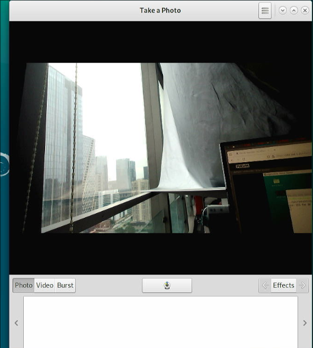
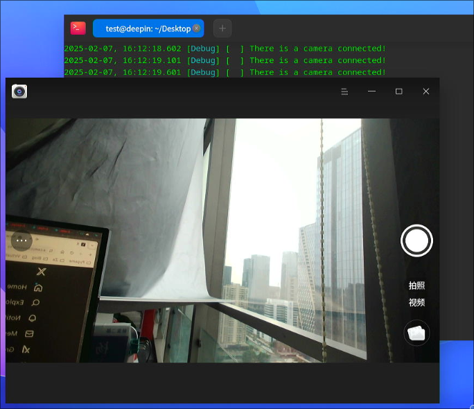

# 20250207
### 1. libvirt hook/script
Hooks:    

```
cat /etc/libvirt/hooks/lxc
#!/bin/bash
OBJECT="$1"
OPERATION="$2"
### dom startup
if [[ $OBJECT == "test" ]]; then
        case "$OPERATION" in
                "prepare")
		        chvt 8
                ;;
            "release")
		        chvt 7
                ;;
        esac
fi
```
attach and detach devices via script:     

```
root@lxcdesktop:/etc/libvirt/hooks# cat attach_dev.sh 
#!/bin/sh
# attach devices to minimum xml, before the lxc instance is launched.  
# Refers to `https://github.com/olavmrk/usb-libvirt-hotplug/blob/master/usb-libvirt-hotplug.sh`
DOMAIN="$1"
COMMAND='attach-device'

echo "attach tty devices"

# tty8
cat >/etc/10-lxc-devices.xml << _EOF_
<hostdev mode='capabilities' type='misc'>
  <source>
    <char>/dev/tty8</char>
  </source>
</hostdev>
_EOF_
echo "done 1"
virsh -c lxc:/// ${COMMAND} "${DOMAIN}" --file /etc/10-lxc-devices.xml --config 
echo "done 2"

# tty0
cat >/etc/10-lxc-devices.xml << _EOF_
<hostdev mode='capabilities' type='misc'>
  <source>
    <char>/dev/tty0</char>
  </source>
</hostdev>
_EOF_
virsh -c lxc:/// ${COMMAND} "${DOMAIN}" --file /etc/10-lxc-devices.xml --config 

# append all of the input devices
cd /dev/input
for input in event*
do
cat >/etc/10-lxc-devices.xml << _EOF_
<hostdev mode='capabilities' type='misc'>
  <source>
    <char>/dev/input/$input</char>
  </source>
</hostdev>
_EOF_
virsh -c lxc:/// ${COMMAND} "${DOMAIN}" --file /etc/10-lxc-devices.xml --config 
done

# append all of the snd devices
cd /dev/snd
for snd in *
do
if [ -d $snd ]
    then
    :
else
cat >/etc/10-lxc-devices.xml << _EOF_
<hostdev mode='capabilities' type='misc'>
  <source>
    <char>/dev/snd/$snd</char>
  </source>
</hostdev>
_EOF_
virsh -c lxc:/// ${COMMAND} "${DOMAIN}" --file /etc/10-lxc-devices.xml --config 
fi
done

# append all of the dri devices
cd /dev/dri
for dri in *
do
if [ -d $dri ]
    then
    :
else
cat >/etc/10-lxc-devices.xml << _EOF_
<hostdev mode='capabilities' type='misc'>
  <source>
    <char>/dev/dri/$dri</char>
  </source>
</hostdev>
_EOF_
virsh -c lxc:/// ${COMMAND} "${DOMAIN}" --file /etc/10-lxc-devices.xml --config 
fi
done

# append all of the fb devices
cd /dev/
for fbdev in fb*
do
cat >/etc/10-lxc-devices.xml << _EOF_
<hostdev mode='capabilities' type='misc'>
  <source>
    <char>/dev/$fbdev</char>
  </source>
</hostdev>
_EOF_
virsh -c lxc:/// ${COMMAND} "${DOMAIN}" --file /etc/10-lxc-devices.xml --config 
done


root@lxcdesktop:/etc/libvirt/hooks# cat detach_dev.sh 
#!/bin/bash
# attach devices to minimum xml, before the lxc instance is launched.  
# Refers to `https://github.com/olavmrk/usb-libvirt-hotplug/blob/master/usb-libvirt-hotplug.sh`
DOMAIN="$1"
COMMAND='detach-device'

echo "detach tty devices"

# tty8
virsh -c lxc:/// ${COMMAND} "${DOMAIN}" --config /dev/stdin <<END
<hostdev mode='capabilities' type='misc'>
  <source>
    <char>/dev/tty8</char>
  </source>
</hostdev>
END

# tty0
virsh -c lxc:/// ${COMMAND} "${DOMAIN}" --config /dev/stdin <<END
<hostdev mode='capabilities' type='misc'>
  <source>
    <char>/dev/tty0</char>
  </source>
</hostdev>
END

# append all of the input devices
cd /dev/input
for input in event*
do
virsh -c lxc:/// ${COMMAND} "${DOMAIN}" --config /dev/stdin <<END
<hostdev mode='capabilities' type='misc'>
  <source>
    <char>/dev/input/$input</char>
  </source>
</hostdev>
END
done

# append all of the snd devices
cd /dev/snd
for snd in *
do
if [ -d $snd ]
    then
    :
else
virsh -c lxc:/// ${COMMAND} "${DOMAIN}" --config /dev/stdin <<END
<hostdev mode='capabilities' type='misc'>
  <source>
    <char>/dev/snd/$snd</char>
  </source>
</hostdev>
END
fi
done

# append all of the dri devices
cd /dev/dri
for dri in *
do
if [ -d $dri ]
    then
    :
else
virsh -c lxc:/// ${COMMAND} "${DOMAIN}" --config /dev/stdin <<END
<hostdev mode='capabilities' type='misc'>
  <source>
    <char>/dev/dri/$dri</char>
  </source>
</hostdev>
END
fi
done

# append all of the fb devices
cd /dev/
for fbdev in fb*
do
virsh -c lxc:/// ${COMMAND} "${DOMAIN}" --config /dev/stdin <<END
<hostdev mode='capabilities' type='misc'>
  <source>
    <char>/dev/$fbdev</char>
  </source>
</hostdev>
END
done
```
Start the lxc instance via:    

```
/bin/attach_dev.sh test && virsh -c lxc:/// start test
```
Stop the lxc instance via:     

```
virsh -c lxc:/// destroy test && /bin/detach_dev.sh test
```
### 2. lxc usb camera
Test the usb cam in host:    

```
apt install -y cheese
cheese
```



Device info:    

```
root@lxcdesktop:~# ls /dev/bus/usb/001/010  -l
crw-rw-r-- 1 root root 189, 9 Feb  7 01:55 /dev/bus/usb/001/010
root@lxcdesktop:~# lsusb | grep -i cam
Bus 001 Device 010: ID 1bcf:2284 Sunplus Innovation Technology Inc. Full HD webcam
```
Undefine all of the lxc instance:    

```
root@lxcdesktop:~# virsh -c lxc:/// undefine deepinlxc
Domain 'deepinlxc' has been undefined

root@lxcdesktop:~# virsh -c lxc:/// undefine test
Domain 'test' has been undefined

root@lxcdesktop:~# lxc-ls
deepinlxc kylinlxc  
root@lxcdesktop:~# lxc-destroy -n deepinlxc
```
edit the common configuration(add 189 related items):    

```
# vim /usr/share/lxc/config/common.conf
### video
lxc.cgroup.devices.allow = c 189:* rwm
lxc.cgroup.devices.allow = c 81:* rwm

### video
lxc.cgroup2.devices.allow = c 189:* rwm
lxc.cgroup2.devices.allow = c 81:* rwm
```
Edit the added.conf file(which will result in the lxc config files):    

```
### allow all of the usb cam
lxc.mount.entry = /dev/bus/usb/001/010 dev/bus/usb/001/010 none bind,optional,create=dir
lxc.mount.entry = /dev/video0 dev/video0 none bind,optional,create=dir
lxc.mount.entry = /dev/video1 dev/video1 none bind,optional,create=dir
```



In guest run `deepin-camera`.    
### 3. libvirt-lxc usb camera
Should use following two scripts: `attach_cam.sh` and `detach_cam.sh`:     

```
root@lxcdesktop:/etc/libvirt/hooks# cat attach_cam.sh 
#!/bin/sh
# attach devices to minimum xml, before the lxc instance is launched.  
# Refers to `https://github.com/olavmrk/usb-libvirt-hotplug/blob/master/usb-libvirt-hotplug.sh`
DOMAIN="$1"
COMMAND='attach-device'

echo "attach cam devices"

# video0
cat >/etc/10-lxc-devices.xml << _EOF_
<hostdev mode='capabilities' type='misc'>
  <source>
    <char>/dev/video0</char>
  </source>
</hostdev>
_EOF_
virsh -c lxc:/// ${COMMAND} "${DOMAIN}" --file /etc/10-lxc-devices.xml --config 

# video1
cat >/etc/10-lxc-devices.xml << _EOF_
<hostdev mode='capabilities' type='misc'>
  <source>
    <char>/dev/video1</char>
  </source>
</hostdev>
_EOF_
virsh -c lxc:/// ${COMMAND} "${DOMAIN}" --file /etc/10-lxc-devices.xml --config 

# video1
cat >/etc/10-lxc-devices.xml << _EOF_
<hostdev mode='capabilities' type='misc'>
  <source>
    <char>/dev/bus/usb/001/006</char>
  </source>
</hostdev>
_EOF_
virsh -c lxc:/// ${COMMAND} "${DOMAIN}" --file /etc/10-lxc-devices.xml --config 

root@lxcdesktop:/etc/libvirt/hooks# cat detach_cam.sh 
#!/bin/sh
# attach devices to minimum xml, before the lxc instance is launched.  
# Refers to `https://github.com/olavmrk/usb-libvirt-hotplug/blob/master/usb-libvirt-hotplug.sh`
DOMAIN="$1"
COMMAND='detach-device'

echo "attach cam devices"

# video0
cat >/etc/10-lxc-devices.xml << _EOF_
<hostdev mode='capabilities' type='misc'>
  <source>
    <char>/dev/video0</char>
  </source>
</hostdev>
_EOF_
virsh -c lxc:/// ${COMMAND} "${DOMAIN}" --file /etc/10-lxc-devices.xml --config 

# video1
cat >/etc/10-lxc-devices.xml << _EOF_
<hostdev mode='capabilities' type='misc'>
  <source>
    <char>/dev/video1</char>
  </source>
</hostdev>
_EOF_
virsh -c lxc:/// ${COMMAND} "${DOMAIN}" --file /etc/10-lxc-devices.xml --config 

# video1
cat >/etc/10-lxc-devices.xml << _EOF_
<hostdev mode='capabilities' type='misc'>
  <source>
    <char>/dev/bus/usb/001/006</char>
  </source>
</hostdev>
_EOF_
virsh -c lxc:/// ${COMMAND} "${DOMAIN}" --file /etc/10-lxc-devices.xml --config 
```
Attach and detach the camera to running instance.    
Notice: should take effect after rebooted.     
