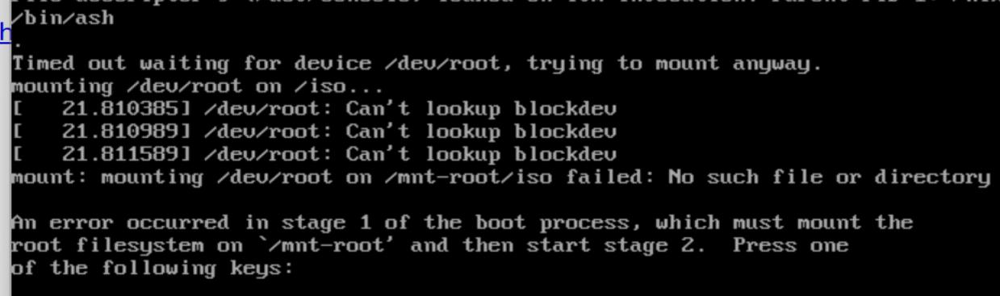

# 20250209
### 1. laptop environment
Re-install hyper-v, wsl after windows upgrading.     

Hyper-v manually installation:    

```
file: hyperv.cmd(run as adminstrator);    
pushd "%~dp0"
dir /b %SystemRoot%\servicing\Packages\*Hyper-V*.mum >hyper-v.txt
for /f %%i in ('findstr /i . hyper-v.txt 2^>nul') do dism /online /norestart /add-package:"%SystemRoot%\servicing\Packages\%%i"
del hyper-v.txt
Dism /online /enable-feature /featurename:Microsoft-Hyper-V-All /LimitAccess /ALL
```
After installation, the machine should be restarted.   

### 2. hyper-v nixos aarch64
Download the iso from `https://releases.nixos.org/nixos/24.11/nixos-24.11.714127.f5a32fa27df9/nixos-minimal-24.11.714127.f5a32fa27df9-aarch64-linux.iso`.     

Issue with minimum iso:    



Change to gnome iso which is downloaded from `https://releases.nixos.org/nixos/24.11/nixos-24.11.714127.f5a32fa27df9/nixos-gnome-24.11.714127.f5a32fa27df9-aarch64-linux.iso`:    

parted the disk:    

```
parted /dev/sda -- mklabel gpt
parted /dev/sda -- mkpart ESP fat32 1MB 512MB
parted /dev/sda -- mkpart primary 512MB -2GB
parted /dev/sda -- mkpart swap linux-swap -2GB 100%
parted /dev/sda -- set 1 esp on
 
mkfs.fat -F 32 -n boot /dev/sda1
mkfs.btrfs -L NIXOS /dev/sda2
mkswap -L swap /dev/sda3
```
mount the formated disk:    

```
mount /dev/disk/by-label/NIXOS /mnt
mkdir -p /mnt/boot
mount /dev/disk/by-label/boot /mnt/boot
swapon /dev/sda3
```
Refresh the channel:   

```
nix-channel --add https://mirrors.ustc.edu.cn/nix-channels/nixpkgs-unstable nixpkgs
nix-channel --add https://mirrors.ustc.edu.cn/nix-channels/nixos-24.11 nixos

nix-channel --list
nix-channel --update
nixos-rebuild --option substituters https://mirrors.ustc.edu.cn/nix-channels/store switch --upgrade
```
Generate a basic configuration:    

```
nixos-generate-config --root /mnt
```
Edit the generated `configuration.nix` file:     

```

{ config, lib, pkgs, ... }:

{
  imports =
    [ # Include the results of the hardware scan.
      ./hardware-configuration.nix
    ];

  # Use the systemd-boot EFI boot loader.
  boot.loader.systemd-boot.enable = true;
  boot.loader.efi.canTouchEfiVariables = true;

  boot.kernelParams = [
    "quiet"
    "splash"
    "video=hyperv_fb:1920x1080"
  ];

# awesome desktop wm
    services={
        xserver = {
            enable = true;

            windowManager.awesome = {
                enable = true;
                luaModules = with pkgs.luaPackages; [
                    luarocks # is the package manager for Lua modules
                    luadbi-mysql # Database abstraction layer
                ];

            };
        };

        displayManager = {
            sddm.enable = true;
            defaultSession = "none+awesome";
        };
    };

  nix.settings.substituters = [ "https://mirrors.ustc.edu.cn/nix-channels/store" ];
  nixpkgs.config.allowUnfree = true;
  networking.hostName = "nixos"; # Define your hostname.
  time.timeZone = "Asia/Shanghai";
  virtualisation.hypervGuest = {
      enable = true;
};

  users.mutableUsers = false; # 禁止useradd添加用户
  #security.sudo.wheelNeedsPassword = false;
  users.users.dash= { #用户名是yh
      isNormalUser = true;
      hashedPassword = "xxxxxxxxxxxxxxxxx";
      extraGroups = [
        "wheel"
        "users"
      ];
    };

  environment.systemPackages = with pkgs; [
      wget
      curl
      unzip
      vim
    ];

 services.openssh.enable = true;

   services.pipewire = {
     enable = true;
     pulse.enable = true;
   };

  system.stateVersion = "24.11"; # Did you read the comment?

}

```
The hashedPassword is generated via:     

```
mkpasswd -m sha-512
```
With this modified configuration file, do following:     

```
cd /mnt
nixos-install --show-trace --option substituters https://mirror.sjtu.edu.cn/nix-channels/store

```
After installation, it will hints your with set passwd for root.      

### 3. default kernel for nixos
Get from the `https://github.com/NixOS/nixpkgs/blob/nixos-24.11/pkgs/top-level/linux-kernels.nix`, the default kernel is:      

```
packageAliases = {
    linux_default = packages.linux_6_6;
    # Update this when adding the newest kernel major version!
    linux_latest = packages.linux_6_13;
    linux_mptcp = throw "'linux_mptcp' has been moved to https://github.com/teto/mptcp-flake";
    linux_rt_default = packages.linux_rt_5_15;
    linux_rt_latest = packages.linux_rt_6_6;
  };

```
you could switch the kernel in configuration.nix:      

```
  #boot.kernelPackages = pkgs.linuxPackages_latest;

```
