# 20250210
1. upgrading ollama for using 70b    
2. backup the ybd images using clonezilla(kx6780A & kylinv10)    
3. rtx 1660s(not good)/rtx 3050(good) vfio    
4. during vfio works, solved the rtl driver issue and systemd reboot issue.    
### 1. upgrade ollama
issue:     

```
llama_model_load: error loading model: done_getting_tensors: wrong number of tensors; expected 724, got 723
```
solved via:      

```
curl https://ollama.ai/install.sh | sh
```
beware of the gfw.   
### 2. passthrough of gtx1660s/3050
Notice: single gpu passthrough.   

Bios configuration:     

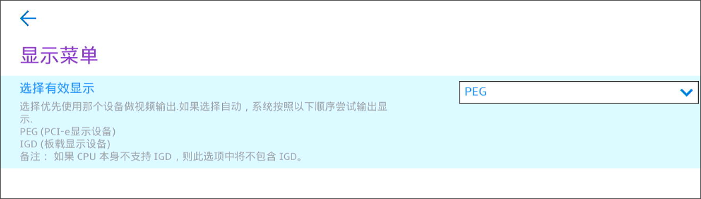

After reboot, only 1 card is available(no 3d controller of intel-uhd630).    

```
$ sudo apt update -y
$ sudo apt install -y sddm awesome
$ sudo vim /etc/sddm.conf
[General]
InputMethod=

[Autologin]
User=xxx
Session=awesome
``` 
This makes the host OS autologin.   

Edit the bootloader(grub):      

```
$ sudo vim /etc/default/grub
GRUB_CMDLINE_LINUX_DEFAULT=" net.ifnames=0 biosdevname=0 ipv6.disable=1 intel_iommu=on intel_iommu=pt kvm.ignore_msrs=1"
$ sudo update-grub2 && sudo reboot
```
After reboot, record the iommu infos:       

```
dash@i9server:~$ sudo ./iommu.sh 
IOMMU Group 0:
	00:00.0 Host bridge [0600]: Intel Corporation Comet Lake-S 6c Host Bridge/DRAM Controller [8086:9b33] (rev 05)
IOMMU Group 1:
	00:01.0 PCI bridge [0604]: Intel Corporation 6th-10th Gen Core Processor PCIe Controller (x16) [8086:1901] (rev 05)
	01:00.0 VGA compatible controller [0300]: NVIDIA Corporation TU116 [GeForce GTX 1660 SUPER] [10de:21c4] (rev a1)
	01:00.1 Audio device [0403]: NVIDIA Corporation TU116 High Definition Audio Controller [10de:1aeb] (rev a1)
	01:00.2 USB controller [0c03]: NVIDIA Corporation TU116 USB 3.1 Host Controller [10de:1aec] (rev a1)
	01:00.3 Serial bus controller [0c80]: NVIDIA Corporation TU116 USB Type-C UCSI Controller [10de:1aed] (rev a1)
IOMMU Group 10:
	00:1f.0 ISA bridge [0601]: Intel Corporation B460 Chipset LPC/eSPI Controller [8086:a3c8]
	00:1f.2 Memory controller [0580]: Intel Corporation Memory controller [8086:a3a1]
	00:1f.3 Audio device [0403]: Intel Corporation Comet Lake PCH-V cAVS [8086:a3f0]
	00:1f.4 SMBus [0c05]: Intel Corporation Comet Lake PCH-V SMBus Host Controller [8086:a3a3]
IOMMU Group 2:
	00:04.0 Signal processing controller [1180]: Intel Corporation Xeon E3-1200 v5/E3-1500 v5/6th Gen Core Processor Thermal Subsystem [8086:1903] (rev 05)
IOMMU Group 3:
	00:08.0 System peripheral [0880]: Intel Corporation Xeon E3-1200 v5/v6 / E3-1500 v5 / 6th/7th/8th Gen Core Processor Gaussian Mixture Model [8086:1911]
IOMMU Group 4:
	00:14.0 USB controller [0c03]: Intel Corporation Comet Lake PCH-V USB Controller [8086:a3af]
	00:14.2 Signal processing controller [1180]: Intel Corporation Comet Lake PCH-V Thermal Subsystem [8086:a3b1]
IOMMU Group 5:
	00:15.0 Signal processing controller [1180]: Intel Corporation Device [8086:a3e0]
	00:15.1 Signal processing controller [1180]: Intel Corporation Device [8086:a3e1]
IOMMU Group 6:
	00:16.0 Communication controller [0780]: Intel Corporation Comet Lake PCH-V HECI Controller [8086:a3ba]
IOMMU Group 7:
	00:17.0 SATA controller [0106]: Intel Corporation 400 Series Chipset Family SATA AHCI Controller [8086:a382]
IOMMU Group 8:
	00:1b.0 PCI bridge [0604]: Intel Corporation Comet Lake PCI Express Root Port #21 [8086:a3eb] (rev f0)
	02:00.0 Non-Volatile memory controller [0108]: SK hynix Device [1c5c:1639]
IOMMU Group 9:
	00:1c.0 PCI bridge [0604]: Intel Corporation Comet Lake PCI Express Root Port #05 [8086:a394] (rev f0)
	00:1c.6 PCI bridge [0604]: Intel Corporation Device [8086:a396] (rev f0)
	03:00.0 Ethernet controller [0200]: Realtek Semiconductor Co., Ltd. RTL8111/8168/8411 PCI Express Gigabit Ethernet Controller [10ec:8168] (rev 15)
	04:00.0 Network controller [0280]: Realtek Semiconductor Co., Ltd. RTL8822CE 802.11ac PCIe Wireless Network Adapter [10ec:c822]
dash@i9server:~$ cat iommu.sh 
#!/bin/bash
shopt -s nullglob
for g in /sys/kernel/iommu_groups/*; do
    echo "IOMMU Group ${g##*/}:"
    for d in $g/devices/*; do
        echo -e "\t$(lspci -nns ${d##*/})"
    done;
done;
```
the passthrough iommu infos:     

```
IOMMU Group 1:
	00:01.0 PCI bridge [0604]: Intel Corporation 6th-10th Gen Core Processor PCIe Controller (x16) [8086:1901] (rev 05)
	01:00.0 VGA compatible controller [0300]: NVIDIA Corporation TU116 [GeForce GTX 1660 SUPER] [10de:21c4] (rev a1)
	01:00.1 Audio device [0403]: NVIDIA Corporation TU116 High Definition Audio Controller [10de:1aeb] (rev a1)
	01:00.2 USB controller [0c03]: NVIDIA Corporation TU116 USB 3.1 Host Controller [10de:1aec] (rev a1)
	01:00.3 Serial bus controller [0c80]: NVIDIA Corporation TU116 USB Type-C UCSI Controller [10de:1aed] (rev a1)

```
Host kernel Changes:     

```
dash@i9server:~$ sudo lspci | grep -i nvidia
01:00.0 VGA compatible controller: NVIDIA Corporation TU116 [GeForce GTX 1660 SUPER] (rev a1)
01:00.1 Audio device: NVIDIA Corporation TU116 High Definition Audio Controller (rev a1)
01:00.2 USB controller: NVIDIA Corporation TU116 USB 3.1 Host Controller (rev a1)
01:00.3 Serial bus controller: NVIDIA Corporation TU116 USB Type-C UCSI Controller (rev a1)
dash@i9server:~$ sudo lspci -vvnn -s 01:00.0 | grep 'Kernel driver'
	Kernel driver in use: nouveau
$ sudo ubuntu-drivers autoinstall && sudo reboot
```
After reboot:     

```
root@i9server:~# nvidia-smi 
Mon Feb 10 03:31:38 2025       
+-----------------------------------------------------------------------------------------+
| NVIDIA-SMI 550.120                Driver Version: 550.120        CUDA Version: 12.4     |
|-----------------------------------------+------------------------+----------------------+
| GPU  Name                 Persistence-M | Bus-Id          Disp.A | Volatile Uncorr. ECC |
| Fan  Temp   Perf          Pwr:Usage/Cap |           Memory-Usage | GPU-Util  Compute M. |
|                                         |                        |               MIG M. |
|=========================================+========================+======================|
|   0  NVIDIA GeForce GTX 1660 ...    Off |   00000000:01:00.0  On |                  N/A |
| 25%   38C    P8              5W /  125W |      32MiB /   6144MiB |      0%      Default |
|                                         |                        |                  N/A |
+-----------------------------------------+------------------------+----------------------+
                                                                                         
+-----------------------------------------------------------------------------------------+
| Processes:                                                                              |
|  GPU   GI   CI        PID   Type   Process name                              GPU Memory |
|        ID   ID                                                               Usage      |
|=========================================================================================|
|    0   N/A  N/A      1412      G   /usr/lib/xorg/Xorg                             29MiB |
+-----------------------------------------------------------------------------------------+
root@i9server:~# uname -a
Linux i9server 6.8.0-52-generic #53~22.04.1-Ubuntu SMP PREEMPT_DYNAMIC Wed Jan 15 19:18:46 UTC 2 x86_64 x86_64 x86_64 GNU/Linux
root@i9server:~# lspci -vvnn -s 01:00.0 | grep -i 'Kernel driver in use'
	Kernel driver in use: nvidia
```

Prepare the qcow2 file:      

```
root@i9server:/var/lib/libvirt/trueimages# qemu-img create -f qcow2 -b /var/lib/libvirt/images/little_win10.qcow2 -F qcow2 win10.qcow2
```

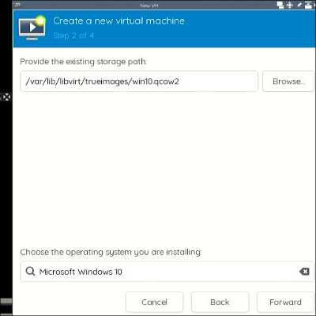

Uefi:    

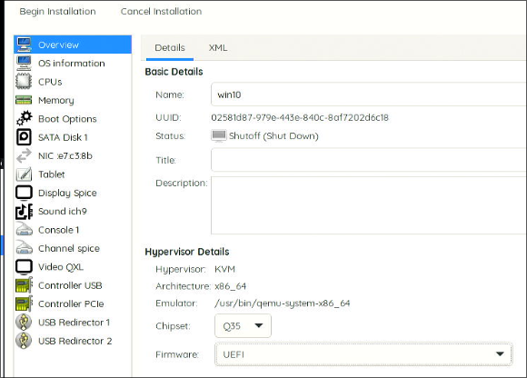

Examine the image via following configration, in guest open rdp support:    

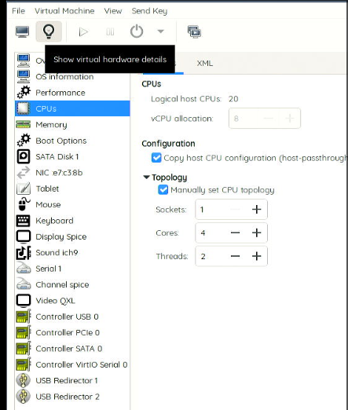

unzip the nvflash:     

```
root@i9server:~/nv# unzip ../nvflash_5.833_linux.zip 
Archive:  ../nvflash_5.833_linux.zip
  inflating: nvflash 
# chmod 777 *
```
stop the wm and remove all of the nvidia kernel modules:      

```
root@i9server:~/nv# systemctl stop sddm
root@i9server:~/nv# rmmod nvidia_uvm
root@i9server:~/nv# rmmod nvidia_drm
root@i9server:~/nv# rmmod nvidia_modeset
root@i9server:~/nv# rmmod nvidia
root@i9server:~/nv# lsmod | grep -i nvidia
```
Do following commands:     

```
# vim /etc/modprobe.d/blacklist.conf
...
blacklist nvidia
blacklist nvidia_uvm
blacklist nvidia_drm
blacklist nvidia_modeset
# systemctl disable sddm && update-initramfs -u -k all && reboot
```
After reboot, you could get the vbios:      

```
root@i9server:~/nv# !562
./nvflash --save vbios.rom
NVIDIA Firmware Update Utility (Version 5.833.0)
Copyright (C) 1993-2023, NVIDIA Corporation. All rights reserved.

Reading EEPROM (this operation may take up to 30 seconds)

Build GUID            : 0F08611866994AA3AE3C9DDECB2F1133  
Build Number          : 27860314
IFR Subsystem ID      : 1462-3797
Subsystem Vendor ID   : 0x1462
Subsystem ID          : 0x3797
Version               : 90.16.4D.00.44
Image Hash            : 7CBA24A9C1C226BF5639D038B066AF37
Hierarchy ID          : Normal Board
Build Date            : 01/10/20
Modification Date     : 03/11/20
UEFI Version          : 0x50014 ( x64 )
UEFI Variant ID       : 0x0000000000000009 ( TU1xx )
UEFI Signer(s)        : Microsoft Corporation UEFI CA 2011
XUSB-FW Version ID    : 0x71030001
XUSB-FW Build Time    : 2019-05-16 18:12:54
InfoROM Version       : G001.0000.02.04
InfoROM Backup        : Present
License Placeholder   : Present
GPU Mode              : N/A
CEC OTA-signed Blob   : Not Present

Reading EEPROM (this operation may take up to 30 seconds)

root@i9server:~/nv# ls                                    
nvflash  vbios.rom
root@i9server:~/nv# ls -l -h vbios.rom 
-rw-r--r-- 1 root root 1023K Feb 10 03:58 vbios.rom
```

Using okteta for patching the vbios :    

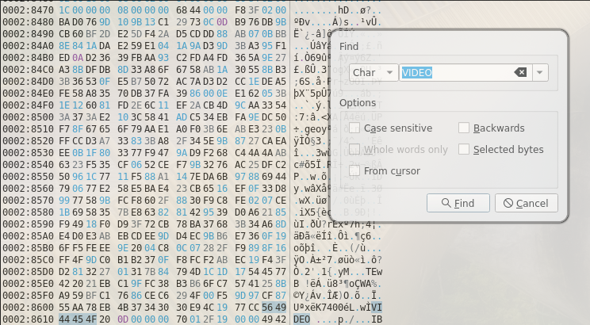

Install driver under qxl display:     

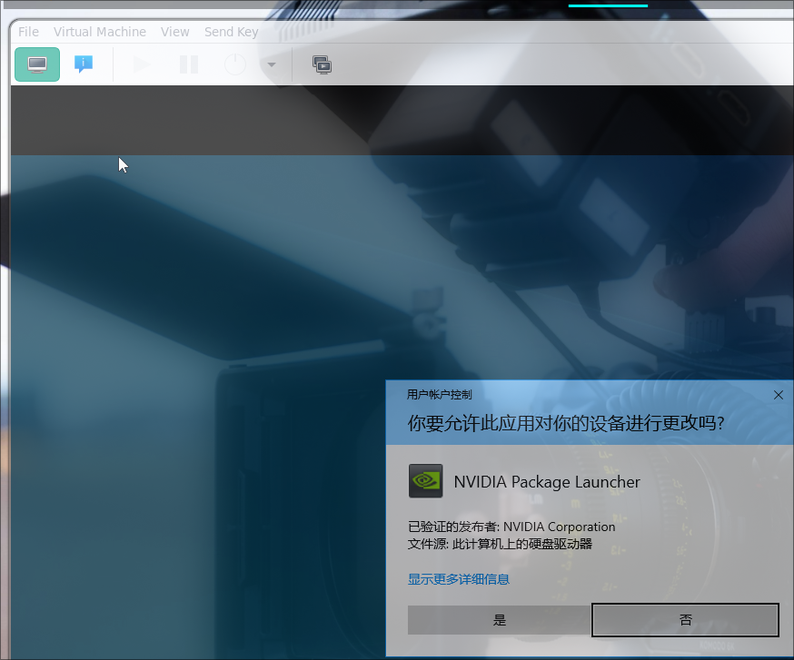


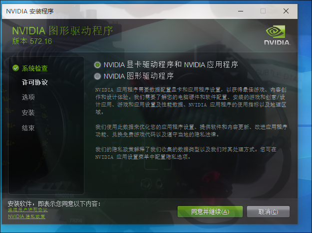


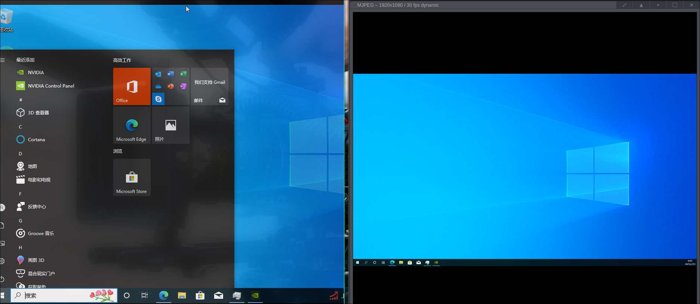

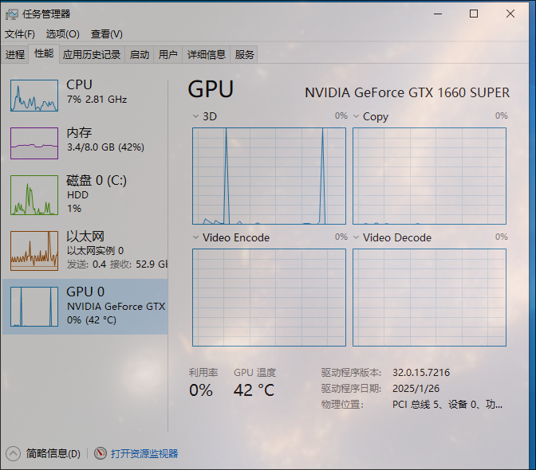


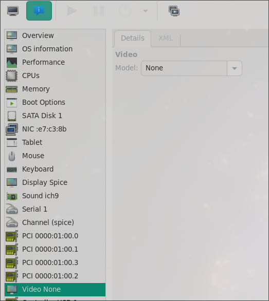


BIOS configuration, stop csm:    

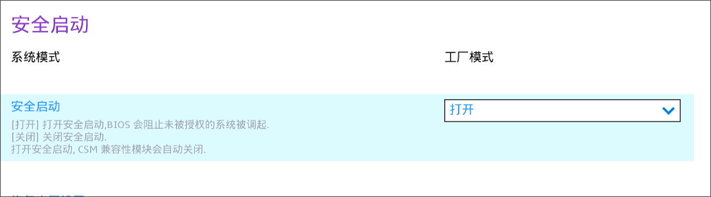

GTX1660 failed to show gop animation, while 3050 will work normaly.     

Both card could be working.   
### 3. r8168 driver issue
Solved via:     

```
# apt install -y linux-headers-6.8.0-52-generic dkms
# tar xjvf r8168-8.055.00.tar.bz2 
# cd r8168-8.055.00/src
# mkdir /usr/src/r8168-8.055.00
# cp -v * /usr/src/r8168-8.055.00/
# vim /usr/src/r8168-8.055.00/dkms.conf

PACKAGE_NAME="r8168"
PACKAGE_VERSION="8.055.00"
BUILT_MODULE_NAME[0]="$PACKAGE_NAME"
DEST_MODULE_LOCATION[0]="/updates/dkms"
AUTOINSTALL="YES"
REMAKE_INITRD="YES"

# dkms add r8168/8.055.00
# dkms build r8168/8.055.00 -k 6.8.0-52-generic
# dkms install r8168/8.055.00 -k 6.8.0-52-generic
# dkms status
r8168/8.055.00, 6.8.0-52-generic, x86_64: installed
```

### 4. systemd reboot hang
Solved via:    

```
# vim /etc/systemd/system.conf
...
[Manager]
...
DefaultTimeoutStopSec=10s
...
# systemctl daemon-reload
```

### 5. workable win10 xml(3050)
Video link:  `https://www.youtube.com/watch?v=MYj8YyW1D0M`    

[https://www.youtube.com/watch?v=MYj8YyW1D0M](https://www.youtube.com/watch?v=MYj8YyW1D0M)    

Following is the win10 xml.    

```
<domain type='kvm' id='2'>
  <name>win10</name>
  <uuid>02581d87-979e-443e-840c-8af7202d6c18</uuid>
  <metadata>
    <libosinfo:libosinfo xmlns:libosinfo="http://libosinfo.org/xmlns/libvirt/domain/1.0">
      <libosinfo:os id="http://microsoft.com/win/10"/>
    </libosinfo:libosinfo>
  </metadata>
  <memory unit='KiB'>8388608</memory>
  <currentMemory unit='KiB'>8388608</currentMemory>
  <vcpu placement='static'>8</vcpu>
  <resource>
    <partition>/machine</partition>
  </resource>
  <os>
    <type arch='x86_64' machine='pc-q35-6.2'>hvm</type>
    <loader readonly='yes' type='pflash'>/usr/share/OVMF/OVMF_CODE_4M.ms.fd</loader>
    <nvram template='/usr/share/OVMF/OVMF_VARS_4M.ms.fd'>/var/lib/libvirt/qemu/nvram/win10_VARS.fd</nvram>
    <boot dev='hd'/>
  </os>
  <features>
    <acpi/>
    <apic/>
    <hyperv mode='custom'>
      <relaxed state='on'/>
      <vapic state='on'/>
      <spinlocks state='on' retries='8191'/>
      <vendor_id state='on' value='123456789123'/>
    </hyperv>
    <kvm>
      <hidden state='on'/>
    </kvm>
    <vmport state='off'/>
    <smm state='on'/>
    <ioapic driver='kvm'/>
  </features>
  <cpu mode='host-passthrough' check='none' migratable='on'>
    <topology sockets='1' dies='1' cores='4' threads='2'/>
  </cpu>
  <clock offset='localtime'>
    <timer name='rtc' tickpolicy='catchup'/>
    <timer name='pit' tickpolicy='delay'/>
    <timer name='hpet' present='no'/>
    <timer name='hypervclock' present='yes'/>
  </clock>
  <on_poweroff>destroy</on_poweroff>
  <on_reboot>restart</on_reboot>
  <on_crash>destroy</on_crash>
  <pm>
    <suspend-to-mem enabled='no'/>
    <suspend-to-disk enabled='no'/>
  </pm>
  <devices>
    <emulator>/usr/bin/qemu-system-x86_64</emulator>
    <disk type='file' device='disk'>
      <driver name='qemu' type='qcow2'/>
      <source file='/var/lib/libvirt/trueimages/win10.qcow2' index='1'/>
      <backingStore type='file' index='2'>
        <format type='qcow2'/>
        <source file='/var/lib/libvirt/images/little_win10.qcow2'/>
        <backingStore/>
      </backingStore>
      <target dev='sda' bus='sata'/>
      <alias name='sata0-0-0'/>
      <address type='drive' controller='0' bus='0' target='0' unit='0'/>
    </disk>
    <controller type='usb' index='0' model='qemu-xhci' ports='15'>
      <alias name='usb'/>
      <address type='pci' domain='0x0000' bus='0x02' slot='0x00' function='0x0'/>
    </controller>
    <controller type='pci' index='0' model='pcie-root'>
      <alias name='pcie.0'/>
    </controller>
    <controller type='pci' index='1' model='pcie-root-port'>
      <model name='pcie-root-port'/>
      <target chassis='1' port='0x10'/>
      <alias name='pci.1'/>
      <address type='pci' domain='0x0000' bus='0x00' slot='0x02' function='0x0' multifunction='on'/>
    </controller>
    <controller type='pci' index='2' model='pcie-root-port'>
      <model name='pcie-root-port'/>
      <target chassis='2' port='0x11'/>
      <alias name='pci.2'/>
      <address type='pci' domain='0x0000' bus='0x00' slot='0x02' function='0x1'/>
    </controller>
    <controller type='pci' index='3' model='pcie-root-port'>
      <model name='pcie-root-port'/>
      <target chassis='3' port='0x12'/>
      <alias name='pci.3'/>
      <address type='pci' domain='0x0000' bus='0x00' slot='0x02' function='0x2'/>
    </controller>
    <controller type='pci' index='4' model='pcie-root-port'>
      <model name='pcie-root-port'/>
      <target chassis='4' port='0x13'/>
      <alias name='pci.4'/>
      <address type='pci' domain='0x0000' bus='0x00' slot='0x02' function='0x3'/>
    </controller>
    <controller type='pci' index='5' model='pcie-root-port'>
      <model name='pcie-root-port'/>
      <target chassis='5' port='0x14'/>
      <alias name='pci.5'/>
      <address type='pci' domain='0x0000' bus='0x00' slot='0x02' function='0x4'/>
    </controller>
    <controller type='pci' index='6' model='pcie-root-port'>
      <model name='pcie-root-port'/>
      <target chassis='6' port='0x15'/>
      <alias name='pci.6'/>
      <address type='pci' domain='0x0000' bus='0x00' slot='0x02' function='0x5'/>
    </controller>
    <controller type='pci' index='7' model='pcie-root-port'>
      <model name='pcie-root-port'/>
      <target chassis='7' port='0x16'/>
      <alias name='pci.7'/>
      <address type='pci' domain='0x0000' bus='0x00' slot='0x02' function='0x6'/>
    </controller>
    <controller type='pci' index='8' model='pcie-root-port'>
      <model name='pcie-root-port'/>
      <target chassis='8' port='0x17'/>
      <alias name='pci.8'/>
      <address type='pci' domain='0x0000' bus='0x00' slot='0x02' function='0x7'/>
    </controller>
    <controller type='pci' index='9' model='pcie-root-port'>
      <model name='pcie-root-port'/>
      <target chassis='9' port='0x18'/>
      <alias name='pci.9'/>
      <address type='pci' domain='0x0000' bus='0x00' slot='0x03' function='0x0' multifunction='on'/>
    </controller>
    <controller type='pci' index='10' model='pcie-root-port'>
      <model name='pcie-root-port'/>
      <target chassis='10' port='0x19'/>
      <alias name='pci.10'/>
      <address type='pci' domain='0x0000' bus='0x00' slot='0x03' function='0x1'/>
    </controller>
    <controller type='pci' index='11' model='pcie-root-port'>
      <model name='pcie-root-port'/>
      <target chassis='11' port='0x1a'/>
      <alias name='pci.11'/>
      <address type='pci' domain='0x0000' bus='0x00' slot='0x03' function='0x2'/>
    </controller>
    <controller type='pci' index='12' model='pcie-root-port'>
      <model name='pcie-root-port'/>
      <target chassis='12' port='0x1b'/>
      <alias name='pci.12'/>
      <address type='pci' domain='0x0000' bus='0x00' slot='0x03' function='0x3'/>
    </controller>
    <controller type='pci' index='13' model='pcie-root-port'>
      <model name='pcie-root-port'/>
      <target chassis='13' port='0x1c'/>
      <alias name='pci.13'/>
      <address type='pci' domain='0x0000' bus='0x00' slot='0x03' function='0x4'/>
    </controller>
    <controller type='pci' index='14' model='pcie-root-port'>
      <model name='pcie-root-port'/>
      <target chassis='14' port='0x1d'/>
      <alias name='pci.14'/>
      <address type='pci' domain='0x0000' bus='0x00' slot='0x03' function='0x5'/>
    </controller>
    <controller type='sata' index='0'>
      <alias name='ide'/>
      <address type='pci' domain='0x0000' bus='0x00' slot='0x1f' function='0x2'/>
    </controller>
    <controller type='virtio-serial' index='0'>
      <alias name='virtio-serial0'/>
      <address type='pci' domain='0x0000' bus='0x03' slot='0x00' function='0x0'/>
    </controller>
    <interface type='bridge'>
      <mac address='52:54:00:e7:c3:8b'/>
      <source bridge='br0'/>
      <target dev='vnet1'/>
      <model type='e1000e'/>
      <alias name='net0'/>
      <address type='pci' domain='0x0000' bus='0x01' slot='0x00' function='0x0'/>
    </interface>
    <serial type='pty'>
      <source path='/dev/pts/1'/>
      <target type='isa-serial' port='0'>
        <model name='isa-serial'/>
      </target>
      <alias name='serial0'/>
    </serial>
    <console type='pty' tty='/dev/pts/1'>
      <source path='/dev/pts/1'/>
      <target type='serial' port='0'/>
      <alias name='serial0'/>
    </console>
    <channel type='spicevmc'>
      <target type='virtio' name='com.redhat.spice.0' state='disconnected'/>
      <alias name='channel0'/>
      <address type='virtio-serial' controller='0' bus='0' port='1'/>
    </channel>
    <input type='tablet' bus='usb'>
      <alias name='input0'/>
      <address type='usb' bus='0' port='1'/>
    </input>
    <input type='mouse' bus='ps2'>
      <alias name='input1'/>
    </input>
    <input type='keyboard' bus='ps2'>
      <alias name='input2'/>
    </input>
    <sound model='ich9'>
      <alias name='sound0'/>
      <address type='pci' domain='0x0000' bus='0x00' slot='0x1b' function='0x0'/>
    </sound>
    <audio id='1' type='none'/>
    <hostdev mode='subsystem' type='pci' managed='yes'>
      <driver name='vfio'/>
      <source>
        <address domain='0x0000' bus='0x01' slot='0x00' function='0x0'/>
      </source>
      <alias name='hostdev0'/>
      <rom file='/usr/share/vgabios/GA106.rom'/>
      <address type='pci' domain='0x0000' bus='0x05' slot='0x00' function='0x0'/>
    </hostdev>
    <hostdev mode='subsystem' type='pci' managed='yes'>
      <driver name='vfio'/>
      <source>
        <address domain='0x0000' bus='0x01' slot='0x00' function='0x1'/>
      </source>
      <alias name='hostdev1'/>
      <address type='pci' domain='0x0000' bus='0x06' slot='0x00' function='0x0'/>
    </hostdev>
    <hostdev mode='subsystem' type='usb' managed='yes'>
      <source>
        <vendor id='0x30fa'/>
        <product id='0x0300'/>
        <address bus='1' device='4'/>
      </source>
      <alias name='hostdev2'/>
      <address type='usb' bus='0' port='4'/>
    </hostdev>
    <hostdev mode='subsystem' type='usb' managed='yes'>
      <source>
        <vendor id='0x1a2c'/>
        <product id='0x0e24'/>
        <address bus='1' device='3'/>
      </source>
      <alias name='hostdev3'/>
      <address type='usb' bus='0' port='5'/>
    </hostdev>
    <redirdev bus='usb' type='spicevmc'>
      <alias name='redir0'/>
      <address type='usb' bus='0' port='2'/>
    </redirdev>
    <redirdev bus='usb' type='spicevmc'>
      <alias name='redir1'/>
      <address type='usb' bus='0' port='3'/>
    </redirdev>
    <memballoon model='virtio'>
      <alias name='balloon0'/>
      <address type='pci' domain='0x0000' bus='0x04' slot='0x00' function='0x0'/>
    </memballoon>
  </devices>
  <seclabel type='dynamic' model='dac' relabel='yes'>
    <label>+64055:+108</label>
    <imagelabel>+64055:+108</imagelabel>
  </seclabel>
</domain>
```

### 6. quicksetup-lxcdesktop
### 6.1 host setup
host setup Steps:     

```
Change repository
# apt update
# apt install -y vim
# vim /etc/lightdm/lightdm.conf
autologin-user=test
autologin-user-timeout=0
#autologin-in-background=false
autologin-session=mate
# apt upgrade -y && apt install -y iotop vim nethogs s-tui libvirt-daemon-driver-lxc virt-manager lxc lxc-templates lxcfs smplayer
# vim /etc/subuid /etc/subgid(both are the same)
test:100000:65536
root:100000:65536
# apt install -y xserver-xorg-video-amdgpu firmware-amd-graphics libdrm-amdgpu1 firmware-linux firmware-linux-nonfree
# reboot
```

Check the graphical info:    

```
root@debian:~# lspci -vvnn -s 06:00.0 | grep -i 'kernel driver'
	Kernel driver in use: amdgpu
root@debian:~# lspci -nn | grep -i vga
06:00.0 VGA compatible controller [0300]: Advanced Micro Devices, Inc. [AMD/ATI] Lexa PRO [Radeon 540/540X/550/550X / RX 540X/550/550X] [1002:699f] (rev c7)
```
Check the audio info:     

```
test@debian:~$ export DISPLAY=:0
test@debian:~$ pactl list sinks short
0	alsa_output.pci-0000_06_00.1.hdmi-stereo-extra3	module-alsa-card.c	s16le 2ch 44100Hz	SUSPENDED
1	alsa_output.usb-Hifi_384Khz_Type-C_Audio_Audio_fs_2.0_2021-11-11-0000-0000-0000-00.analog-stereo	module-alsa-card.c	s16le 2ch 48000Hz	RUNNING

```
edit the lxc default :     

```
# vim /etc/lxc/default.conf
lxc.apparmor.profile = unconfined

```
disable and totally remove apparmor:     

```
# systemctl disable apparmor
# apt remove --assume-yes --purge apparmor
```
common configuration files:    

```
cp /usr/share/lxc/config/common.conf /usr/share/lxc/config/common.conf.back
Copy the template common.conf from my github.
```
### 6.2 deepin lxc
Quickly launch:    

```
# lxc-create -t local -n deepinlxc -- -m  /root/meta.tar.xz -f /root/deepinlxc.tar.xz && cat added.conf >> /var/lib/lxc/deepinlxc/config  && mkdir -p /var/lib/lxc/deepinlxc/rootfs/usr/local/bin/ && cp preX-populate-input.sh /var/lib/lxc/deepinlxc/rootfs/usr/local/bin/ && mkdir -p /var/lib/lxc/deepinlxc/rootfs/etc/X11/xorg.conf.d/ &&  mkdir -p /var/lib/lxc/deepinlxc/rootfs/etc/systemd/system/lightdm.service.d && cp override.conf  /var/lib/lxc/deepinlxc/rootfs/etc/systemd/system/lightdm.service.d
# vim /var/lib/lxc/deepinlxc/rootfs/etc/lightdm/lightdm.conf
minimum-vt=8
# cp /root/wind.mp4 /var/lib/lxc/deepinlxc/rootfs/home/test/Desktop/
# lxc-start -n deepinlxc -F
```
Sound:     

```
root@debian:~# lxc-attach -n deepinlxc
root@deepin:~# su test
test@deepin:/root$ vim ~/.config/autostart/pactl.desktop
test@deepin:/root$ sudo reboot
```
Now it will be OK.   
### 6.2. zkfd lxc
Create:   

```
lxc-create -t local -n zkfdlxc -- -m /root/meta.tar.xz -f /root/zkfdlxc.tar.xz
mv /var/lib/lxc/zkfdlxc/rootfs/etc/acpi /var/lib/lxc/zkfdlxc/rootfs/etc/acpi.bak
cat added.conf >> /var/lib/lxc/zkfdlxc/config  && mkdir -p /var/lib/lxc/zkfdlxc/rootfs/usr/local/bin/ && cp preX-populate-input.sh /var/lib/lxc/zkfdlxc/rootfs/usr/local/bin/ && mkdir -p /var/lib/lxc/zkfdlxc/rootfs/etc/X11/xorg.conf.d/ &&  mkdir -p /var/lib/lxc/zkfdlxc/rootfs/etc/systemd/system/lightdm.service.d && cp override.conf  /var/lib/lxc/zkfdlxc/rootfs/etc/systemd/system/lightdm.service.d
# vim /var/lib/lxc/zkfdlxc/rootfs/etc/lightdm/lightdm.conf
minimum-vt=8
```
Change the user's passwd(30 days):    

```
root@debian:~# lxc-attach -n zkfdlxc
root@zkfdlxc:~# passwd test
New password: 
Retype new password: 
passwd: password updated successfully
root@zkfdlxc:~# reboot
```
Test the audio:     

```
cp wind.mp4 /var/lib/lxc/zkfdlxc/rootfs/home/tes桌面/
sudo dhclient eth0
sudo apt install -y smplayer
mkdir -p ~/.config/autostart
vim ~/.config/autostart/pactl.desktop
```
Change the sound:    

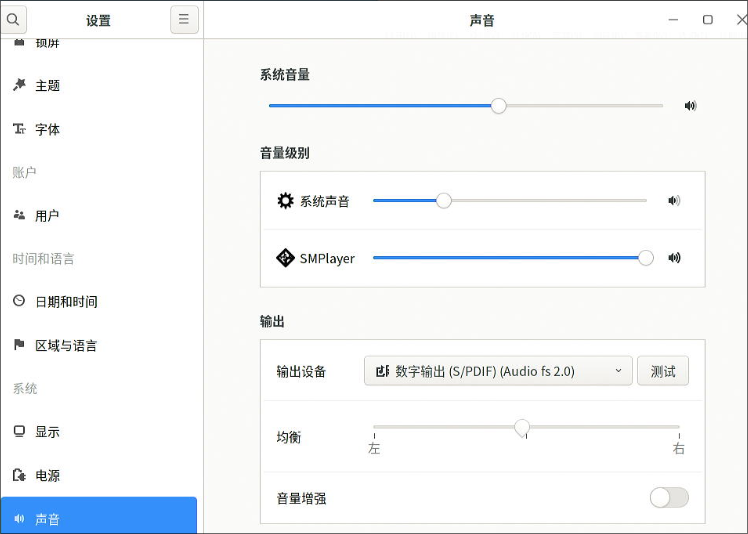

### 6.3 uoslxc(kodi modifed)
Create via:     

```
lxc-create -t local -n uoslxc -- -m /root/meta.tar.xz -f /root/uoslxc.tar.xz
cat added.conf >> /var/lib/lxc/uoslxc/config  && mkdir -p /var/lib/lxc/uoslxc/rootfs/usr/local/bin/ && cp preX-populate-input.sh /var/lib/lxc/uoslxc/rootfs/usr/local/bin/ && mkdir -p /var/lib/lxc/uoslxc/rootfs/etc/X11/xorg.conf.d/ &&  mkdir -p /var/lib/lxc/uoslxc/rootfs/etc/systemd/system/lightdm.service.d && cp override.conf  /var/lib/lxc/uoslxc/rootfs/etc/systemd/system/lightdm.service.d

```
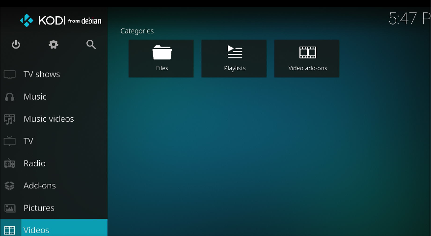

Since this image is only for testing kodi, ignore it.     

### 6.4 uoslxcdesktop
Create via:     

```
# lxc-create -t local -n uoslxcdesktop -- -m /root/meta.tar.xz -f uoslxcdesktop.tar.xz
# cat added.conf >> /var/lib/lxc/uoslxcdesktop/config  && mkdir -p /var/lib/lxc/uoslxcdesktop/rootfs/usr/local/bin/ && cp preX-populate-input.sh /var/lib/lxc/uoslxcdesktop/rootfs/usr/local/bin/ && mkdir -p /var/lib/lxc/uoslxcdesktop/rootfs/etc/X11/xorg.conf.d/ &&  mkdir -p /var/lib/lxc/uoslxcdesktop/rootfs/etc/systemd/system/lightdm.service.d && cp override.conf  /var/lib/lxc/uoslxcdesktop/rootfs/etc/systemd/system/lightdm.service.d

# vim /var/lib/lxc/uoslxcdesktop/rootfs/etc/lightdm/lightdm.conf
minimum-vt=8

```
Directly copy from other lxc:     

```
root@debian:/var/lib/lxc/uoslxcdesktop/rootfs/home/test/.config/autostart# cp /var/lib/lxc/deepinlxc/rootfs/home/test/.config/autostart/pactl.desktop .
root@debian:/var/lib/lxc/uoslxcdesktop/rootfs/home/test/.config/autostart# pwd
/var/lib/lxc/uoslxcdesktop/rootfs/home/test/.config/autostart
```
Comment the `/etc/fstab` in container:     

```
root@uoslxc:~# cat /etc/fstab 
# /dev/vda2
#UUID=4edf73b8-87f7-4ba1-99a4-e3306afade89	/         	ext4      	rw,relatime	0 1

# /dev/vda1
#UUID=20720be2-6c80-4e1f-ab73-ab0da9714e99	/boot     	ext4      	rw,relatime	0 2
```
Start via `lxc-start -n uoslxcdesktop -F`:    

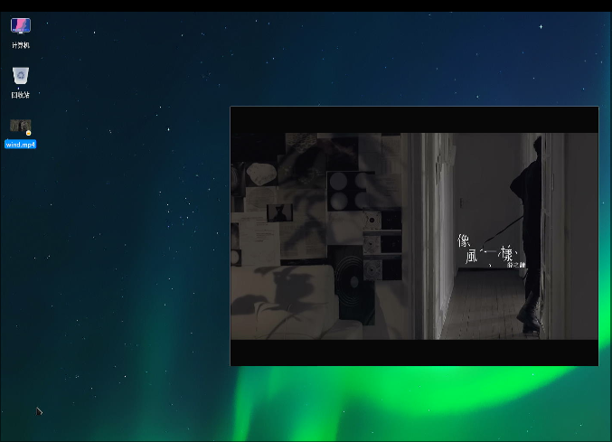


