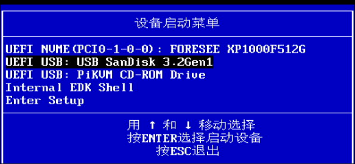
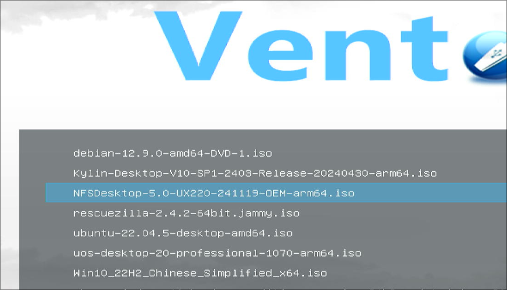
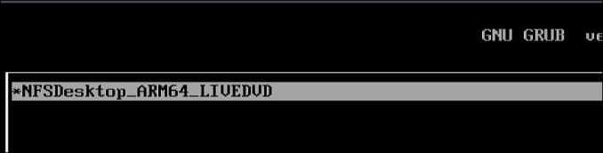
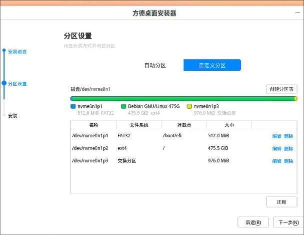
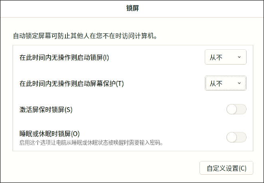
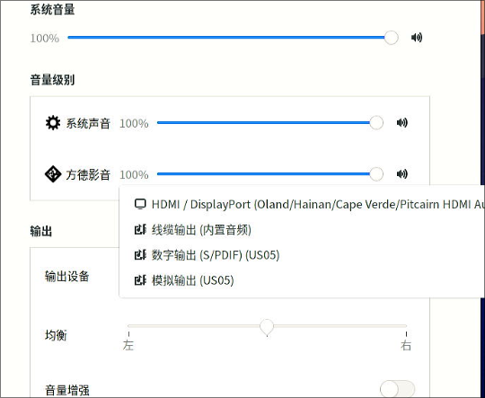
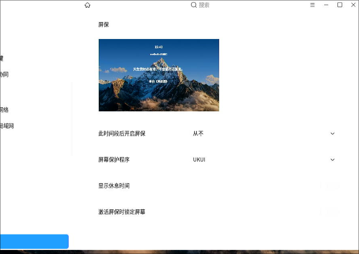

# 20250211
Mainly working on arm64 lxc desktop .    
 
arm workable items:      

```
# ls arm64_workable_20250211/
added.conf  kylinpulse.tar.xz  preX-populate-input.sh  zkfdpulse.tar.xz
kkk.sh      override.conf      uoslxc.tar.xz
root@lxchost:~# scp -r arm64_workable_20250211/ dash@192.168.1.7:/media/big/
```
### 1. lxc(kylinlxc)
Create via:    

```
lxc-create -t local -n kylinlxc -- -m  /root/meta.tar.xz -f /root/kylinlxc.tar.xz
cat added.conf >> /var/lib/lxc/kylinlxc/config  && mkdir -p /var/lib/lxc/kylinlxc/rootfs/usr/local/bin/ && cp preX-populate-input.sh /var/lib/lxc/kylinlxc/rootfs/usr/local/bin/ && mkdir -p /var/lib/lxc/kylinlxc/rootfs/etc/X11/xorg.conf.d/ &&  mkdir -p /var/lib/lxc/kylinlxc/rootfs/etc/systemd/system/lightdm.service.d && cp override.conf  /var/lib/lxc/kylinlxc/rootfs/etc/systemd/system/lightdm.service.d
vim /var/lib/lxc/kylinlxc/rootfs/etc/lightdm/lightdm.conf
    Added:  
    [LightDM]
    minimum-vt=8
mkdir -p /var/lib/lxc/kylinlxc/rootfs/home/test/.config/autostart/
cp /var/lib/lxc/uoslxcdesktop/rootfs/home/test/.config/autostart/pactl.desktop /var/lib/lxc/kylinlxc/rootfs/home/test/.config/autostart/
chmod 777 -R /var/lib/lxc/kylinlxc/rootfs/home/test/.config/autostart/
lxc-start -n kylinlxc -F
cp wind.mp4 /var/lib/lxc/kylinlxc/rootfs/home/tes桌面/
```
Everything will be ok,including video/audio..        

### 2. Backup Release
Backup release for x86 lxc:     

```
root@debian:~# ls
added.conf        kk.sh   kylinlxc.tar.xz  override.conf           uoslxc.tar.xz         wind.mp4
deepinlxc.tar.xz  kkk.sh  meta.tar.xz      preX-populate-input.sh  uoslxcdesktop.tar.xz  zkfdlxc.tar.xz
root@debian:~# mkdir x86_lxc_20250211
root@debian:~# mv * x86_lxc_20250211/
root@debian:~# scp -r x86_lxc_20250211/ dash@192.168.1.7:/media/big/
```

### 3. arm64 lxchost

OS Installation:     







Install the system via livecd.    

Partition:    




passwd-less login:    


Never lock screen:    




audio problem(use usb audio for output):   




Install packages:     

```
sudo apt update -y && sudo apt install -y iotop vim nethogs s-tui libvirt-daemon-driver-lxc virt-manager lxc lxc-templates lxcfs smplayer
sudo reboot
sudo systemctl enable ssh && sudo systemctl start ssh
sudo ufw disable
$ cat /etc/subuid /etc/subgid
test:100000:65536
root:100000:65536
test:100000:65536
root:100000:65536
# systemctl disable apparmor
# apt remove --assume-yes --purge apparmor
# vim /etc/lxc/default.conf
lxc.apparmor.profile = unconfined
```
Edit the config file then save:    

```
test@lxchost:~$ sudo vim /usr/share/lxc/config/common.conf
test@lxchost:~$ scp -P21322 /usr/share/lxc/config/common.conf dash@yqnyjy.ddns.net:~/common.conf.zkfdarm64
```
Copy all of the lxcarm images to root directory:     

```
$ ls
all.txt      kylinv10arm.tar.xz  uoslxc.tar.xz
history.txt  meta.tar.xz         zkfdlxc.tar.xz
$ sudo cp *.tar.xz /root/
$ cd /root, copy the sh files and conf files from my git repo
added.conf  kkk.sh  override.conf  preX-populate-input.sh

```
add crontab:     

```
@reboot chmod 777 /dev/tty* && chmod 777 /dev/fb* && chmod 777 -R /dev/dri/* && chmod 777 -R /dev/snd/* && chmod 777 -R /dev/input/*
```

### 4. kylinlxc
Include making images and run.     

In vm:    

```
sudo apt udpate -y && sudo apt install -y openssh-server
```





security related:   

```
$ setstatus disable -p
$ sudo vim /etc/default/grub
GRUB_CMDLINE_LINUX_DEFAULT="quiet splash loglevel=0 net.ifnames=0 biosdevname=0"
GRUB_CMDLINE_LINUX_SECURITY=""
$ sudo update-grub2
$ sudo apt install -y smplayer glmark2
$ sudo reboot
$ sudo shutdown -h now
```
Extract the files:    

```
cp kylinraw.img kylinraw.img.def_pulseaudio
losetup -f -P kylinraw.img.def_pulseaudio
# mount /dev/loop1p2 /mnt-resource/
# mount /dev/loop1p1 /mnt-resource/boot/efi/
# df -h
...
/dev/loop1p2     30G  9.4G   19G   34% /mnt-resource
/dev/loop1p1    253M   18M  235M    7% /mnt-resource/boot/efi
# mkdir /root/kl
# rsync -av /mnt-resource/* /root/kl/
# cd /root/kl
# vim etc/fstab
# rm -rf dev/*
# vim etc/lightdm/lightdm.conf
[LightDM]
minimum-vt=8
......

```
Should use system level pulseaudio, (optional systemd pulseaudio):     

```
test@kylin:~$ sudo vim /etc/pulse/client.conf
autospawn = no
test@kylin:~$ systemctl --user disable pulseaudio.service pulseaudio.socket
test@kylin:~$ sudo systemctl --global disable pulseaudio.service pulseaudio.socket
test@kylin:~$ sudo mv /lib/systemd/user/pulseaudio.s* .
test@kylin:~$ sudo mv /etc/xdg/autostart/pulseaudio.desktop  .
test@kylin:~$ sudo usermod -aG pulse-access root
test@kylin:~$ sudo usermod -aG pulse-access test
test@kylin:~$ sudo usermod -aG pulse test
test@kylin:~$ sudo usermod -aG audio test
test@kylin:~$ sudo vim /etc/systemd/system/pulseaudio.service

test@kylin:~$ sudo systemctl enable pulseaudio
Created symlink /etc/systemd/system/default.target.wants/pulseaudio.service → /etc/systemd/system/pulseaudio.service.

```
The workable lxc image is `kylinpulse.tar.xz`.    

```
lxc-create -t local -n kylinpulse -- -m /root/meta.tar.xz -f /root/kylinpulse.tar.xz
cat added.conf >> /var/lib/lxc/kylinpulse/config && mkdir -p /var/lib/lxc/kylinpulse/rootfs/usr/local/bin && cp preX-populate-input.sh /var/lib/lxc/kylinpulse/rootfs/usr/local/bin/ && mkdir -p /var/lib/lxc/kylinpulse/rootfs/etc/X11/xorg.conf.d/ && mkdir -p /var/lib/lxc/kylinpulse/rootfs/etc/systemd/system/lightdm.service.d && cp override.conf /var/lib/lxc/kylinpulse/rootfs/etc/systemd/system/lightdm.service.d

lxc-start -n kylinpulse
```

### 5. zkfd(image&testing)
Edit grub:     

```
$ sudo vim /etc/default/grub
GRUB_CMDLINE_LINUX_DEFAULT="quiet splash resume=UUID=357de008-1923-459c-a854-c835816c8667 net.ifnames=0 biosdevname=0"
$ sudo update-grub2
$ sudo systemctl enable ssh
```
Edit system-level pulseaudio:      

```
sudo vim /etc/pulse/client.conf
sudo systemctl --user disable pulseaudio.service pulseaudio.socket
sudo systemctl --global disable pulseaudio.service pulseaudio.socket
sudo mv /lib/systemd/user/pulseaudio.s* .
sudo mv /etc/xdg/autostart/pulseaudio.desktop .
sudo usermod -aG pulse-access root
sudo usermod -aG pulse-access test
sudo usermod -aG audio test
systemctl --user disable pipewire.service pipewire.socket
sudo systemctl --user disable pipewire.service pipewire.socket
sudo systemctl --global disable pipewire.service pipewire.socket
sudo mv /lib/systemd/user/pipewire.s* .
sudo vim /etc/systemd/system/pulseaudio.service
sudo systemctl enable pulseaudio
```
Disable the screen-lock, firewall, selinux related items.   

rsync the items to folder:     

```
# vim etc/lightdm/lightdm.conf
minimum-vt=8
# vim etc/fstab
# vim etc/systemd/system/pulseaudio.service
[Unit]
Description=Sound Service
After=multi-user.target
 
[Service]
# Note that notify will only work if --daemonize=no
Type=notify
ExecStart=/usr/bin/pulseaudio --daemonize=no --exit-idle-time=-1 --disallow-exit=true --system --disallow-module-loading
Restart=always
 
[Install]
WantedBy=default.target
# rm -f home/test/.config/autostart/pactl.desktop
# tar -cpvf zkfdpulse.tar * && xz -T8 zkfdpulse.tar
``` 
Create and test:     

```
# lxc-create -t local -n zkfdpulse -- -m /root/meta.tar.xz -f /root/zkfdpulse.tar.xz
# cat added.conf >> /var/lib/lxc/zkfdpulse/config && mkdir -p /var/lib/lxc/zkfdpulse/rootfs/usr/local/bin && cp preX-populate-input.sh /var/lib/lxc/zkfdpulse/rootfs/usr/local/bin/ && mkdir -p /var/lib/lxc/zkfdpulse/rootfs/etc/X11/xorg.conf.d/ && mkdir -p /var/lib/lxc/zkfdpulse/rootfs/etc/systemd/system/lightdm.service.d && cp override.conf /var/lib/lxc/zkfdpulse/rootfs/etc/systemd/system/lightdm.service.d
root@lxchost:~# lxc-start -n zkfdpulse
root@lxchost:~# cp /home/test/桌面/wind.mp4  /var/lib/lxc/zkfdpulse/rootfs/home/test/桌面/
```
video/audio both works well.   

### 6. deepinlxc
Install deepinlxc:     


Configuration of guest os:     


no effect for update grub:    

```
$ sudo apt update && sudo apt install -y openssh-server && sudo systemctl enable ssh
$ sudo vim /etc/default/grub
GRUB_CMDLINE_LINUX_DEFAULT="quiet splash loglevel=0 net.ifnames=0 biosdevname=0"
$ sudo update-grub2 && sudo update-grub && sudo reboot
```
sync the content:     

```
# mount /dev/loop3p2 /mnt-resource/
# mount /dev/loop3p1 /mnt-resource/boot/efi/
# mkdir /root/deepinlxc
# history | grep rsync
# rsync -av /mnt-resource/* /root/deepinlxc
# cd /root/deepinlxc
# tar cpvf deepinlxc * && xz -T8 deepinlxc.tar
```
Test and verification.     
