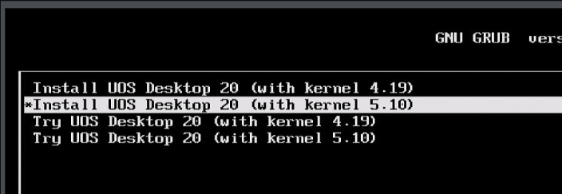
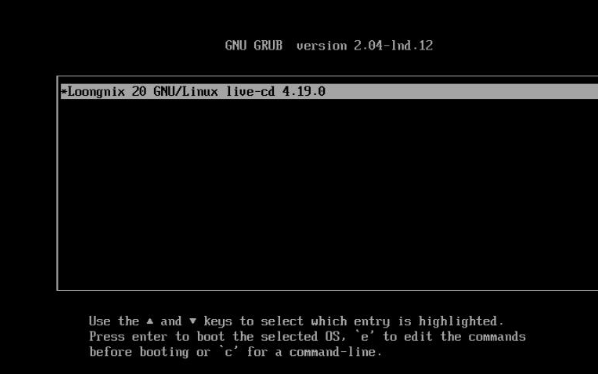
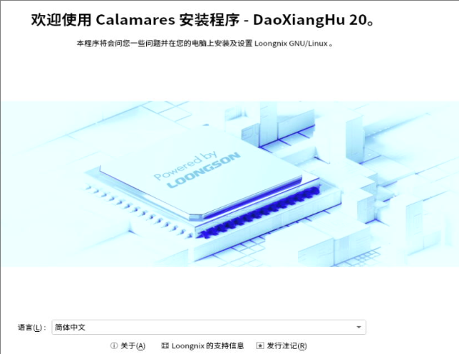
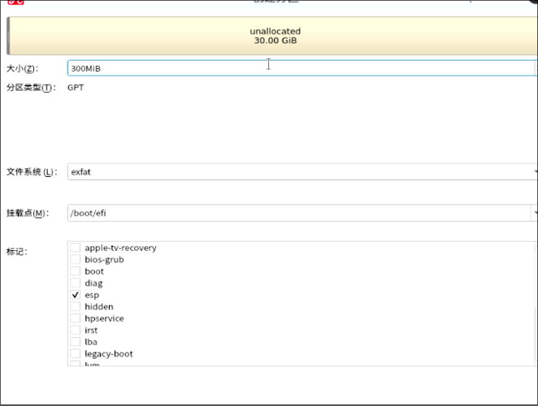
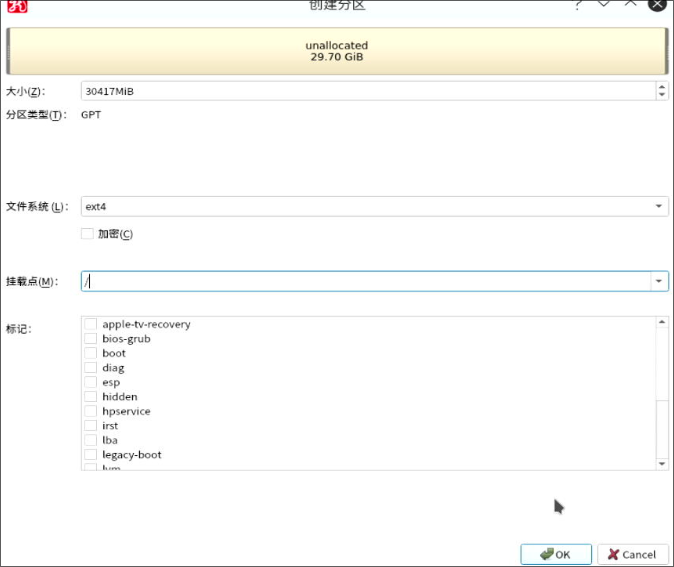
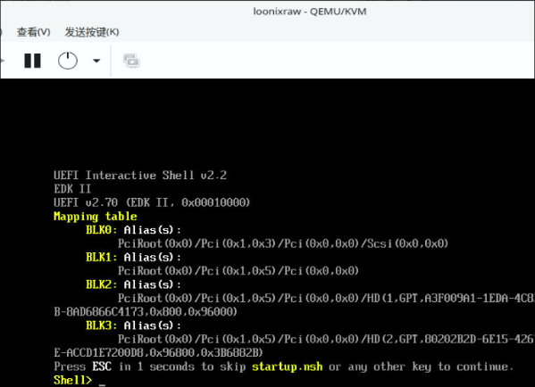
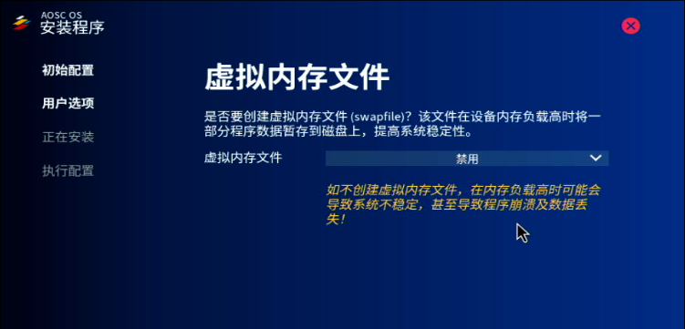
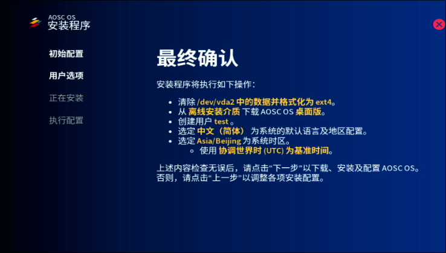

# 20240212
3a6000:    

```
old world, zkfd/kylin/uos      
new world, deepin/aosc, etc   
```

aosc, used for libvirt/virt-manager, for getting the rawimg.     

### 1. Kylin host
Write iso:    

```
sudo dd if=/media/nfs1/Kylin-Desktop-V10-SP1-2403-Release-20240506-loongarch64.iso of=/dev/sdb bs=10M && sudo sync
```
Install by default.   


```
$ sudo apt update -y && sudo apt install -y openssh-server && sudo systemctl enable ssh 
$ setstatus disable -p
$ sudo vim /etc/default/grub
GRUB_CMDLINE_LINUX_DEFAULT="quiet splash loglevel=0 net.ifnames=0 biosdevname=0"
GRUB_CMDLINE_LINUX_SECURITY=""
$ sudo apt install -y aptitude
$ sudo apt install -y iotop vim nethogs s-tui libvirt-daemon-driver-lxc virt-manager smplayer lxcfs
``` 
lxc issue:    

```
$ sudo aptitude install lxc
下列“新”软件包将被安装。         
  lxc{b} 
0 个软件包被升级，新安装 1 个，0 个将被删除， 同时 69 个将不升级。
需要获取 70.0 kB 的存档。解包后将要使用 75.8 kB。
下列软件包存在未满足的依赖关系：
 lxc : 依赖: lxc-utils (>= 1:4.0.2-0kylin1)是虚拟软件包，未被任何可用软件包所提供

下列动作将解决这些依赖关系：

     保持 下列软件包于其当前版本：
1)     lxc [未安装的]             


是否接受该解决方案？[Y/n/q/?] n

*** 没有更多的解决方案了 ***

下列动作将解决这些依赖关系：

     保持 下列软件包于其当前版本：
1)     lxc [未安装的]             


是否接受该解决方案？[Y/n/q/?] n

```
`lxc-utils` did not exists:     

```
$ apt-cache policy lxc-utils
lxc-utils:
  已安装：(无)
  候选： (无)
  版本列表：

```

### 2. uos host



Inject the sshkey then you could ssh login into host.   

packages lost:     

```
apt install -y iotop vim nethogs s-tui libvirt-daemon-driver-lxc virt-manager lxc lxc-templates lxcfs smplayer

E: 无法定位软件包 libvirt-daemon-driver-lxc
E: 无法定位软件包 virt-manager
```

### 3. zkfd host
Install:     

```
$ sudo apt install -y iotop vim nethogs s-tui libvirt-daemon-driver-lxc virt-manager lxc lxc-templates lxcfs smplayer
正在读取软件包列表... 完成
正在分析软件包的依赖关系树... 完成
正在读取状态信息... 完成                 
E: 无法定位软件包 libvirt-daemon-driver-lxc
```
old world, could run most of the lxc instance of old world.   

### 4. deepin guest
Install in `Try ` mode.    


Install:     


```
# lxc-create -t local -n  deepinlxc -- -m /root/meta.tar.xz -f /root/deepinlxc.tar.xz
```
When start lxc, get the following issue:     

```
root@zkfdhost:~# lxc-start -n deepinlxc -F
lxc-start: deepinlxc: utils.c: safe_mount: 1179 No such file or directory - Failed to mount "/dev/video0" onto "/usr/lib/loongarch64-linux-gnu/lxc/rootfs/dev/video0"
           lxc-start: deepinlxc: utils.c: safe_mount: 1179 No such file or directory - Failed to mount "/dev/video1" onto "/usr/lib/loongarch64-linux-gnu/lxc/rootfs/dev/video1"
                      systemd 255.2-4 running in system mode (+PAM +AUDIT +SELINUX +APPARMOR +IMA +SMACK -SECCOMP +GCRYPT -GNUTLS +OPENSSL +ACL +BLKID +CURL +ELFUTILS +FIDO2 +IDN2 -IDN +IPTC +KMOD +LIBCRYPTSETUP +LIBFDISK +PCRE2 -PWQUALITY +P11KIT +QRENCODE +TPM2 +BZIP2 +LZ4 +XZ +ZLIB +ZSTD -BPF_FRAMEWORK -XKBCOMMON +UTMP +SYSVINIT default-hierarchy=unified)
Detected virtualization lxc.
Detected architecture loongarch64.

Welcome to Deepin 23!

Hostname set to <deepin>.
Assertion 'sigaction(SIGCHLD, &sa, NULL) == 0' failed at src/core/manager.c:517, function manager_setup_signals(). Aborting.

```
### 4. loognix guest










Cannot boot to loognix vm.   



### 5. aosc guest 







### 6. deepin host
需要刷写bios固件到新世界，才可以安装deepin.   

```
sudo apt update -y
sudo apt install -y openssh-server
sudo systemctl enable ssh --now
sudo apt install -y iotop vim s-tui libvirt-daemon-driver-lxc  lxc lxc-templates lxcfs smplayer
sudo systemctl disable apparmor
sudo apt purge --assume-yes apparmor
```
package info:    

```
test@lxchost:~$ lxc-ls --version
6.0.1
test@lxchost:~$ dpkg -l | grep libvirt | grep lxc
ii  libvirt-daemon-driver-lxc                       10.7.0-3deepin1                        loong64      Virtualization daemon LXC connection driver
```
Edit the following files:    

```
/etc/lxc/default.conf
/usr/share/lxc/config/common.conf
```
#### 6.1 zkfd guest
Test via:     

```
lxc-create -t local -n zkfdlxc -- -m /root/meta.tar.xz -f /root/zkfd.tar.xz
....
lxc-start -n zkfdlxc
```
issue:     

```
root@lxchost:/var/lib/lxc# lxc-start -n zkfdlxc -F
/sbin/init: error while loading shared libraries: libc.so.6: cannot stat shared object: Error 38
```

#### 6.2 deepin guest
Acts well.  

#### 6.3 kylin guest
issue:    

```
root@lxchost:~# lxc-start -n kylinlxc -F
/sbin/init: error while loading shared libraries: libc.so.6: cannot stat shared object: Error 38
```
#### 6.4 uos guest
issue:    

```
lxc-start -n uoslxc -F
/sbin/init: error while loading shared libraries: libc.so.6: cannot stat shared object: Error 38
```
