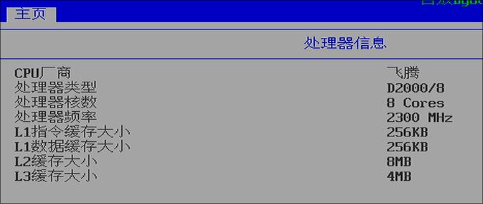
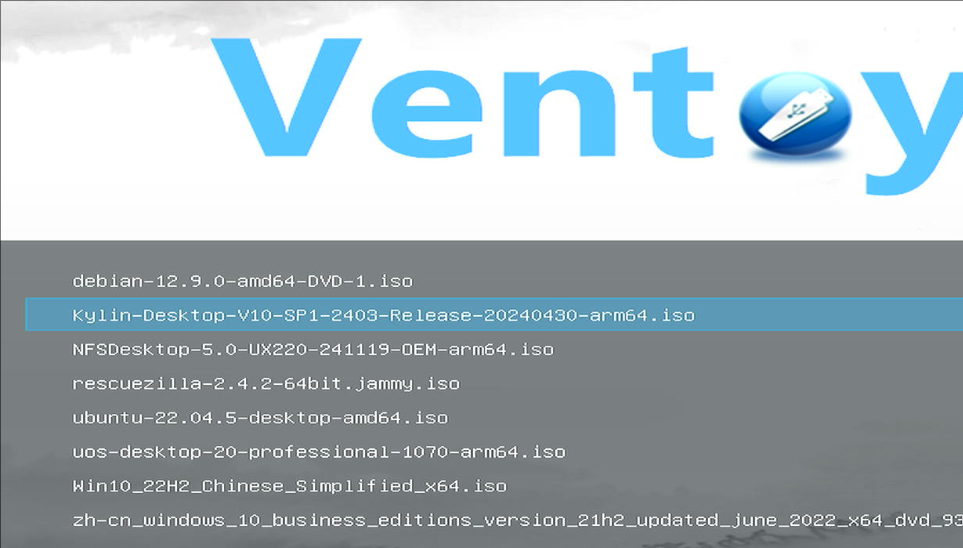

# 20250213
Conclusion:    

```
1. libvirt-lxc need to be compiled on 3a6000.    
2. arm64-lxc could back to d2000 and most of its functionality works well.   
3. 
```

### 1. compile libvirt
Get the specified version:    

```
wget https://github.com/libvirt/libvirt/archive/refs/tags/v5.0.0.tar.gz
tar xzvf libvirt-5.0.0.tar.gz
```
To be continue.    

`https://developer.ibm.com/tutorials/compiling-libvirt-and-qemu/`
`https://gitlab.com/lixianglai/libvirt/-/tree/loongarch?ref_type=heads`

### 2. lxc Verification(D2000)
System hardware Info:   




Boot from iso and install system.    



(ignored)Install some necessary packages and configuration of the lxc default options.     

```
lxc-create -t local -n kylinlxc -- -m /root/meta.tar.xz -f /root/kylinpulse.tar.xz
lxc-create -t local -n  uoslxc -- -m /root/meta.tar.xz -f /root/uoslxc.tar.xz
lxc-create -t local -n zkfdlxc -- -m  /root/meta.tar.xz -f /root/zkfdpulse.tar.xz
./patchlxc.sh zkfdlxc && ./patchlxc.sh kylinlxc && ./patchlxc.sh uoslxc
```
uos's sound issue(kt-usb audio not recognized).    

### 3. libvirt-lxc verification(d2000) 
kylinlxc: got xorg startup issue.      
zkfdlxc: got keyboard/mouse input issue.    
uoslxc: got sound issue.    

```
$ ls arm64_workable_20250211
added.conf  copy.sh  hooks  kkk.sh  kylinpulse.tar.xz  LXC  override.conf  patchlxc.sh  preX-populate-input.sh  uoslxc.tar.xz  zkfdpulse.tar.xz
```

| name | description |
| ----------- | ----------- |
| added.conf | lxc instance specified conf |
| copy.sh | copy items into instance |
| hooks | libvirt hooks for lxc |
| kylinpulse.tar.xz | lxc images(pulse audio system-level in guest) |
| uoslxc.tar.xz | lxc images |
| zkfdpulse.tar.xz | lxc images (pulse audio system-level in guest) |
| patchlxc.sh | usage: ./patchlxc.sh lxcinstance, after lxc-create |
| override.conf | override of the lxc instance lightdm systemd file |
| preX-populate-input.sh | added input to lxc instance|
| LXC | definition for lxc xml|
