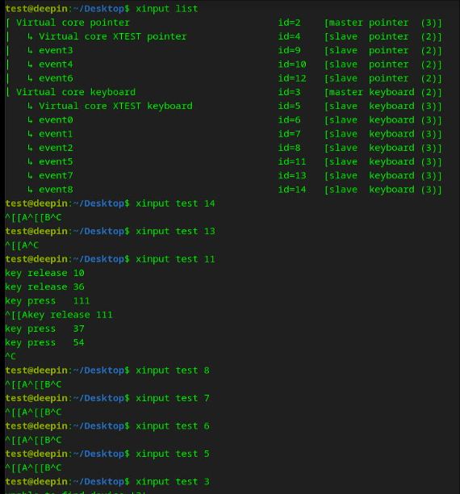
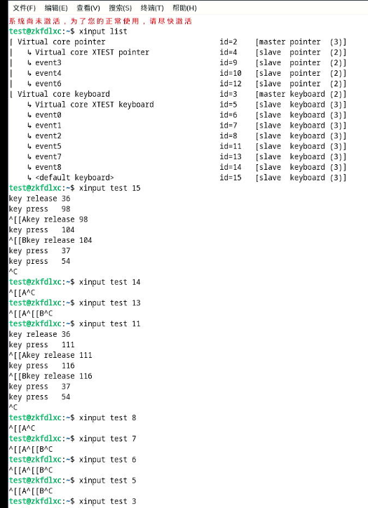
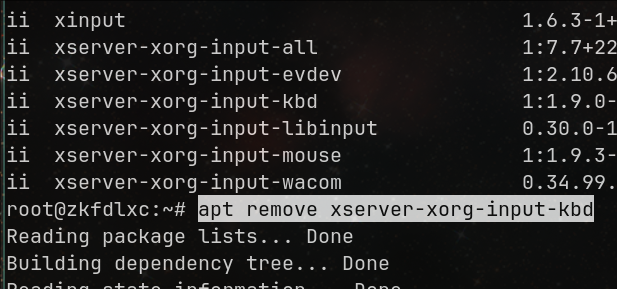
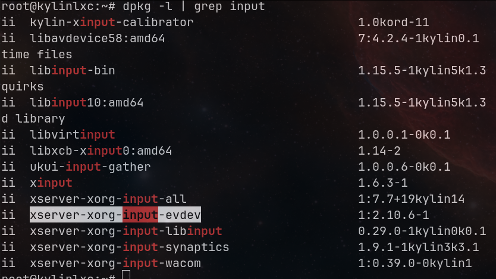

# 20250217
### 1. zkfd evdev issue
Problem:    
problem 1: input key slow.    
problem 2: When input UP key in terminal(alsamixer), call screenshot instead.     

debugging period(it turns it's not the real reason).    

```
apt update -y
apt install -y xfce4
Change to xfce by default.   
```
Problem 1, input key is normal under xfce4.   

Problem 1/2 are solved via `xinput debugging`. Install/Uninstall some packages(xinput).    


### 2. xinput debugging
Under deepinlxc:    



Under zkfdlxc:     



float 15:    

```
xinput float 15
```
Test via following method:      

```
root@debian:~# lxc-attach -n zkfd1
root@zkfdlxc:~# su test
test@zkfdlxc:/root$ DISPLAY=:0 xev

Press UP/Down shows OK

KeyPress event, serial 33, synthetic NO, window 0x1000001,
    root 0x6c7, subw 0x0, time 18939240, (1918,355), root:(1919,398),
    state 0x0, keycode 111 (keysym 0xff52, Up), same_screen YES,
    XLookupString gives 0 bytes: 
    XmbLookupString gives 0 bytes: 
    XFilterEvent returns: False

KeyRelease event, serial 36, synthetic NO, window 0x1000001,
    root 0x6c7, subw 0x0, time 18939311, (1918,355), root:(1919,398),
    state 0x0, keycode 111 (keysym 0xff52, Up), same_screen YES,
    XLookupString gives 0 bytes: 
    XFilterEvent returns: False


KeyPress event, serial 36, synthetic NO, window 0x1000001,
    root 0x6c7, subw 0x0, time 18942639, (1918,355), root:(1919,398),
    state 0x0, keycode 116 (keysym 0xff54, Down), same_screen YES,
    XLookupString gives 0 bytes: 
    XmbLookupString gives 0 bytes: 
    XFilterEvent returns: False

KeyRelease event, serial 36, synthetic NO, window 0x1000001,
    root 0x6c7, subw 0x0, time 18942711, (1918,355), root:(1919,398),
    state 0x0, keycode 116 (keysym 0xff54, Down), same_screen YES,
    XLookupString gives 0 bytes: 
    XFilterEvent returns: False
```
Kylin lxc issue(Up 111/Down 116):      

```
KeyPress event, serial 38, synthetic NO, window 0x7200001,
    root 0x6c7, subw 0x0, time 19040788, (912,406), root:(960,540),
    state 0x0, keycode 111 (keysym 0xff61, Print), same_screen YES,
    XLookupString gives 0 bytes: 
    XmbLookupString gives 0 bytes: 
    XFilterEvent returns: False

KeyRelease event, serial 41, synthetic NO, window 0x7200001,
    root 0x6c7, subw 0x0, time 19040828, (912,406), root:(960,540),
    state 0x0, keycode 111 (keysym 0xff61, Print), same_screen YES,
    XLookupString gives 0 bytes: 
    XFilterEvent returns: False


KeyPress event, serial 41, synthetic NO, window 0x7200001,
    root 0x6c7, subw 0x0, time 19052107, (912,406), root:(960,540),
    state 0x0, keycode 116 (keysym 0xffec, Super_R), same_screen YES,
    XLookupString gives 0 bytes: 
    XmbLookupString gives 0 bytes: 
    XFilterEvent returns: False

KeyRelease event, serial 41, synthetic NO, window 0x7200001,
    root 0x6c7, subw 0x0, time 19052163, (912,406), root:(960,540),
    state 0x40, keycode 116 (keysym 0xffec, Super_R), same_screen YES,
    XLookupString gives 0 bytes: 
    XFilterEvent returns: False
```
Using `xmodmap -pke` for detecting the key mapping.    

Solved:    
zkfd because I installed too much input equipments:    



kylin because no input equipments installed:    



```
zkfd: 
remove the  kbd, then the evdev got OK.   

apt remove xserver-xorg-input-kbd

kylin:    

apt install xserver-xorg-input-evdev
``` 
Now the system behaves OK.    
