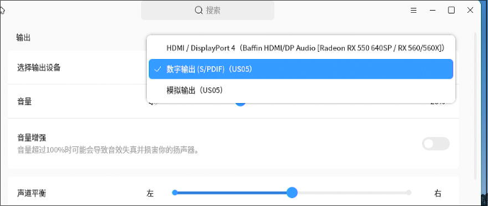
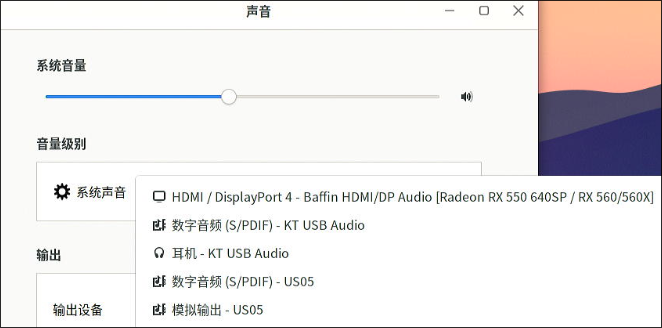
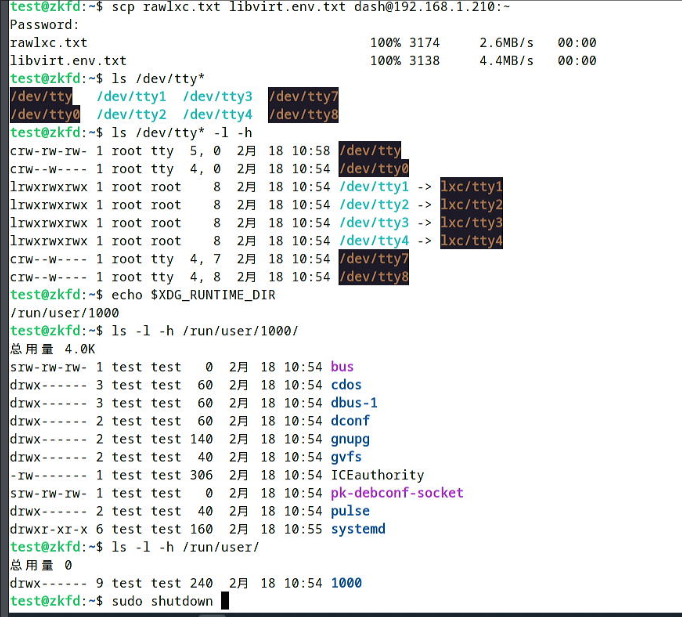
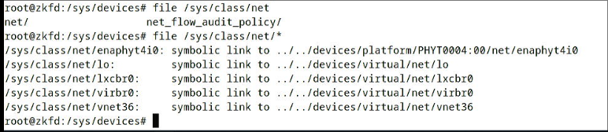

# 20250218
### 1. arm64 sound(KT USB Audio)
In guest(lxc):     



In Host:    



### 2. arm64 lxc
libvirt-lxc startup vs lxc-start startup issue:    



In libvirt-lxc, pulseaudio won't use, while lxc-start could use.     

`pactl list cards short` shows no card in libvirt-lxc, while lxc-start could show.    

Solved via:      

```
    <filesystem type='mount' accessmode='passthrough'>
      <source dir='/sys/fs/fuse/connections'/>
      <target dir='/sys/fs/fuse/connections'/>
    </filesystem>
    <filesystem type='mount' accessmode='passthrough'>
      <source dir='/sys'/>
      <target dir='/sys'/>
    </filesystem>


  <os>
    <type arch='x86_64'>exe</type>
    <init>/lib/systemd/systemd</init>
  </os>
  <features>
    <capabilities policy='allow'>
      <audit_control state='on'/>
      <audit_write state='on'/>
      <block_suspend state='on'/>
      <chown state='on'/>
      <dac_override state='on'/>
      <dac_read_search state='on'/>
      <fowner state='on'/>
      <fsetid state='on'/>
      <ipc_lock state='on'/>
      <ipc_owner state='on'/>
      <kill state='on'/>
      <lease state='on'/>
      <linux_immutable state='on'/>
      <mac_admin state='on'/>
      <mac_override state='on'/>
      <mknod state='on'/>
      <net_admin state='on'/>
      <net_bind_service state='on'/>
      <net_broadcast state='on'/>
      <net_raw state='on'/>
      <setgid state='on'/>
      <setfcap state='on'/>
      <setpcap state='on'/>
      <setuid state='on'/>
      <sys_admin state='on'/>
      <sys_boot state='on'/>
      <sys_chroot state='on'/>
      <sys_module state='on'/>
      <sys_nice state='on'/>
      <sys_pacct state='on'/>
      <sys_ptrace state='on'/>
      <sys_rawio state='on'/>
      <sys_resource state='on'/>
      <sys_time state='on'/>
      <sys_tty_config state='on'/>
      <syslog state='on'/>
      <wake_alarm state='on'/>
    </capabilities>
  </features>

```
### 3. lxc network
In /sys mounted lxc container:     



not mounted lxc instance:    


### 4. xml definition


```
<domain type='lxc'>
  <name>zkfdlxc</name>
  <uuid>4c5bbaef-0b21-48b6-bdf9-21a0d0f793df</uuid>
  <memory unit='KiB'>4276800</memory>
  <currentMemory unit='KiB'>4276800</currentMemory>
  <vcpu placement='static'>1</vcpu>
  <resource>
    <partition>/machine</partition>
  </resource>
  <os>
    <type arch='x86_64'>exe</type>
    <init>/lib/systemd/systemd</init>
  </os>
  <features>
    <capabilities policy='allow'>
      <audit_control state='on'/>
      <audit_write state='on'/>
      <block_suspend state='on'/>
      <chown state='on'/>
      <dac_override state='on'/>
      <dac_read_search state='on'/>
      <fowner state='on'/>
      <fsetid state='on'/>
      <ipc_lock state='on'/>
      <ipc_owner state='on'/>
      <kill state='on'/>
      <lease state='on'/>
      <linux_immutable state='on'/>
      <mac_admin state='on'/>
      <mac_override state='on'/>
      <mknod state='on'/>
      <net_admin state='on'/>
      <net_bind_service state='on'/>
      <net_broadcast state='on'/>
      <net_raw state='on'/>
      <setgid state='on'/>
      <setfcap state='on'/>
      <setpcap state='on'/>
      <setuid state='on'/>
      <sys_admin state='on'/>
      <sys_boot state='on'/>
      <sys_chroot state='on'/>
      <sys_module state='on'/>
      <sys_nice state='on'/>
      <sys_pacct state='on'/>
      <sys_ptrace state='on'/>
      <sys_rawio state='on'/>
      <sys_resource state='on'/>
      <sys_time state='on'/>
      <sys_tty_config state='on'/>
      <syslog state='on'/>
      <wake_alarm state='on'/>
    </capabilities>
  </features>
  <clock offset='utc'/>
  <on_poweroff>destroy</on_poweroff>
  <on_reboot>restart</on_reboot>
  <on_crash>destroy</on_crash>
  <devices>
    <emulator>/usr/lib/libvirt/libvirt_lxc</emulator>
    <filesystem type='mount' accessmode='passthrough'>
      <source dir='/var/lib/lxc/zkfd2/rootfs'/>
      <target dir='/'/>
    </filesystem>
    <filesystem type='mount' accessmode='passthrough'>
      <source dir='/dev/snd'/>
      <target dir='/dev/snd'/>
    </filesystem>
    <filesystem type='mount' accessmode='passthrough'>
      <source dir='/sys/fs/fuse/connections'/>
      <target dir='/sys/fs/fuse/connections'/>
    </filesystem>
    <filesystem type='mount' accessmode='passthrough'>
      <source dir='/sys'/>
      <target dir='/sys'/>
    </filesystem>

```
