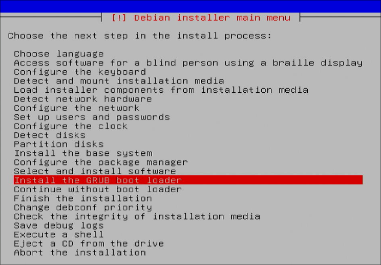
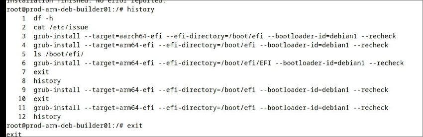
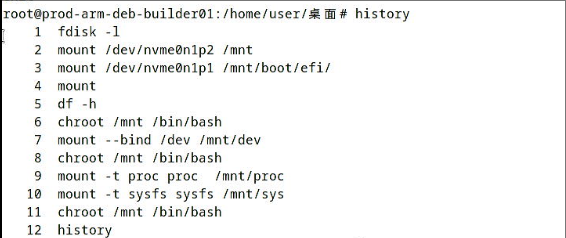

# 20250219
### 1. ArchLinux vm for lxc
Steps(from pacstrap):     

```
pacman -S vim
vim /etc/pacman.d/mirrorlist 
pacman -Sy
pacman -S linux linux-firmware base-devel base
ln -s /usr/share/zoneinfo/Asia/Shanghai  /etc/localtime
vim /etc/locale.gen
locale-gen
vim /etc/locale.conf
vim /etc/hostname
vim /etc/hosts 
pacman -S net-tools tcpdump iotop dhcpcd openssh dosfstools ntfs-3g amd-ucode intel-ucode grub efibootmgr
systemctl enable sshd
vim /etc/mkinitcpio.conf
mkinitcpio -P
passwd
grub-install --target=i386-pc /dev/vda --recheck
grub-mkconfig -o /boot/grub/grub.cfg
reboot
```
After reboot:    

```
$ pacman -S lightdm networkmanager mate pulseaudio Xorg mate-extra lightdm-gtk-greeter alsa-utils libvirt dnsmasq
$ systemctl enable NetworkManager
$ useradd -m dash
$ passwd dash
$ systemctl enable lightdm
$ systemctl status lightdm
$ pacman -Ss mate | grep terminal
$ groupadd -r autologin
$ gpasswd -a dash autologin
$ vim /etc/lightdm/lightdm.conf 
$ vim /etc/pacman.conf 
[archlinuxcn]
SigLevel = Optional TrustAll
Server = https://mirrors.ustc.edu.cn/archlinuxcn/$arch
$ pacman -S yay
$ systemctl enable libvirtd
$ systemctl enable virtlxcd
```
virsh network related:    

```
$ systemctl enable virtnetworkd
$ systemctl start virtnetworkd
$ virsh net-start default
$ virsh net-autostart default
```
lxc installation:    

```
$ pacman -S lxc lxcfs
$ vim /etc/subgid
dash:100000:65536
root:100000:65536
$ vim /etc/subuid
dash:100000:65536
root:100000:65536
$ systemctl enable lxc-net.service --now
$ vim /etc/default/lxc-net
$ systemctl restart lxc-net
$ virsh -c lxc:/// list --all
```
Content of `/etc/default/lxc-net`:      

```
cat /etc/default/lxc-net 
# Leave USE_LXC_BRIDGE as "true" if you want to use lxcbr0 for your
# containers.  Set to "false" if you'll use virbr0 or another existing
# bridge, or mavlan to your host's NIC.
USE_LXC_BRIDGE="true"

# If you change the LXC_BRIDGE to something other than lxcbr0, then
# you will also need to update your /etc/lxc/default.conf as well as the
# configuration (/var/lib/lxc/<container>/config) for any containers
# already created using the default config to reflect the new bridge
# name.
# If you have the dnsmasq daemon installed, you'll also have to update
# /etc/dnsmasq.d/lxc and restart the system wide dnsmasq daemon.
LXC_BRIDGE="lxcbr0"
LXC_ADDR="10.0.3.1"
LXC_NETMASK="255.255.255.0"
LXC_NETWORK="10.0.3.0/24"
LXC_DHCP_RANGE="10.0.3.2,10.0.3.254"
LXC_DHCP_MAX="253"
# Uncomment the next line if you'd like to use a conf-file for the lxcbr0
# dnsmasq.  For instance, you can use 'dhcp-host=mail1,10.0.3.100' to have
# container 'mail1' always get ip address 10.0.3.100.
#LXC_DHCP_CONFILE=/etc/lxc/dnsmasq.conf

# Uncomment the next line if you want lxcbr0's dnsmasq to resolve the .lxc
# domain.  You can then add "server=/lxc/10.0.3.1' (or your actual $LXC_ADDR)
# to your system dnsmasq configuration file (normally /etc/dnsmasq.conf,
# or /etc/NetworkManager/dnsmasq.d/lxc.conf on systems that use NetworkManager).
# Once these changes are made, restart the lxc-net and network-manager services.
# 'container1.lxc' will then resolve on your host.
#LXC_DOMAIN="lxc"

```
Create lxc instance:     

```
$ lxc-create -t local -n zkfdlxc -- -m /root/meta.tar.xz -f /root/zkfdlxc.tar.xz
$ ./patchlxc zkfdlxc
$ make modifications to root system. 
$ lxc-start -n zkfdlxc
```
Create libvirt-lxc instance:     

```
$ mkdir -p ~/LXC
$ vim ~/LXC/zkfd.xml
$ virsh -c lxc:/// define ~/LXC/zkfd.xml
$ mkdir -p /etc/libvirt/hooks
$ cd /etc/libvirt/hooks
$ vim lxc
$ vim /bin/attach_dev.sh
$ chmod 777 /bin/attach_dev.sh 
$ vim /bin/detach_dev.sh
$ chmod 777 /bin/detach_dev.sh 
$ /bin/attach_dev.sh zkfdlxc
$ virsh -c lxc:/// start zkfdlxc
```
### 2. libvirt-lxc sound
lxc-start vs libvirt-lxc:     

```
test@zkfdlxc:~$ DISPLAY=:0 pactl list cards short
0	alsa_card.pci-0000_00_1b.0	module-alsa-card.c
```
Solved via:     

```
test@uoslxc:~$ pactl load-module module-alsa-card device_id=1
27
test@uoslxc:~$ pactl load-module module-alsa-card device_id=0
28
test@uoslxc:~$ pactl load-module module-alsa-card device_id=2
失败：模块初始化失败
test@uoslxc:~$ pactl list cards short
0	alsa_card.1	module-alsa-card.c
1	alsa_card.0	module-alsa-card.c
test@uoslxc:~$ pactl list sinks short
1	alsa_output.1.analog-stereo	module-alsa-card.c	s16le 2ch 48000Hz	SUSPENDED
2	alsa_output.0.hdmi-stereo-extra3	module-alsa-card.c	s16le 2ch 44100Hz	SUSPENDED
```
### 3. libvirt-lxc arm64 kylin
issue:    
Xorg start failed.   

```
[ 18850.260] (II) AMDGPU(0): Set up textured video (glamor)
[ 18850.265] (EE) modeset(G0): drmSetMaster failed: Invalid argument
[ 18850.265] (EE) 
Fatal server error:
[ 18850.265] (EE) AddScreen/ScreenInit failed for gpu driver 0 -1
[ 18850.265] (EE) 
[ 18850.265] (EE) 
Please consult the The X.Org Foundation support 
	 at http://wiki.x.org
 for help. 
[ 18850.265] (EE) Please also check the log file at "/var/log/Xorg.0.log" for additional information.
[ 18850.265] (EE) 
[ 18850.320] (EE) Server terminated with error (1). Closing log file.

```
works well under `lxc-start`.  
### 4. arm64(debian 12) verification 
Grub install issue:    







Finally, use a rescue mode for re-install grub, then everything goest OK.   


```
# apt update -y
# apt install -y iotop vim nethogs s-tui libvirt-daemon-driver-lxc virt-manager lxc lxc-templates lxcfs smplayer
# systemctl disable apparmor
# uname -a
Linux debianlxc 6.1.0-29-arm64 #1 SMP Debian 6.1.123-1 (2025-01-02) aarch64 GNU/Linux
# virsh net-autostart default
# apt remove --purge apparmor
# crontab -e(auto chmod 777)
# vim /etc/lightdm/lightdm.con(autologin)
root@debianlxc:~# vim /etc/lxc/default.conf 
root@debianlxc:~# vim /etc/subuid
root@debianlxc:~# vim /etc/subgid
root@debianlxc:~# vim /usr/share/lxc/config/common.conf
root@debianlxc:~# vim /usr/share/lxc/config/common.conf
```
