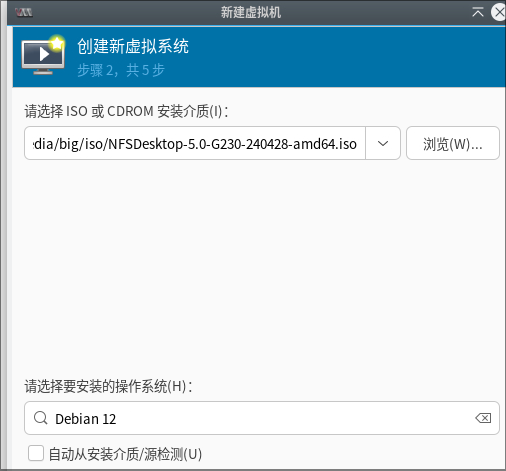
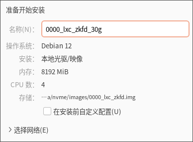
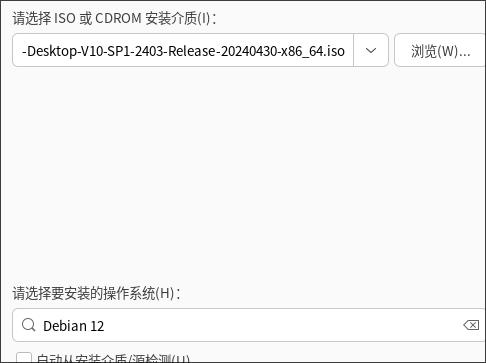
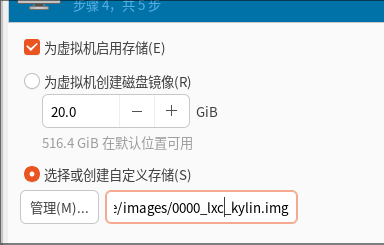
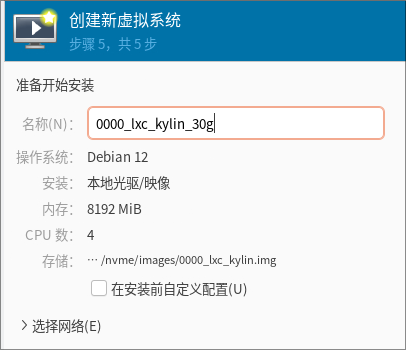
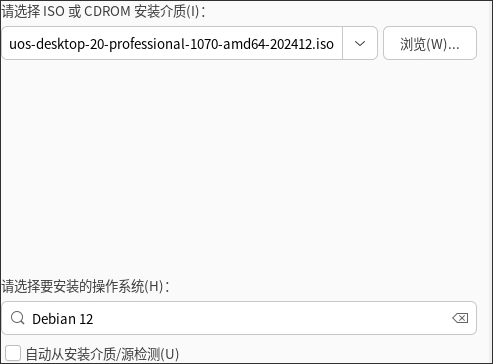
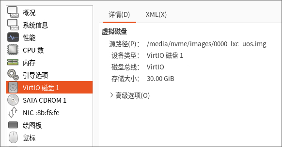
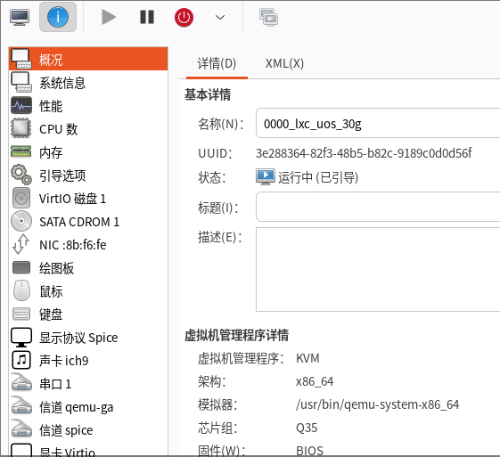
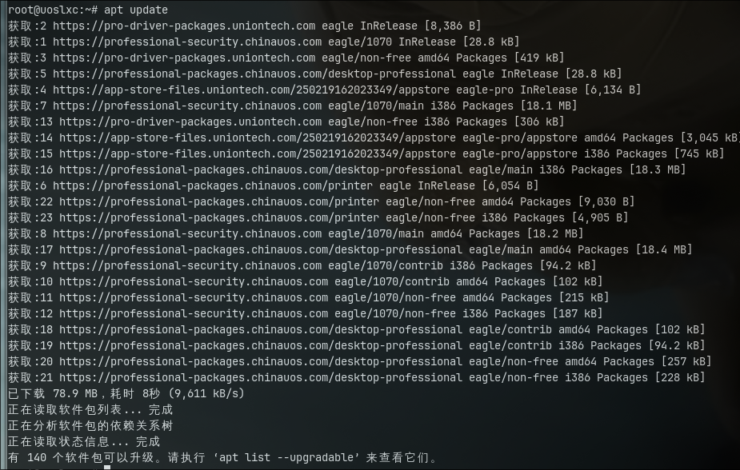
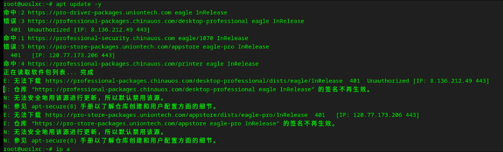

# 20250220
### 1. arm64-lxc images
Changed to ubuntu lxc image.   

Under arm64 minimal vm:     

```
sudo apt-get install mate-desktop-environment-core
# This will install the complete MATE desktop
sudo apt-get install mate-desktop-environment
# This will install the complete MATE desktop including a few extras
sudo apt-get install mate-desktop-environment-extras
```
Changes to lightdm:    

```
$ sudo apt install -y lightdm
$ sudo systemctl set-default graphical.target
$ cat /etc/lightdm/lightdm.conf
[LightDM]
minimum-vt=8
[SeatDefaults]
autologin-guest=false
autologin-user=test
autologin-user-timeout=0
autologin-session=mate
```
Shutdown the vm and convert it to lxc images.     

### 2. libvirt-lxc network
ubuntulxc:      

```
# cat /var/lib/lxc/ubuntulxc/rootfs/etc/systemd/network/05-eth0.network 
[Match]
Name=eth0

[Network]
DHCP=yes
########################################3
In lxc instance: 
$ sudo systemctl disable NetworkManager
$ sudo systemctl enable systemd-networkd
########################################3
```
zkfdlxc:       

```
The same as ubuntulxc
```
### 3. libvirt-lxc reboot
Seems no issue under arm64(debian 12.9).   

Sometimes it will not OK.   needed to open log and view libvirtd's behavior.  
### 4. sound
Solved via:     

```
test@idv:~$ cat /etc/pulse/default.pa 
load-module module-alsa-card device_id=0
load-module module-alsa-card device_id=1

### Make some devices default
#set-default-sink output
#set-default-source input

```
Added to usermod, then `aplay -L` will acts well:    

```
 usermod -aG audio test
 usermod -aG audio root
 usermod -aG pulse test
 usermod -aG pulse-access test
```
### 5. kylin desktop issue(arm64)
solved via replace the package(using ubuntu's package):     

```
sudo apt install xserver-xorg-video-all=1:7.7+19ubuntu14
```

### 6. x86 to-do
zkfd image:    






kylin image:    







uos image:    







Notice, uos could be upgrade under vm.    



Notice, uos lxc upgrade will failed:     



### 7. ffmpeg for cutting mp4
Via(start time, stop time):     

```
fmpeg -ss 00:02:23 -to 00:06:59 -i ~/Downloads/bao.mp4 -threads 2 -c:v copy -c:a copy  mybao.mp4
```
