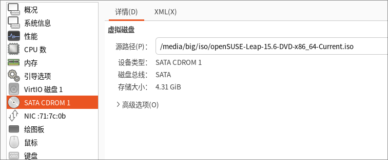

# 20250221
### 1. x86 lxc images
Debian 12.9:    


ubuntu24.04.1 desktop:    


```
$ sudo apt install -y openssh-server lightdm mate-desktop-environment-core mate-desktop-environment mate-desktop-environment-extras
$ cat /etc/lightdm/lightdm.conf
[LightDM]
minimum-vt=8
[SeatDefaults]
autologin-guest=false
autologin-user=test
autologin-user-timeout=0
autologin-session=mate
$ cat /etc/default/grub
GRUB_CMDLINE_LINUX_DEFAULT="quiet splash net.ifnames=0 biosdevname=0 ipv6.disabled=1"
$ sudo update-grub2
$ sudo apt install -y pulseaudio
$ sudo vim /etc/pulse/default.pa
```


opensuse:    





Package refresh:    

```
sudo zypper lr -d
sudo zypper mr -da
sudo zypper ar -fcg 'https://mirrors.ustc.edu.cn/opensuse/distribution/leap/$releasever/repo/oss' USTC:OSS
sudo zypper ar -fcg 'https://mirrors.ustc.edu.cn/opensuse/distribution/leap/$releasever/repo/non-oss' USTC:NON-OSS
sudo zypper ar -fcg 'https://mirrors.ustc.edu.cn/opensuse/update/leap/$releasever/oss' USTC:UPDATE-OSS
sudo zypper ar -fcg 'https://mirrors.ustc.edu.cn/opensuse/update/leap/$releasever/non-oss' USTC:UPDATE-NON-OSS
sudo zypper ar -fcg 'https://mirrors.ustc.edu.cn/opensuse/update/leap/$releasever/sle' USTC:UPDATE-SLE
sudo zypper ar -fcg 'https://mirrors.ustc.edu.cn/opensuse/update/leap/$releasever/backports' USTC:UPDATE-BACKPORTS
sudo zypper ar -fcg 'https://mirrors.ustc.edu.cn/opensuse/tumbleweed/repo/oss' USTC:OSS
sudo zypper ar -fcg 'https://mirrors.ustc.edu.cn/opensuse/tumbleweed/repo/non-oss' USTC:NON-OSS
sudo zypper ar -fcg 'https://mirrors.ustc.edu.cn/opensuse/update/tumbleweed' USTC:UPDATE
sudo zypper ref
```
evdev related packages has been installed:     

```
localhost:/home/test # zypper search -i | grep -i input | grep evdev
i  | xf86-input-evdev                           | Generic Linux input driver for the Xorg X server                              | package

```
Issue for debian(mouse/keyboard not stable)     
Issue for ubuntu: snapd installed app won't start.   


Rocky9:    


Install lightdm:     

```
sudo dnf install -y epel-release
sudo sed -e 's|^metalink=|#metalink=|g'          -e 's|^#baseurl=https\?://download.fedoraproject.org/pub/epel/|baseurl=https://mirrors.ustc.edu.cn/epel/|g'          -e 's|^#baseurl=https\?://download.example/pub/epel/|baseurl=https://mirrors.ustc.edu.cn/epel/|g'          -i.bak          /etc/yum.repos.d/epel{,-testing}.repo
sudo dnf install -y lightdm lightdm-gtk-greeter-settings
sudo systemctl disable gdm
sudo systemctl enable lightdm
```
