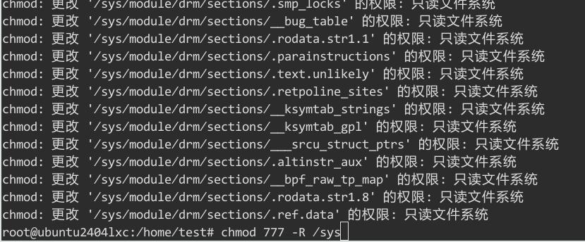

# 20250223
### 1. sound debug
lxc-start:     

```
test@ubuntu2404lxc:~$ loginctl list-sessions
SESSION  UID USER SEAT  TTY   STATE  IDLE SINCE
      5 1000 test seat0 tty8  active no   -    
     c1 1000 test -     pts/5 active no   -    

2 sessions listed.
```
virsh start:      

```
test@ubuntu2404lxc:~$ loginctl list-sessions
SESSION  UID USER SEAT TTY   STATE  IDLE SINCE
     62 1000 test -    pts/1 active no   -    

1 sessions listed.

```
console(virsh start):     

```
test@ubuntu2404lxc:~$ loginctl list-sessions
No sessions.
```


console(lxc-start)
```
test@ubuntu2404lxc:~$ loginctl list-sessions
SESSION  UID USER SEAT  TTY  STATE  IDLE SINCE
      5 1000 test seat0 tty8 active no   -    

1 sessions listed.
```

### 2. rebuild libvirt
Steps:     

```
cd lxcpkg
 dpkg-source -x libvirt_6.0.0-0ubuntu8.20.dsc 
cd libvirt-6.0.0
vim src/lxc/lxc_container.c
...

-    { "sysfs", "/sys", "sysfs", MS_NOSUID|MS_NOEXEC|MS_NODEV|MS_RDONLY, false, false, false },
-    { "sysfs", "/sys", "sysfs", MS_NOSUID|MS_NOEXEC|MS_NODEV|MS_BIND, false, false, false },
dpkg-source --commit
debuild -us -uc
...
```
Verification:     

```
apt remove --purge libvirt-daemon-system libvirt-daemon
cd ..
 dpkg -i libvirt0_6.0.0-0ubuntu8.20_amd64.deb libvirt-daemon_6.0.0-0ubuntu8.20_amd64.deb libvirt-daemon-driver-lxc_6.0.0-0ubuntu8.20_amd64.deb libvirt-daemon-driver-qemu_6.0.0-0ubuntu8.20_amd64.deb libvirt-daemon-driver-storage-rbd_6.0.0-0ubuntu8.20_amd64.deb libvirt-daemon-system_6.0.0-0ubuntu8.20_amd64.deb libvirt-daemon-system-systemd_6.0.0-0ubuntu8.20_amd64.deb
```

### 3. reason
Under libvirt-lxc, the `systemd-udevd` is not properly started:     

```
journalctl -xeu systemd-udevd
2月 23 17:29:26 ubuntu2404lxc systemd[1]: systemd-udevd.service - Rule-based Manager for Device Events and Files was skipped because of an unmet condition check (ConditionPathIsReadWrite=/>

```


