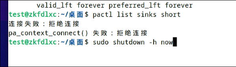
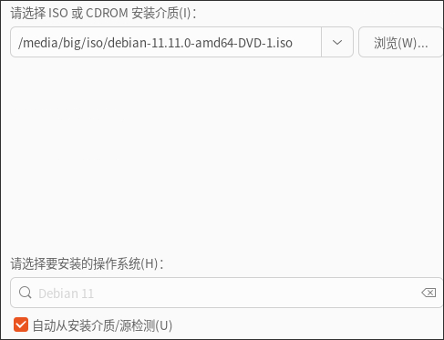
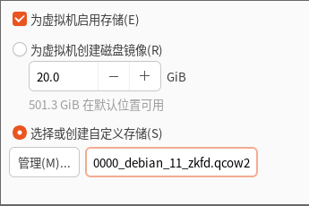
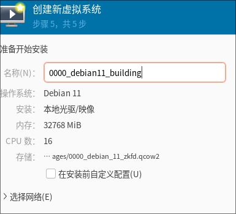
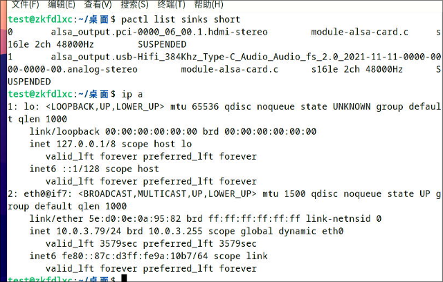
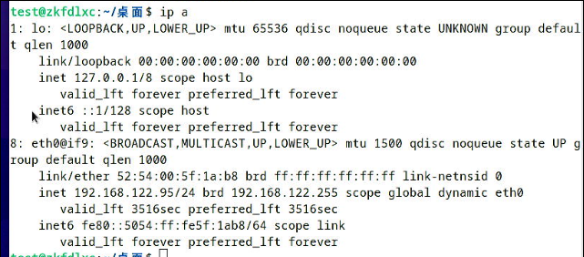

# 20250225
### 1. zkfd lxchost
Install following packages:     

```
root@zkfd:~# apt install -y iotop vim nethogs s-tui lxc lxc-templates lxcfs smplayer
```
Get the debs from `libvirt70debs`, install them:     

```
# vim /etc/dpkg/dpkg.cfg
no-debsig
#  cd ~/libvirt70debs
$ sudo apt-get --allow-unauthenticated  -o APT::Get::AllowUnauthenticated=true  install ./libvirt0_7.0.0-3+deb11u3_amd64.deb ./libvirt-clients_7.0.0-3+deb11u3_amd64.deb ./libvirt-daemon_7.0.0-3+deb11u3_amd64.deb ./libvirt-daemon-driver-lxc_7.0.0-3+deb11u3_amd64.deb ./libvirt-daemon-driver-qemu_7.0.0-3+deb11u3_amd64.deb ./libvirt-daemon-driver-storage-rbd_7.0.0-3+deb11u3_amd64.deb ./libvirt-daemon-system_7.0.0-3+deb11u3_amd64.deb ./libvirt-daemon-system-systemd_7.0.0-3+deb11u3_all.deb ./libvirt-daemon-config-network_7.0.0-3+deb11u3_all.deb ./libvirt-daemon-config-nwfilter_7.0.0-3+deb11u3_all.deb
```
remove apparmor:     

```
systemctl disable apparmor
apt remove --purge apparmor
```
zkfd guest(virsh):    



kylin30g guest: both are OK.   
uos30g guest: both are OK.   
### 2. debian 11 building
debian 11 building:    







```
root@debian:~# uname -a
Linux debian 5.10.0-32-amd64 #1 SMP Debian 5.10.223-1 (2024-08-10) x86_64 GNU/Linux
root@debian:~# cat /etc/issue
Debian GNU/Linux 11 \n \l
```

```
apt install -y build-essential pbuilder
apt-get build-dep libvirt-daemon-driver-lxc
apt-get source libvirt-daemon-driver-lxc
cd libvirt-7.0.0
vim src/lxc/lxc_container.c
......
dpkg-source --commit
debuild -us -uc
cd ..
mkdir ~/libvirt70debs
cp *.deb ~/libvirt70debs
```
### 3. zkfd30g comparison
under debian host, zkfd guest:     



under debian host, libvirt zkfd guest:    



under zkfd host, zkfd guest(virsh):    


### 4. ubuntu 22.04 host
Should back to old kernel:      

```
$ apt install -y linux-image-generic
$ vim /etc/default/grub
GRUB_DEFAULT="Advanced options for Ubuntu>Ubuntu, with Linux 5.15.0-133-generic"
$ sudo update-grub2
```

Make package(re-build).   

Install pkg:     

```
apt remove --purge libvirt-daemon-system libvirt-daemon
apt install ./libvirt0_8.0.0-1ubuntu7.10_amd64.deb ./libvirt-daemon_8.0.0-1ubuntu7.10_amd64.deb  ./libvirt-daemon-driver-lxc_8.0.0-1ubuntu7.10_amd64.deb ./libvirt-daemon-driver-qemu_8.0.0-1ubuntu7.10_amd64.deb ./libvirt-daemon-system_8.0.0-1ubuntu7.10_amd64.deb ./libvirt-clients_8.0.0-1ubuntu7.10_amd64.deb ./libvirt-daemon-system-sysv_8.0.0-1ubuntu7.10_all.deb
```
zkfd30g image, should remove xorg-input-kbd
