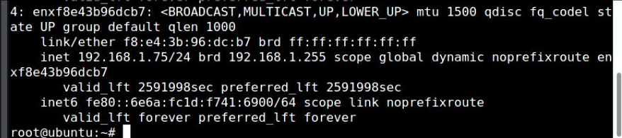
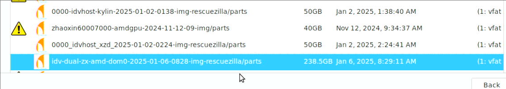
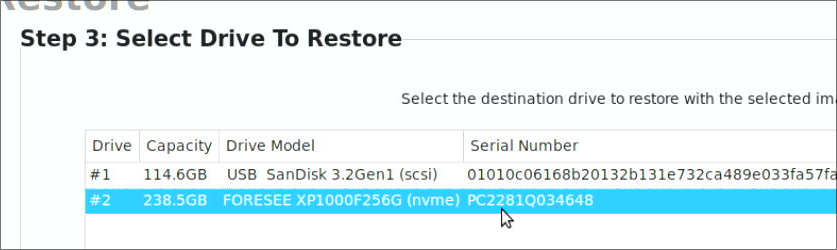
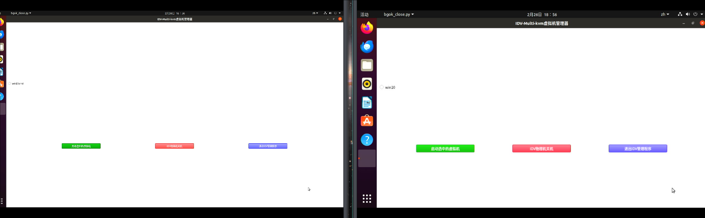
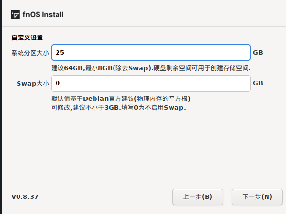
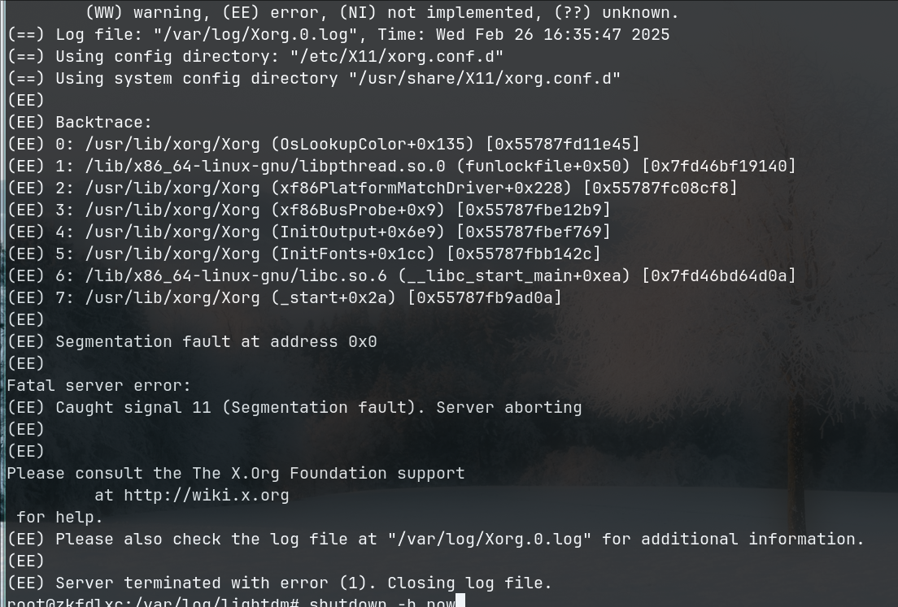

# 20250226
### 1. hwe zkfd host


```
# uname -a
Linux zkfdhwe 6.2.16 #m4+1nfs5.6 SMP PREEMPT_DYNAMIC Fri Nov  1 12:58:14 CST 2024 x86_64 GNU/Linux
```

Could be run on gen12 idv.   
### 2. dual vm rescue
USB network adapter:    




256GB rescue image:   



destination:   




After restore, configuration:    


Save/Restart the machine.    




ssh into the machine and shutdown :     

```
root@zkfd:~# virsh list
 Id   名称      状态
-------------------------
 1    dom0zx    running
 2    dom0amd   running

root@zkfd:~# shutdown -h now

```
### 3. fnnas
Download from `fnnas.com`:    





### 4. kylinlxchost
Install packages:     

```
sudo apt install -y iotop vim nethogs s-tui lxc lxc-templates lxcfs smplayer
cd debs
sudo apt install ./libvirt0_6.0.0-0ubuntu8.20_amd64.deb ./libvirt-daemon_6.0.0-0ubuntu8.20_amd64.deb ./libvirt-daemon-driver-lxc_6.0.0-0ubuntu8.20_amd64.deb ./libvirt-daemon-driver-qemu_6.0.0-0ubuntu8.20_amd64.deb  ./libvirt-daemon-system_6.0.0-0ubuntu8.20_amd64.deb  ./libvirt-clients_6.0.0-0ubuntu8.20_amd64.deb ./libvirt-daemon-system-sysv_6.0.0-0ubuntu8.20_amd64.deb
sudo reboot
```
Added:     

```
# cat /etc/lxc/default.conf
lxc.apparmor.profile = unconfined

# vim /usr/share/lxc/config/common.conf

lxc.mount.auto = cgroup:rw proc:rw sys:rw
lxc.mount.entry = /sys/fs/fuse/connections sys/fs/fuse/connections none bind,optional 0 0

# Blacklist some syscalls which are not safe in privileged
# containers
lxc.seccomp.profile = /usr/share/lxc/config/common.seccomp

# Lastly, include all the configs from /usr/share/lxc/config/common.conf.d/
lxc.include = /usr/share/lxc/config/common.conf.d/

### tty0, tty1, tty3, tty4, tty5, tty6, tty7, tty8
lxc.cgroup.devices.allow = c 4:0 rwm
lxc.cgroup.devices.allow = c 4:1 rwm
#lxc.cgroup.devices.allow = c 4:3 rwm
#lxc.cgroup.devices.allow = c 4:4 rwm
#lxc.cgroup.devices.allow = c 4:5 rwm
#lxc.cgroup.devices.allow = c 4:6 rwm
lxc.cgroup.devices.allow = c 4:7 rwm
lxc.cgroup.devices.allow = c 4:8 rwm
## graphics. /dev/dri
lxc.cgroup.devices.allow = c 226:0 rwm
lxc.cgroup.devices.allow = c 226:128 rwm
## graphics. /dev/fb0
lxc.cgroup.devices.allow = c 29:0 rwm
### sound
lxc.cgroup.devices.allow = c 116:* rwm
### input
lxc.cgroup.devices.allow = c 13:* rwm

lxc.mount.entry = /dev/snd dev/snd none bind,optional,create=dir

```
zkfdlxc:    



kylinlxc/uoslxc, OK.   

zkfdhwe30g, OK.   

### 5. kylin libvirt changes
Get the source code:    

```

Added followinig to `/etc/apt/sources.list`
deb-src http://mirrors.lzu.edu.cn/ubuntu/ focal main restricted
deb-src http://mirrors.lzu.edu.cn/ubuntu/ focal-updates main restricted
deb-src http://mirrors.lzu.edu.cn/ubuntu/ focal universe
deb-src http://mirrors.lzu.edu.cn/ubuntu/ focal-updates universe
deb-src http://mirrors.lzu.edu.cn/ubuntu/ focal multiverse
deb-src http://mirrors.lzu.edu.cn/ubuntu/ focal-updates multiverse
deb-src http://mirrors.lzu.edu.cn/ubuntu/ focal-backports main restricted universe multiverse
deb-src http://archive.canonical.com/ubuntu focal partner
deb-src http://mirrors.lzu.edu.cn/ubuntu focal-security main restricted
deb-src http://mirrors.lzu.edu.cn/ubuntu focal-security universe
deb-src http://mirrors.lzu.edu.cn/ubuntu focal-security multiverse
# apt-get source libvirt-daemon-driver-lxc
```
Diffs:     

```
test@kylinidvhost:~$ diff Code1/libvirt-6.0.0/src/lxc/lxc_container.c ~/Code/libvirtlxc/libvirt-6.0.0/src/lxc/lxc_container.c
798c798
<     { "/proc/sys", "/proc/sys", "none", MS_BIND|MS_NOSUID|MS_NOEXEC|MS_NODEV|MS_RDONLY, false, false, false },
---
>     { "/proc/sys", "/proc/sys", "none", MS_BIND|MS_NOSUID|MS_NOEXEC|MS_NODEV, false, false, false },
801c801
<     { "sysfs", "/sys", "sysfs", MS_NOSUID|MS_NOEXEC|MS_NODEV|MS_RDONLY, false, false, false },
---
>     { "sysfs", "/sys", "sysfs", MS_NOSUID|MS_NOEXEC|MS_NODEV, false, false, false },
```
test@kylinidvhost:~$ diff Code1/libvirt-6.0.0/debian/rules ~/Code/libvirtlxc/libvirt-6.0.0/debian/rules 
50,51c50,51
<   WITH_SELINUX        = --with-selinux --with-secdriver-selinux --with-selinux-mount=/sys/fs/selinux
<   WITH_APPARMOR       = --with-apparmor --with-secdriver-apparmor --with-apparmor-profiles
---
>   WITH_SELINUX        = --without-selinux
>   WITH_APPARMOR       = --without-apparmor
124,125c124,125
< 	$(WITH_SELINUX)          \
< 	$(WITH_APPARMOR)         \
---
> 	$(WITH_SELINUX)             \
> 	$(WITH_APPARMOR)             \
215,218c215,218
< 	dh_install -p libvirt-daemon-system usr/lib/libvirt/virt-aa-helper
< 	dh_install -p libvirt-daemon-system etc/apparmor.d
< 	dh_apparmor -p libvirt-daemon-system --profile-name=usr.lib.libvirt.virt-aa-helper
< 	dh_apparmor -p libvirt-daemon-system --profile-name=usr.sbin.libvirtd
---
> 	#dh_install -p libvirt-daemon-system usr/lib/libvirt/virt-aa-helper
> 	#dh_install -p libvirt-daemon-system etc/apparmor.d
> 	#dh_apparmor -p libvirt-daemon-system --profile-name=usr.lib.libvirt.virt-aa-helper
> 	#dh_apparmor -p libvirt-daemon-system --profile-name=usr.sbin.libvirtd
246c246
< 	rm debian/libvirt-daemon-system/etc/apparmor.d/local/*
---
> 	#rm debian/libvirt-daemon-system/etc/apparmor.d/local/*
```
Changes are made for installation.   
