# 20250227
### 1. ybd verification
Information:    

```
root@TY12345-pc:~# cat /etc/issue
Kylin V10 SP1 \n \l

root@TY12345-pc:~# uname -a
Linux TY12345-pc 5.4.18-91-generic #80-KYLINOS SMP Fri Jun 16 09:34:23 UTC 2023 x86_64 x86_64 x86_64 GNU/Linux
root@TY12345-pc:~# cat /proc/cpuinfo | grep -i model
model		: 59
model name	: ZHAOXIN KaiXian KX-U6780A@2.7GHz
root@TY12345-pc:~# free -m
              总计         已用        空闲      共享    缓冲/缓存    可用
内存：       15552        1768         352          13       13432       13440

```
Remove the origin packages and install :     

```
# pwd
/data/x86_lxc_20250211/kylin_libvirtdebs

apt remove --purge libvirt-daemon-system libvirt-daemon
vim /etc/uid_list
apt install ./libvirt0_6.0.0-0ubuntu8.20_amd64.deb ./libvirt-daemon_6.0.0-0ubuntu8.20_amd64.deb ./libvirt-daemon-driver-lxc_6.0.0-0ubuntu8.20_amd64.deb ./libvirt-daemon-driver-qemu_6.0.0-0ubuntu8.20_amd64.deb ./libvirt-daemon-system_6.0.0-0ubuntu8.20_amd64.deb ./libvirt-clients_6.0.0-0ubuntu8.20_amd64.deb ./libvirt-daemon-system_6.0.0-0ubuntu8.20_amd64.deb
apt install -y iotop vim nethogs s-tui lxc lxc-templates lxcfs
systemctl disable dnsmasq(lxc-net issue)
```
Reboot and create the lxc instance:     

```
lxc-create -t local -n zkfdhwelxc -- -m /data/x86_lxc_20250211/meta.tar.xz -f /data/x86_lxc_20250211/zkfdhwe30g.tar.xz
```
### 2. arm64 verification
Copy & convert the disk:     

```
# cp zkfdux220.img zkfdvm.img
# qemu-img convert -f raw -O qcow2  zkfdvm.img zkfdvm.qcow2
# qemu-img resize  zkfdvm.qcow2 +100G
Image resized.
```
Create and start the vm, then use gparted for resize the disk.   

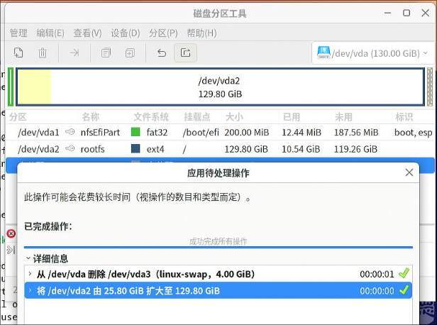

Install packages:     

```
sudo vim /etc/dpkg/dpkg.cfg
sudo apt install -y iotop vim nethogs s-tui lxc lxc-templates lxcfs smplayer
cd debs/
sudo apt install ./libvirt0_7.0.0-3+deb11u3_arm64.deb ./libvirt-daemon_7.0.0-3+deb11u3_arm64.deb ./libvirt-daemon-driver-lxc_7.0.0-3+deb11u3_arm64.deb ./libvirt-daemon-driver-qemu_7.0.0-3+deb11u3_arm64.deb ./libvirt-daemon-system_7.0.0-3+deb11u3_arm64.deb ./libvirt-clients_7.0.0-3+deb11u3_arm64.deb ./libvirt-daemon-system-systemd_7.0.0-3+deb11u3_all.deb  ./libvirt-daemon-config-network_7.0.0-3+deb11u3_all.deb ./libvirt-daemon-config-nwfilter_7.0.0-3+deb11u3_all.deb 
```

### 3. arm64(debian11) libvirt building
Download iso:     

```
wget https://cdimage.debian.org/cdimage/archive/11.11.0/arm64/iso-dvd/debian-11.11.0-arm64-DVD-1.iso
```
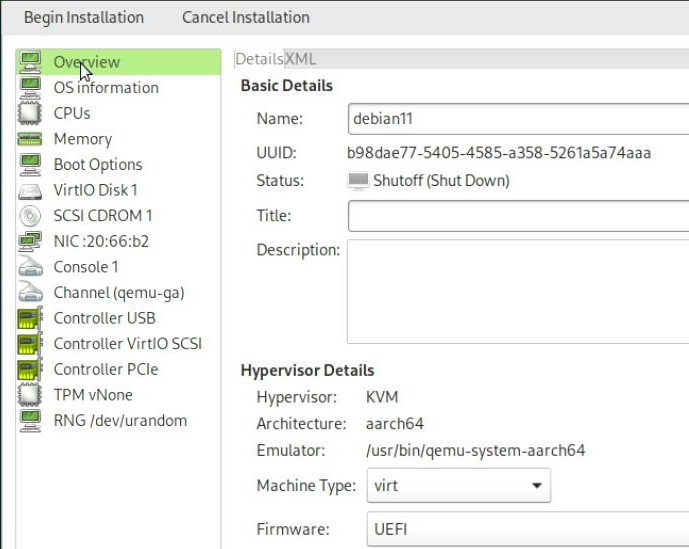

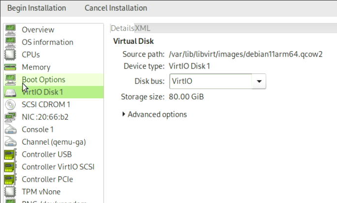

make secure boot off:    

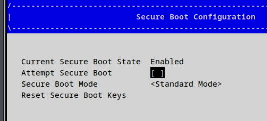

Automatically retrieve file(so you need to unplugin the ethernet for speedup ):     

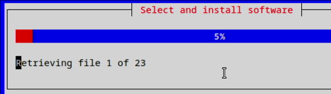

```
root@debian:/home/test# cat /etc/apt/sources.list
# 默认注释了源码仓库，如有需要可自行取消注释
deb http://mirrors.ustc.edu.cn/debian bullseye main contrib non-free
deb-src http://mirrors.ustc.edu.cn/debian bullseye main contrib non-free
deb http://mirrors.ustc.edu.cn/debian bullseye-updates main contrib non-free
deb-src http://mirrors.ustc.edu.cn/debian bullseye-updates main contrib non-free
# apt update -y && apt install -y vim build-essential pbuilder
# 
```
### 4. arm64 images building
Create 5 disks:     

```
 qemu-img create -f raw kylinarm30g.img 30G
 qemu-img create -f raw uosarm30g.img 30G
 qemu-img create -f raw zkfdarm30g.img 30G
 qemu-img create -f raw debianarm30g.img 30G
 qemu-img create -f raw ubuntu2204arm30g.img 30G
```
#### 4.1 zkfdarm30g    
libvirt info:    

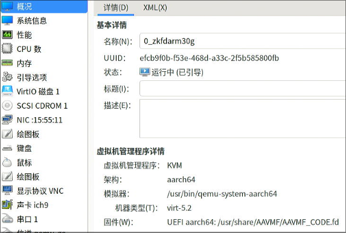

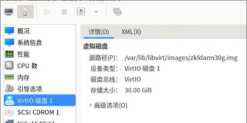

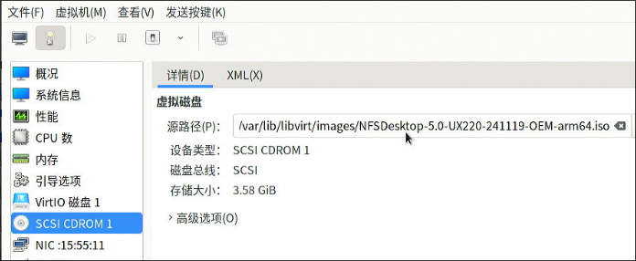

Disable screensave, lock, enable ssh

```
$ sudo vim /etc/default/grub
GRUB_CMDLINE_LINUX_DEFAULT="quiet splash net.ifnames=0 biosdevname=0 ipv6.disable=1"
$ sudo update-grub2
$ sudo vim /etc/selinux/config
disable selinux
$ vim /etc/systemd/network/05-eth0.network 
[Match]
Name=eth0

[Network]
DHCP=yes
$ sudo systemctl disable NetworkManager
$ sudo systemctl mask NetworkManager
$ sudo systemctl enable systemd-networkd
$ sudo vim /etc/lightdm/lightdm.conf
minimum-vts=8

```
audio related:    

```
test@zkfd30g:~$ id test
用户id=1000(test) 组id=1001(test) 组=1001(test),24(cdrom),25(floppy),27(sudo),29(audio),30(dip),44(video),46(plugdev),109(netdev),118(bluetooth),123(scanner),124(lpadmin),130(sambashare)
test@zkfd30g:~$ sudo su
root@zkfd30g:/home/test#  usermod -aG audio test
 usermod -aG audio root
 usermod -aG pulse test
 usermod -aG pulse-access test
root@zkfd30g:/home/test# id test
用户id=1000(test) 组id=1001(test) 组=1001(test),24(cdrom),25(floppy),27(sudo),29(audio),30(dip),44(video),46(plugdev),109(netdev),118(bluetooth),123(scanner),124(lpadmin),128(pulse),129(pulse-access),130(sambashare)

$ cat /etc/pulse/default.pa 
load-module module-alsa-card device_id=0
load-module module-alsa-card device_id=1

```
remove kbd:    

```
sudo apt remove xserver-xorg-input-kbd
```
shutdown the vm.    
#### 4.2 uosarm30g    
libvirt info:    

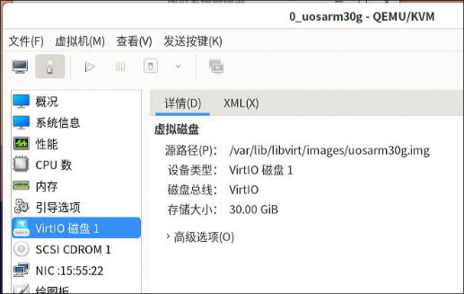

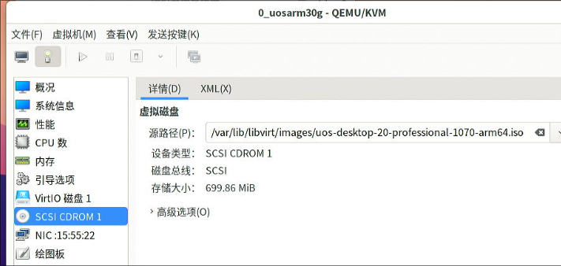

Install with kernel5.10 support     


Use rambuf:    

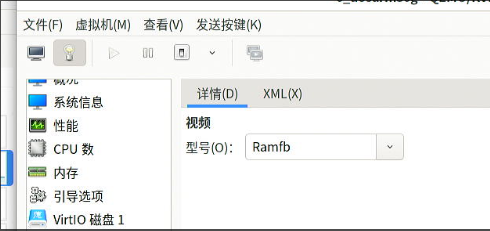

Disable :   

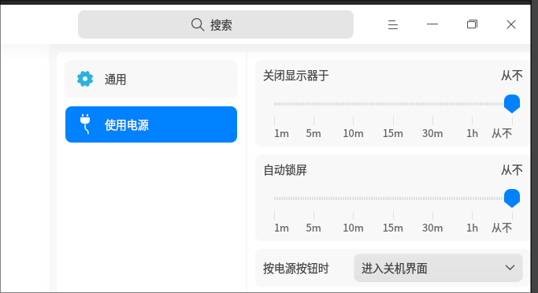

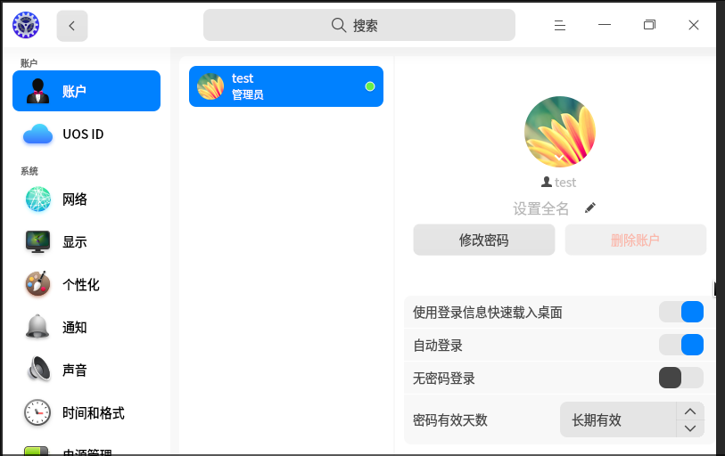

ssh-keygen:   

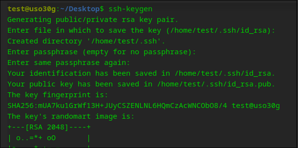

Inject the ssh key into /root/.ssh/.    

```
apt update -y
apt install -y xserver-xorg-input-evdev smplayer
vim /etc/default/grub
update-grub2 
dpkg -l | grep apparmor
vim /etc/selinux/config 
vim /etc/systemd/network/05-eth0.network
systemctl disable NetworkManager
systemctl mask NetworkManager
systemctl enable systemd-networkd
vim /etc/lightdm/lightdm.conf 
sudo su
usermod -aG audio test
 usermod -aG audio root
 usermod -aG pulse test
 usermod -aG pulse-access test
vim /etc/pulse/default.pa 
```

#### 4.3 kylinarm30g    
libvirt info:    

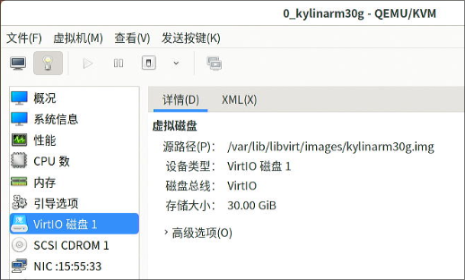

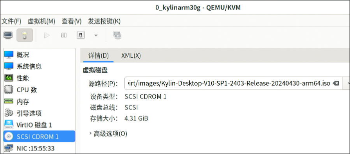

```
$ sudo apt install -y openssh-server
```
Disable security related:    

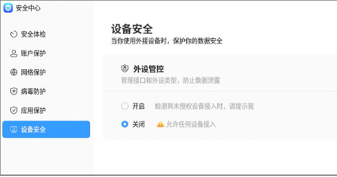

Disable screensaver, lock, related.   

```
$ setstatus disable -p
$ sudo vim /etc/default/grub
GRUB_CMDLINE_LINUX_DEFAULT="quiet splash loglevel=0 net.ifnames=0 biosdevname=0 ipv6.disable=1"
GRUB_CMDLINE_LINUX=""
GRUB_CMDLINE_LINUX_SECURITY=""

$ cat /etc/lightdm/lightdm.conf
[LightDM]
minimum-vt=8
[SeatDefaults]

$ sudo vim /etc/systemd/network/05-eth0.network
$ sudo systemctl disable NetworkManager
$ sudo systemctl mask NetworkManager
$ sudo systemctl enable systemd-networkd
$ sudo su
 usermod -aG audio test
 usermod -aG audio root
 usermod -aG pulse test
 usermod -aG pulse-access test
$ cat /etc/pulse/default.pa 
load-module module-alsa-card device_id=0
load-module module-alsa-card device_id=1
```
Downgrade xorg-video-all, install input-evdev:     

```
$ sudo vim /etc/apt/sources.list
...


# 默认注释了源码仓库，如有需要可自行取消注释
deb https://mirrors.ustc.edu.cn/ubuntu-ports/ focal main restricted universe multiverse
# deb-src https://mirrors.ustc.edu.cn/ubuntu-ports/ focal main restricted universe multiverse

deb https://mirrors.ustc.edu.cn/ubuntu-ports/ focal-security main restricted universe multiverse
# deb-src https://mirrors.ustc.edu.cn/ubuntu-ports/ focal-security main restricted universe multiverse

deb https://mirrors.ustc.edu.cn/ubuntu-ports/ focal-updates main restricted universe multiverse
# deb-src https://mirrors.ustc.edu.cn/ubuntu-ports/ focal-updates main restricted universe multiverse

deb https://mirrors.ustc.edu.cn/ubuntu-ports/ focal-backports main restricted universe multiverse


$ sudo apt install xserver-xorg-video-all=1:7.7+19ubuntu14
$  sudo apt install -y xserver-xorg-input-evdev
```
#### 4.4 debianarm30g    
libvirt info:    

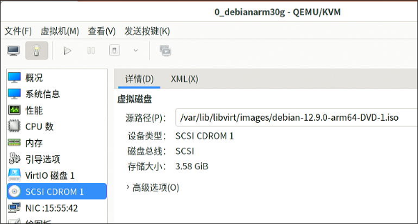

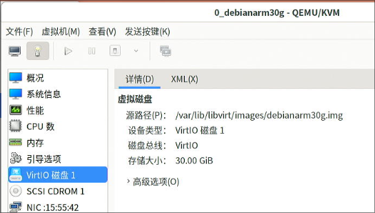

Changes to rambuf.   

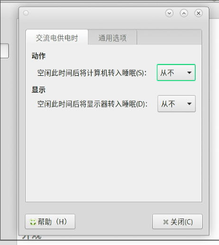

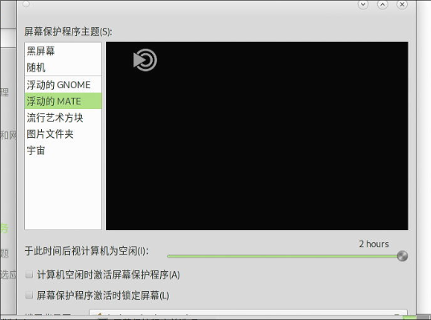

```
# apt install -y vim smplayer glmark2 xserver-xorg-video-amdgpu firmware-amd-graphics xserver-xorg-input-evdev
# vim /etc/lightdm/lightdm.conf
minimum-vt=8
...
autologin-user=test
autologin-user-timeout=0
#autologin-in-background=false
autologin-session=mate
# sudo su
usermod -aG audio test
 usermod -aG audio root
 usermod -aG pulse test
 usermod -aG pulse-access test
# vim /etc/pulse/default.pa
...
# vim /etc/default/grub
# update-grub2 
# vim /etc/systemd/network/05-eth0.network
# systemctl disable NetworkManager
# systemctl mask NetworkManager
# systemctl enable systemd-networkd

```
#### 4.5 ubuntu2204arm30g    
libvirt info:    

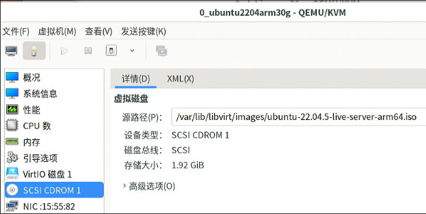

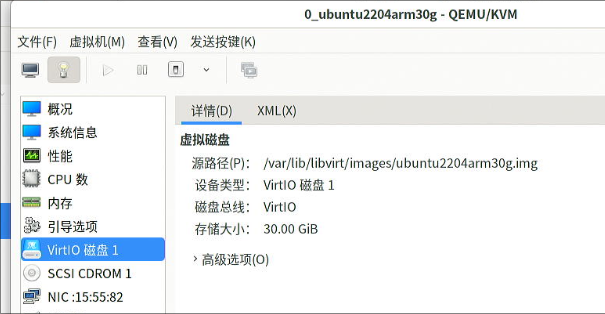

```
sudo apt update -y && sudo apt upgrade -y
sudo apt install -y mate-desktop-environment-core mate-desktop-environment mate-desktop-environment-extras lightdm
sudo systemctl set-default graphical.target
sudo vim /etc/lightdm/lightdm.conf
sudo reboot
```

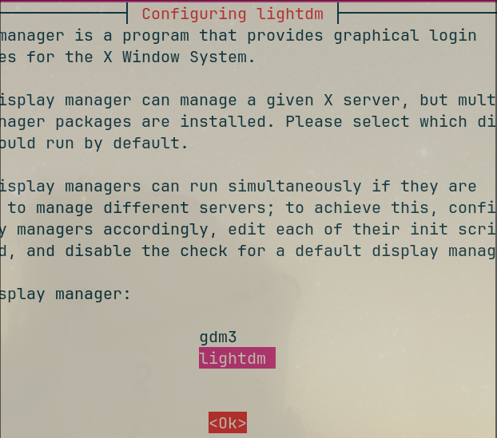

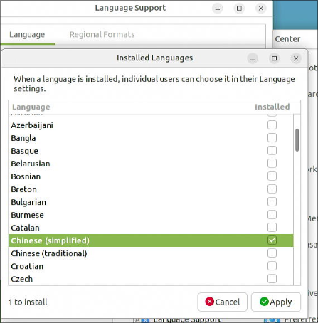

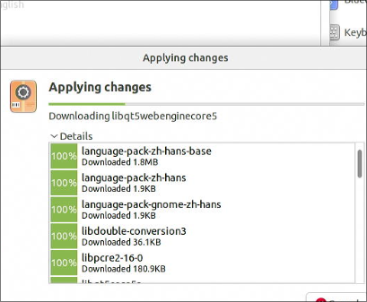

Change language:    

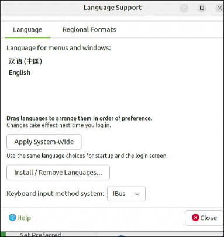

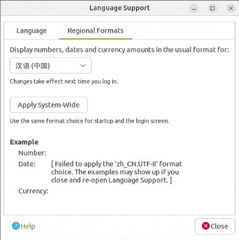

```
sudo apt install -y fonts-wqy-microhei fonts-wqy-zenhei xfonts-wqy smplayer glmark2
```
Install firefox, download it from nightly build, and create shortcuts.    

```
     vim /etc/pulse/default.pa
     apt install xserver-xorg-input-evdev
 sudo vim /etc/default/grub
 sudo update-grub2 
 sudo ufw disable
 sudo systemctl disable apparmor
 sudo apt remove --purge apparmor
 sudo vim /etc/systemd/network/05-eth0.network
 sudo systemctl disable NetworkManager
 sudo systemctl mask NetworkManager
 sudo systemctl enable systemd-networkd

add test to several groups.   
```    

### 5. ybd worktips

