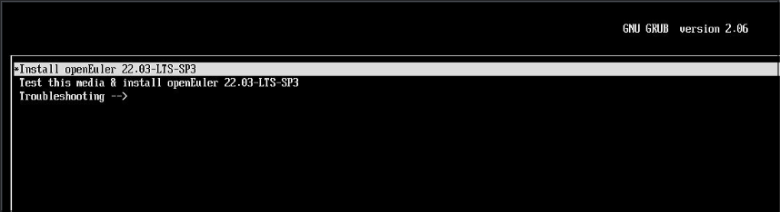
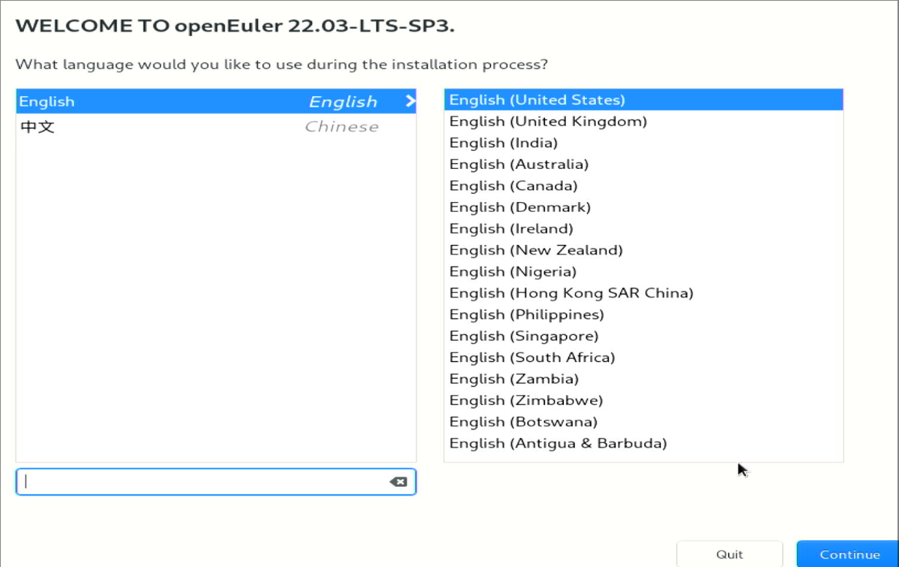
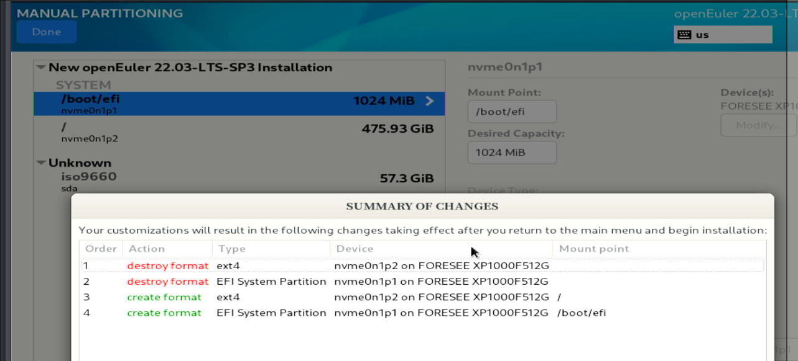
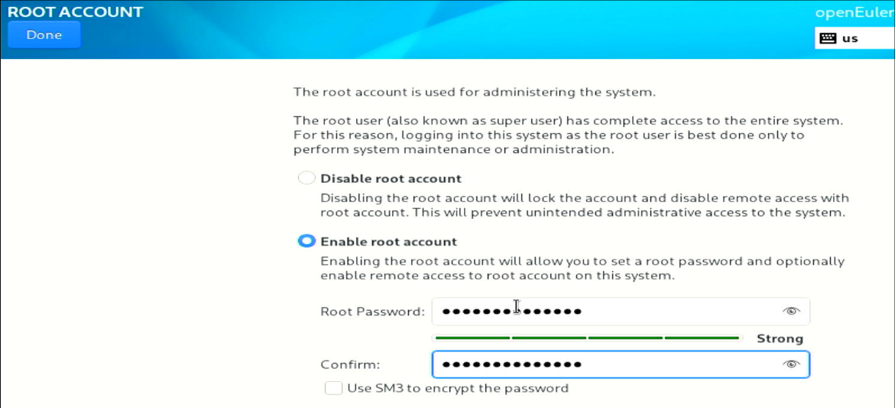
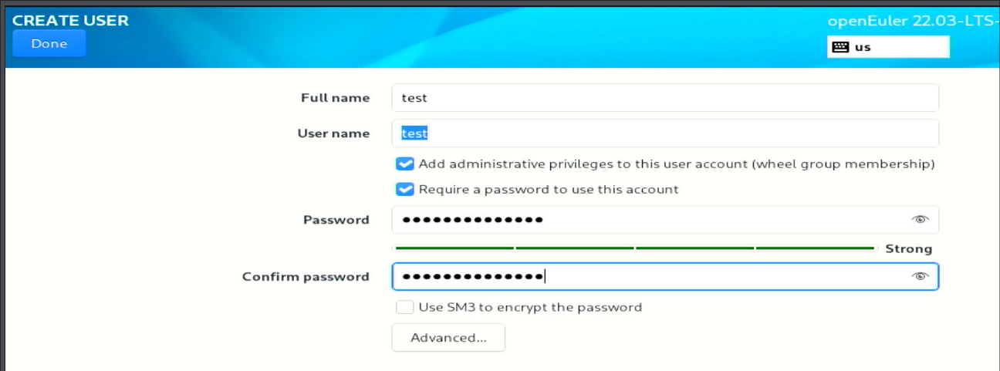
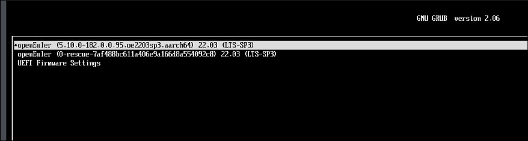

# 20250305
### 1. docker related
Build kbox steps:     

```
cd /home/
cd auto_compile/
apt update -y
apt install -y vim
apt install -y build-essential openssh-client
apt install -y wget
wget https://mirrors.huaweicloud.com/kunpeng/archive/kunpeng_solution/ARMNative/BoostKit24.0.0_Demo/Kbox_Demo/Kbox-AOSP11.zip
apt install -y unzip sudo
unzip Kbox-AOSP11.zip 
cd Kbox-AOSP11
cd /home/auto_compile/Kbox-AOSP11/make_img_sample/kbox11_android_build
vim kbox11_android_build.sh 
DNS=223.5.5.5
cd /home/auto_compile/Kbox-AOSP11/make_img_sample/kbox11_android_build
mkdir -p package
# ls /root/kbox/
BoostKit-kbox_6.0.0_11.zip       Kbox-AOSP11.zip         libva-2.14.0.tar.gz     mesa-22.1.7.tar.xz   patchForExagear.zip
ExaGear_ARM32-ARM64_V2.5.tar.gz  drm-libdrm-2.4.111.zip  llvm-13.0.1.src.tar.xz  meson-0.63.2.tar.gz  vmi-CloudPhone.zip
```

### 2. openeuler 22.03-sp3





reformat:    





create user:    



After installation:    



```
# vi /etc/default/grub
cgroup_enable=memory swapaccount=1
# grub2-mkconfig -o /boot/efi/EFI/openEuler/grub.cfg
# vi /etc/selinux/config 
disabled
# echo "fs.inotify.max_user_instances=8192" >> /etc/sysctl.conf
# sudo sed -e 's|http://repo.openeuler.org/|https://mirrors.ustc.edu.cn/openeuler/|g' \
         -e 's|https://mirrors.openeuler.org/|https://mirrors.ustc.edu.cn/openeuler/|g' \
         -i.bak \
         /etc/yum.repos.d/openEuler.repo
# yum install -y make dpkg dpkg-devel openssl openssl-devel ncurses ncurses-devel bison flex bc libdrm build elfutils-libelf-devel patch gcc
```
Kernel should downloaded from:    

```
https://gitee.com/openeuler/kernel/repository/archive/5.10.0-182.0.0.zip
```
