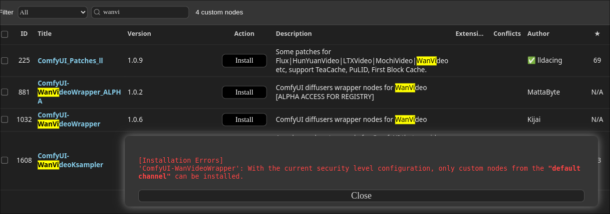
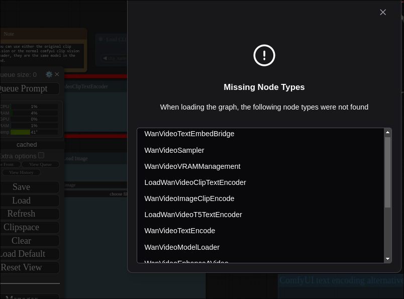
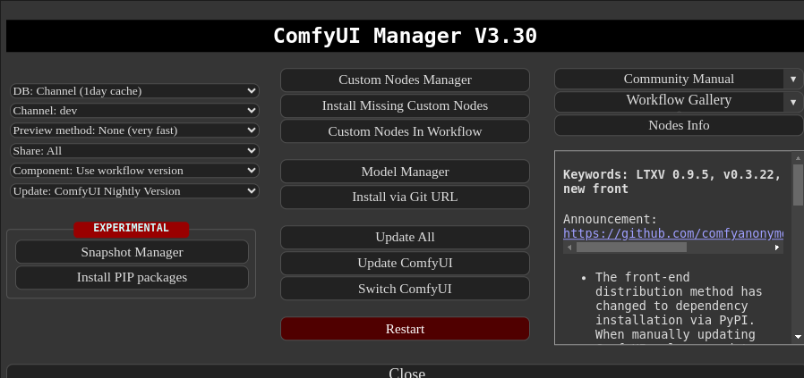

# 20250306
### 1. openEuler kernel building
Get files:     

```
https://mirrors.ustc.edu.cn/kernel.org/linux/kernel/firmware/linux-firmware-20210919.tar.gz
kernel-5.10.0-182.0.0.zip
ExaGear_ARM32-ARM64_V2.5.tar.gz
```
Install kernel:     

```
[root@phone openEuler_deploy]# ./kbox_install_kernel.sh /root/patch/

```

### 2. ollama listening port
Change to listening on `0.0.0.0`:     

```
dash@ai:~$ sudo vim /etc/systemd/system/ollama.service 
...
[Service]
Environment="OLLAMA_HOST=0.0.0.0"
ExecStart=/usr/local/bin/ollama serve

...
$ sudo systemctl daemon-reload
$ sudo systemctl restart ollama
```

### 3. comfyui wan2.1



Solved via:    

```
dash@ai:~/Code/Comfy/ComfyUI$ vim ./user/default/ComfyUI-Manager/config.ini
...
security_level = weak

...

```
workflow:    

```
https://github.com/kijai/ComfyUI-WanVideoWrapper/blob/main/example_workflows/wanvideo_480p_I2V_example_02.json

```



too many missing nodes.    



channel should be dev channel.   


Refers to :    `https://www.youtube.com/watch?v=gdoRVlJH218`
### 4. comfyui update 
update failed, but you could re update via:      

```
python custom_nodes/ComfyUI-Manager/cm-cli.py update all 
```
