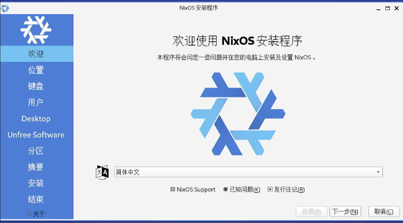
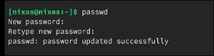

# 20250310
### 1. nixos x86
Get the installation iso:     

```
axel https://mirrors.tuna.tsinghua.edu.cn/nixos-images/nixos-24.11/latest-nixos-gnome-x86_64-linux.iso
axel https://mirrors.tuna.tsinghua.edu.cn/nixos-images/nixos-24.11/latest-nixos-minimal-x86_64-linux.iso; axel https://mirrors.tuna.tsinghua.edu.cn/nixos-images/nixos-24.11/latest-nixos-gnome-aarch64-linux.iso; axel https://mirrors.tuna.tsinghua.edu.cn/nixos-images/nixos-24.11/latest-nixos-minimal-aarch64-linux.iso
```
Write iso to disk.     

Installation cdrom is gnome based:    



Open the terminal and change the passwd for nixos user:     




```
# cat parted.sh
parted /dev/nvme0n1 -- mklabel gpt
parted /dev/nvme0n1 -- mkpart ESP fat32 1MB 512MB
parted /dev/nvme0n1 -- mkpart primary 512MB -2GB
parted /dev/nvme0n1 -- mkpart swap linux-swap -2GB 100%
parted /dev/nvme0n1 -- set 1 esp on
 
mkfs.fat -F 32 -n boot /dev/nvme0n1p1
mkfs.btrfs -L NIXOS /dev/nvme0n1p2
mkswap -L swap /dev/nvme0n1p3
# ./parted.sh
# lsblk
...
nvme0n1     259:0    0 953.9G  0 disk 
├─nvme0n1p1 259:1    0   487M  0 part 
├─nvme0n1p2 259:2    0 951.5G  0 part 
└─nvme0n1p3 259:3    0   1.9G  0 part
```

### 2. redsocks related
Generate the chnroute.txt:    

```
curl 'http://ftp.apnic.net/apnic/stats/apnic/delegated-apnic-latest' | grep ipv4 | grep CN | awk -F\| '{ printf("%s/%d\n", $4, 32-log($5)/log(2)) }' > chnroute.txt
```
The content of `redsocks.sh` is listed:      

```
#! /bin/sh

case "$1" in
  start|"")
    cd /home/nixos/redsocks
    if [ -e redsocks.log ] ; then
      rm redsocks.log
    fi
    redsocks -p /home/nixos/redsocks/redsocks.pid #set daemon = on in config file
    # start redirection
    #iptables -t nat -A OUTPUT -d 192.168.0.0/16 -j RETURN
    #iptables -t nat -A OUTPUT -d 10.10.0.0/16 -j RETURN
    #iptables -t nat -A OUTPUT -p tcp --dport 80 -j REDIRECT --to 12345
    #iptables -t nat -A OUTPUT -p tcp --dport 443 -j REDIRECT --to 12345
    # Create new chain
    iptables -t nat -N REDSOCKS

    # Ignore LANs and some other reserved addresses.
    iptables -t nat -A REDSOCKS -d 0.0.0.0/8 -j RETURN
    iptables -t nat -A REDSOCKS -d 10.0.0.0/8 -j RETURN
    iptables -t nat -A REDSOCKS -d 100.64.0.0/10 -j RETURN
    iptables -t nat -A REDSOCKS -d 127.0.0.0/8 -j RETURN
    iptables -t nat -A REDSOCKS -d 169.254.0.0/16 -j RETURN
    iptables -t nat -A REDSOCKS -d 172.16.0.0/12 -j RETURN
    iptables -t nat -A REDSOCKS -d 192.168.0.0/16 -j RETURN
    iptables -t nat -A REDSOCKS -d 198.18.0.0/15 -j RETURN
    iptables -t nat -A REDSOCKS -d 224.0.0.0/4 -j RETURN
    iptables -t nat -A REDSOCKS -d 240.0.0.0/4 -j RETURN
    
    # Anything else should be redirected to port 12345
    iptables -t nat -A REDSOCKS -p tcp -j REDIRECT --to-ports 12345
    ;;

  stop)
    cd /home/nixos/redsocks
    if [ -e redsocks.pid ]; then
      kill `cat redsocks.pid`
      rm redsocks.pid
    else
      echo already killed, anyway, I will try killall
      killall -9 redsocks
    fi
    # stop redirection
    #iptables -t nat -F OUTPUT
    iptables -t nat -F REDSOCKS
    ;;

  start_ssh)
    #ssh -NfD 1234 user@example.cc #TODO: change it!!!
    ssh -NfD 1234 544644af4382ec37bc0009da@weatherapp-kkkttt.rhcloud.com
    ;;

  stop_ssh)
    ps aux|grep "ssh -NfD 1234"|awk '{print $2}'|xargs kill
    ;;

  clean_dns)
    iptables -A INPUT -p udp --sport 53 -m state --state ESTABLISHED -m gfw -j DROP -m comment --comment "drop gfw dns hijacks"
    ;;

  *)
    echo "Usage: redsocks start|stop|start_ssh|stop_ssh|clean_dns" >&2
    exit 3
    ;;
esac
```
the redsocks environment could be activated via:     

```
nix-shell -p redsocks
```
After start redsocks, do following for adding rules:     

```
cat /home/nixos/chnroute.txt | xargs -I % iptables -t nat -A REDSOCKS -d % -j RETURN
```
