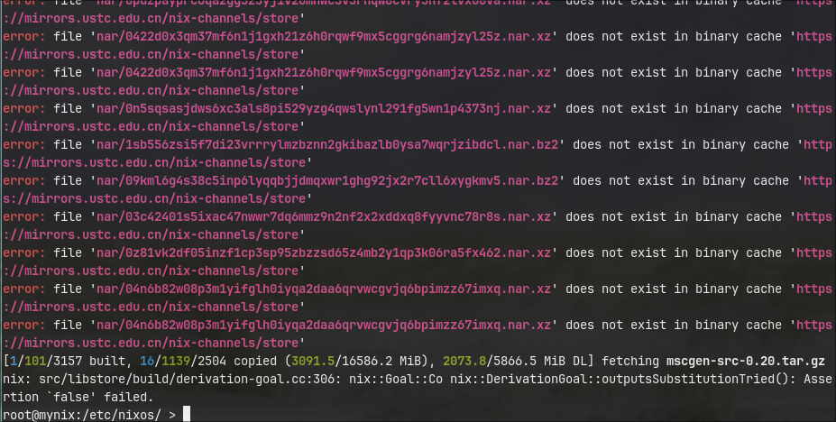
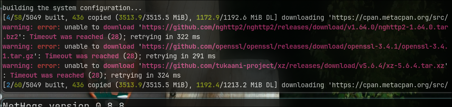
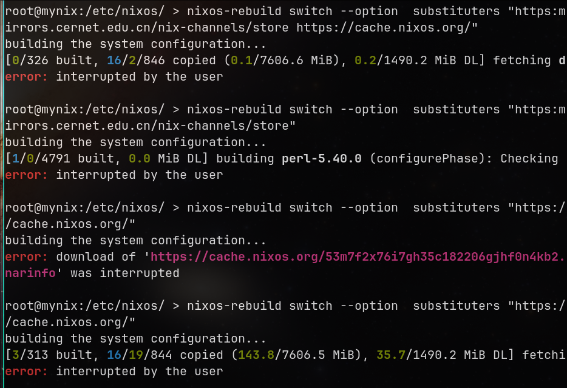
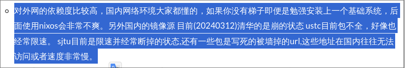

# 20250312
### 1. disable ipv6(linux)
via:     

```
sysctl -w net.ipv6.conf.all.disable_ipv6=1
sysctl -w net.ipv6.conf.default.disable_ipv6=1
```

### 2. quick-setup nixos
via selecting the correct store channel(almost all of the pkgs are fetched from cache), we will get quick setup.   

```
nix-channel --add https://mirrors.ustc.edu.cn/nix-channels/nixpkgs-unstable nixpkgs
nix-channel --add https://mirrors.ustc.edu.cn/nix-channels/nixos-24.11 nixos
nix-channel --list
nix-channel --update
nixos-generate-config --root /mnt
vim /mnt/etc/nixos/configuration.nix
nixos-install --show-trace --option substituters https://mirrors.ustc.edu.cn/nix-channels/store
```
Reboot, introducing `/etc/nixos/flake.nix<home.nix>`, then :     

```
nixos-rebuild switch --option  substituters https://mirrors.ustc.edu.cn/nix-channels/store
```
Issue:    





Solved via(cross-gfw):     

```
dash@mynix:~/ > scp dash@192.168.1.210:~/nix_redsocks.tar.gz .
nix_redsocks.tar.gz                                                              100%   27KB   3.1MB/s   00:00    
dash@mynix:~/ > tar xzvf nix_redsocks.tar.gz 
redsocks/
redsocks/redsocks.sh
redsocks/redsocks.conf
redsocks/chnroute.txt
redsocks/redsocks.pid
dash@mynix:~/ > sudo su
root@mynix:/home/dash/ > cd redsocks 
root@mynix:/home/dash/redsocks/ > ./redsocks.sh start
root@mynix:/home/dash/redsocks/ > cat chnroute.txt| xargs -I % iptables -t nat -A OUTPUT -d % -j RETURN
```
Then re-launch the rebuild script, notice should choose cernet:    

```
nixos-rebuild switch --option  substituters https://mirrors.cernet.edu.cn/nix-channels/store
```

Difference:    



reason:   



Change to correct repository:     

```
sudo nixos-rebuild switch --option substituters  "https://mirrors.sjtug.sjtu.edu.cn/nix-channels/store"
```

### 3. dual vms in i9
Ignore, for no reason to do this.   
