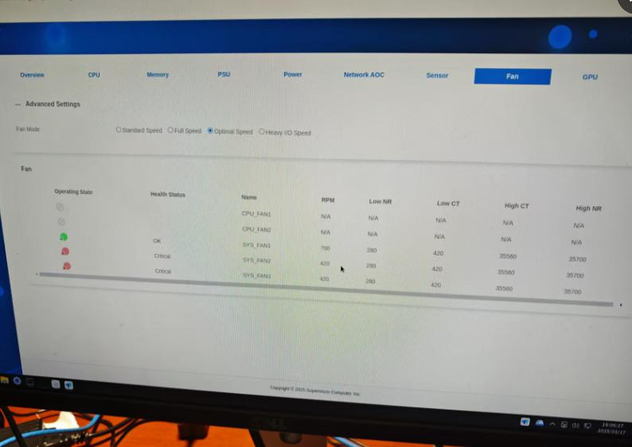

# 20250317
### 1. graphical setup for xxxOS
repo position:     

```
# cat /etc/yum.repos.d/ctyunos.repo 
[everything]
name=CTyunOS - everything
baseurl=http://repo.ctyun.cn/hostos/ctyunos-2.0.1/everything/$basearch/
enabled=1
gpgcheck=
```
### 2. fan speed for tower
Still the same when you changed in i9 server.  
 


### 3. integrate conky into awesome
my conky configuration:      

```
conky.config = {
    xinerama_head = 2,
    alignment = 'top_right',
    use_xft = true,
    xftalpha = 0.8,
    font = 'Noto:normal:size=8',
    text_buffer_size = 2048,
    update_interval = 1.0,
    total_run_times = 0,
    background = true,
    double_buffer = true,
    no_buffers = true,
    imlib_cache_size = 0,
    cpu_avg_samples = 2,
    own_window = true,
    own_window_class = 'Conky',
    own_window_argb_visual = true,
    own_window_argb_value = 50,
    own_window_transparent = false,
    own_window_type = 'override',
    own_window_hints = 'undecorated,below,skip_taskbar,sticky,skip_pager',
    own_window_colour = '000000',
    draw_shades = no,
    default_shade_color = '000000',
    draw_outline = yes,
    default_outline_color = '000000',
    draw_borders = false,
    border_width = 2,
    gap_x = 5,
    gap_y = 30,
    minimum_height = 0,
    minimum_width = 0,
    draw_graph_borders = true,
    show_graph_scale = yes,
    show_graph_range = yes,
    short_units = yes,
    override_utf8_locale = yes,
    format_human_readable = yes,
    uppercase = no,
    default_color = 'ffffff',
    color1 = '22b4ac',
    color2 = '8308FF',
    color3 = '83FF08',
    color4 = '0883FF',
    color5 = 'FF0883',
    color6 = 'FF8308',
    color7 = '000000',
    use_spacer = none,
}
conky.text = [[
# day/time
${font Noto:normal:size=9}${goto 5}Date:${color3}${goto 50}${time %d %b %Y}${color}${goto 165}Up:${color3}${alignr 5}$uptime
${goto 5}${color}Kernel:${goto 60}${color3}${kernel}${color}${alignr 5}Host: ${color3}${exec hostname}
#Processor section
${color2}${hr}${color}
${color3}${font Noto:normal:size=9}${goto 5}${exec cat /proc/cpuinfo|grep 'model name'|sed -e 's/model name.*: //'| uniq }${color} @ ${color3}${freq_g 1}GHz${color}${alignr -5}Mode: ${color3}${exec cat /sys/devices/system/cpu/cpu1/cpufreq/scaling_governor | awk '{print $1}'}${color}
${color}${font}${goto 5}Avg CPU Load: ${color6}${cpu cpu0}% ${alignr 5}${color4}${cpubar cpu0 10,145}
${goto 10}${color7}${cpugraph cpu0 20,255 83FF08 FF0883 -t}
#${goto 5}${color}Current Vcore: ${color6}${execi 1 sensors | grep 'Vcore' | cut -c 27-35} ${alignr 5}${color}Max Vcore: ${color1}${execi 1 sensors | grep 'Vcore' | cut -c 61-67}
#
#Cores
${font Noto:normal:size=8}${goto 5}${color}C1/T1: ${color6}${cpu cpu1}% ${goto 75}${color4}${cpubar cpu1 10,55} ${goto 145}${color}C1/T2: ${color6}${cpu cpu2}% ${goto 215}${color4}${cpubar cpu2 10,55}
${goto 10}${color7}${cpugraph cpu1 20,110 83FF08 FF0883 -t} ${alignr 10}${color7}${cpugraph cpu2 20,110 83FF08 FF0883 -t}
${color}${goto 5}C2/T1: ${color6}${cpu cpu3}% ${goto 75}${color4}${cpubar cpu3 10,55} ${goto 135}${color}${goto 145}C2/T2: ${color6}${cpu cpu4}% ${goto 215}${color4}${cpubar cpu4 10,55}
${goto 10}${color7}${cpugraph cpu3 20,110 83FF08 FF0883 -t} ${alignr 10}${color7}${cpugraph cpu4 20,110 83FF08 FF0883 -t}
#
#Thermal
${color}${goto 10}C1 Thermal: ${color6}${exec sensors|grep 'Core 0'|awk '{print $3}'}${goto 160}${color}C2 Thermal: ${color6}${exec sensors|grep 'Core 1'|awk '{print $3}'}
${color7}${goto 10}${execigraph 1 "sensors|grep 'Core 0'| cut -c 17-20" 20,110 83FF08 FF0883 -t} ${alignr 10}${execigraph 1 "sensors|grep 'Core 1'| cut -c 17-20" 20,110 83FF08 FF0883 -t}
${color}${goto 10}C3 Thermal: ${color6}${exec sensors|grep 'Core 2'|awk '{print $3}'}${goto 160}${color}C4 Thermal: ${color6}${exec sensors|grep 'Core 3'|awk '{print $3}'}
${color7}${goto 10}${execigraph 1 "sensors|grep 'Core 2'| cut -c 17-20" 20,110 83FF08 FF0883 -t} ${alignr 10}${execigraph 1 "sensors|grep 'Core 3'| cut -c 17-20" 20,110 83FF08 FF0883 -t}
#
#
# top processes
${color3}${goto 10}${top name 1}${alignr 10}${color3}${top cpu 1}%
${color}${goto 10}${top name 2}${alignr 10}${color6}${top cpu 2}%
${color}${goto 10}${top name 3}${alignr 10}${color6}${top cpu 3}%
#
#
${color2}${hr}${color}
# top memory
${goto 10}${color}Current RAM Usage: ${alignr 10}${color6}${mem} - ${memperc}%
${goto 10}${color7}${memgraph 20,110 83FF08 FF0883 -t}${alignr 10}${color4}${membar 20,110}
${goto 10}${color}Current SWAP Usage: ${alignr 10}${color6}${swap} - ${swapperc}%
${goto 10}${color7}${execgraph "top -b -n1 | grep -e Swap | cut -c 44-49 | sed 's/$/\/8192/' | bc -l | cut -c 1-4 | sed 's/$/*100/' | bc | cut -c 1-2" 20,110 83FF08 FF0883 -t}${alignr 10}${color4}${swapbar 20,110}
${goto 10}${color3}${top_mem name 1}${alignr 10}${color3}${top mem 1}%
${color}${goto 10}${top_mem name 2}${alignr 10}${color6}${top mem 2}%
${color}${goto 10}${top_mem name 3}${alignr 10}${color6}${top mem 3}%
#
#
# GPU Section
${color2}${hr}
##------------Card1-------------##
${color}${alignc}${font Noto:normal:size=9}iGPU: ${color3}${exec lspci | grep VGA | cut -c 36-68}${font}${color}
${color}${goto 10}GPU Spd: ${color6}${execi 1 "cat /sys/class/drm/card1/gt_cur_freq_mhz"}MHz${alignr 10}${color}Max GPU Spd: ${color6}${exec cat /sys/class/drm/card1/gt_max_freq_mhz}MHz
${color7}${goto 5}${execigraph 1 "cat /sys/class/drm/card1/gt_cur_freq_mhz | sed 's/$/\/1100/' | bc -l | sed 's/$/*100/' | bc | cut -c 1-2" 20,265 83FF08 FF0883 -t}
#
#
#network
${color2}${hr}${color}
${color}${font}${goto 10}Internal IP: ${color6}${alignr 10}${addr eth0}
${font}${goto 10}${color}Up Spd:   ${color6}${upspeed }${goto 140}${color}Down Spd: ${alignr 10}${color6}${downspeed eth0}
${color}${goto 10}Total Up: ${color6}${totalup }${goto 140}${color}Total Dn: ${alignr 10}${color6}${totaldown eth0}
${goto 10}${color7}${upspeedgraph  20,110 83FF08 FF0883 -t}${alignr 10}${color7}${downspeedgraph eth0 20,110 83FF08 FF0883 -t}
${color}${font}${goto 10}Internal IP: ${color6}${alignr 10}${addr eth1}
${font}${goto 10}${color}Up Spd:   ${color6}${upspeed }${goto 140}${color}Down Spd: ${alignr 10}${color6}${downspeed eth1}
${color}${goto 10}Total Up: ${color6}${totalup }${goto 140}${color}Total Dn: ${alignr 10}${color6}${totaldown eth1}
${goto 10}${color7}${upspeedgraph  20,110 83FF08 FF0883 -t}${alignr 10}${color7}${downspeedgraph eth1 20,110 83FF08 FF0883 -t}
#
#Storage
${color2}${hr}${color}
#${goto 10}${color}Disk I/O Scheduler: ${color2}${alignr 10}${ioscheduler /dev/nvme}
${goto 10}${color}NVME Disk I/O:    
${goto 10}${color}Read: ${color6}${goto 90}${diskio_read nvme0n1}${goto 140}${color}Write: ${color6}${alignr 10}${diskio_write nvme0n1}
${goto 10}${color7}${diskiograph_read /dev/nvme0n1 20,110 83FF08 FF0883 -l -t}${alignr 10}${diskiograph_write /dev/nvme0n1 20,110 83FF08 FF0883 -l -t}
#${goto 10}${color}Sys:      ${alignr 10}${color6}${fs_used /}${color}  /  ${color3}${alignr 10}${fs_size /} ${color6}(${fs_free_perc /}% free)
${goto 10}${color}Home:      ${alignr 10}${color6}${fs_used /home}${color}  /  ${color3}${alignr 10}${fs_size /home} ${color6}(${fs_free_perc /home}% free)
#${alignc}${color}NVME Temp: ${color6}${exec sudo nvme smart-log /dev/nvme0n1 -H | grep 'Temperature Sensor 1' | cut -c 34-38} 
#${goto 10}${color6}
]]

```
Awesome startup tips(add sleep items for delay conky startup):      

```
run_once("sleep 1 && xrandr --output HDMI-1 --mode 1920x1080 --left-of HDMI-2")
run_once("sleep 10 && conky -c /home/dash/.config/awesome/conky_intel.conf")
```
