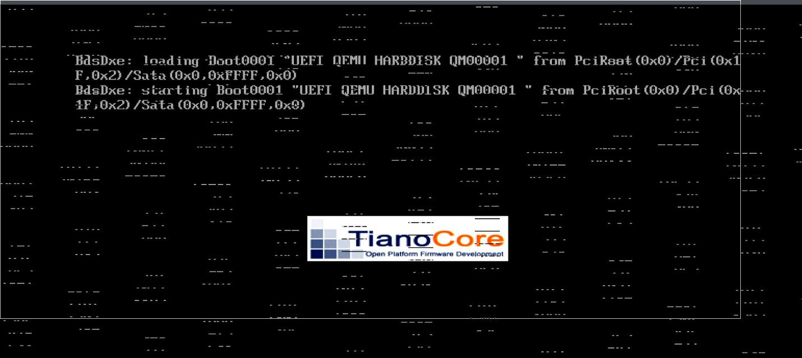

# 20250318
### 1. virtualization(under 22.06)
Commands in xxxOS:    

```
yum install -y virt-manager edk2-ovmf libvirt-client libvirt-daemon-driver-qemu qemu-kvm libvirt-daemon-driver-storage libvirt*
yum install -y ninja-build spice-server-devel SDL2-devel alsa-utils-devel  alsa-utils-devel alsa-utils alsa-lib alsa-lib-devel alsa-tools alsa-tools-devel pulseaudio-libs-dev
grubby --args="iommu=pt amd_iommu=on pcie_acs_override=downstream,multifunction" --update-kernel=ALL
systemctl enable libvirtd --now && reboot
```
After reboot:    

```
# virsh list --all
 Id   名称   状态
-------------------
# grubby --args="vfio-pci.ids=1002:6613,1002:aab0" --update-kernel=ALL
# vim /etc/modprobe.d/vfio.conf
options vfio-pci ids=1002:6611,1002:aab0
# vim /etc/modules-load.d/vfio.conf
vfio-pci
# reboot
```
Now examine the driver status of gpu:     

```
# lspci -vvnn -s 06:00.0 | grep -i 'in use'
	Kernel driver in use: vfio-pci
# lspci -vvnn -s 06:00.1 | grep -i 'in use'
	Kernel driver in use: vfio-pci
```
Build qemu(6.2.0):     

```
wget https://download.qemu.org/qemu-6.2.0.tar.xz
tar cJvf qemu-6.2.0.tar.xz
Build error:      
ERROR: You need at least GCC v7.4 or Clang v6.0 (or XCode Clang v10.0)
```
6.0.0:      

```
 wget https://download.qemu.org/qemu-6.0.0.tar.xz
 tar xJvf qemu-6.0.0.tar.xz 
 cd qemu-6.0.0
./configure --prefix=/opt/local --enable-kvm --disable-xen --enable-libusb --enable-debug-info --enable-debug --enable-sdl --enable-vhost-net --enable-spice --disable-debug-tcg --enable-opengl --enable-gtk --target-list=x86_64-softmmu --audio-drv-list=oss,alsa,pa --enable-usb-redir --enable-spice
make -j16
make install
/opt/local/bin/qemu-system-x86_64 --version
QEMU emulator version 6.0.0
Copyright (c) 2003-2021 Fabrice Bellard and the QEMU Project developers
```

Prepare the disk:     

```
scp little_win10.qcow2  root@192.168.1.70:/var/lib/libvirt/images/
qemu-img create -f qcow2 -b little_win10.qcow2 win10_amd.qcow2
Copy the llllllittle_win10_VARS.fd to :   
cp llllllittle_win10_VARS.fd   /var/lib/libvirt/qemu/nvram/win10amd_VARS.fd
```
Win10amd.xml is fetched from gist, then:     

```
virsh define Win10amd.xml
virsh start win10amd
```
The kernel output:      

```
it pref]
[  921.373281] vfio-pci 0000:06:00.0: BAR 0: can't reserve [mem 0x3fff0000000-0x3ffffffffff 64bit pref]
[  921.373402] vfio-pci 0000:06:00.0: BAR 0: can't reserve [mem 0x3fff0000000-0x3ffffffffff 64bit pref]
[  921.373518] vfio-pci 0000:06:00.0: BAR 0: can't reserve [mem 0x3fff0000000-0x3ffffffffff 64bit pref]
[  921.373634] vfio-pci 0000:06:00.0: BAR 0: can't reserve [mem 0x3fff0000000-0x3ffffffffff 64bit pref]
[  921.373749] vfio-pci 0000:06:00.0: BAR 0: can't reserve [mem 0x3fff0000000-0x3ffffffffff 64bit pref]
[  921.373864] vfio-pci 0000:06:00.0: BAR 0: can't reserve [mem 0x3fff0000000-0x3ffffffffff 64bit pref]
[  921.373979] vfio-pci 0000:06:00.0: BAR 0: can't reserve [mem 0x3fff0000000-0x3ffffffffff 64bit pref]

```
Won't startup:     
 



### 2. enable tips
should add following:       

```
grubby --args="video=efifb:off" --update-kernel=ALL
```
