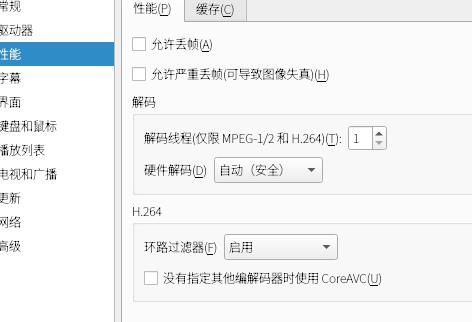
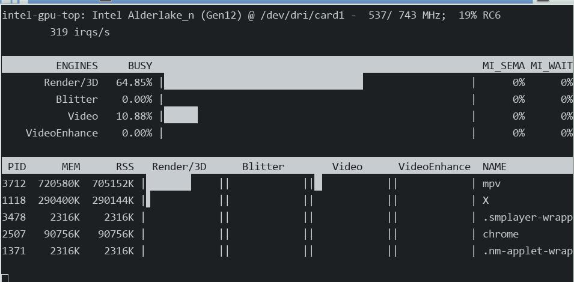

# 20250319
### 1. xxxos 22.06 verification
Fetch the qcow2 file from dual-launch vm.   
### 2. smplayer configuration
hardware decode:    



Video is used:     



### 3. xxxos vmlaunch rescuezilla
Enable the nested hypervisor:     

```
# cat /sys/module/kvm_intel/parameters/nested 
Y
```
TBD in tomorrow.    
### 4. chrome issue(device)
chrome stucks(xrandr shows virtual display):     

```
      services={
          xserver = {
              enable = true;
              videoDrivers = [
             #"intel"
             "intel"
             "modesetting"
             "fbdev"
              ];
              deviceSection = ''
  Option "VirtualHeads" "2"
              ''; 
              exportConfiguration = true
```
Chrome not stucks:    

```
      services={
          xserver = {
              enable = true;
              videoDrivers = [
             #"intel"
             "modesetting"
             "fbdev"
             "intel"
              ];
              deviceSection = ''
  Option "VirtualHeads" "2"
              ''; 
              exportConfiguration = true
```
Solved via(DRI-2):      

```
              deviceSection = ''
  Option "VirtualHeads" "2"
  #Option  "SwapbuffersWait"  "false"
  Option  "DRI" "2"
              ''; 
```
