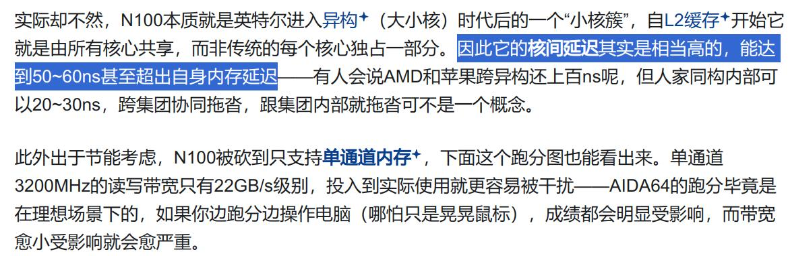
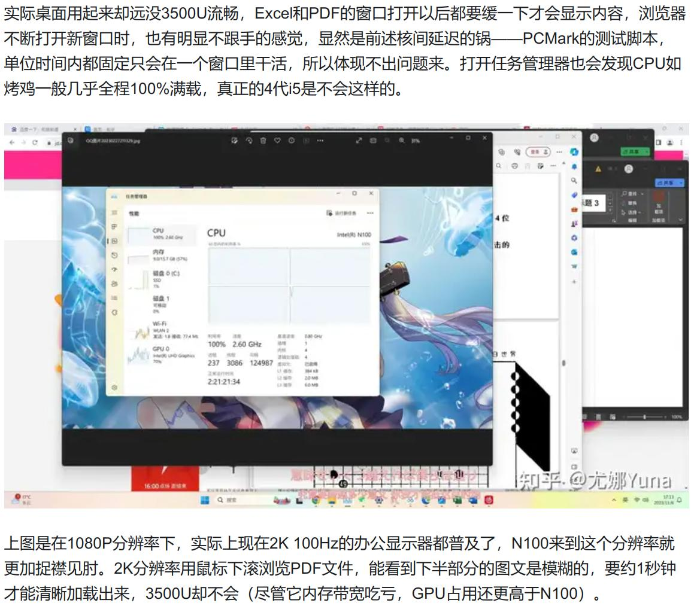
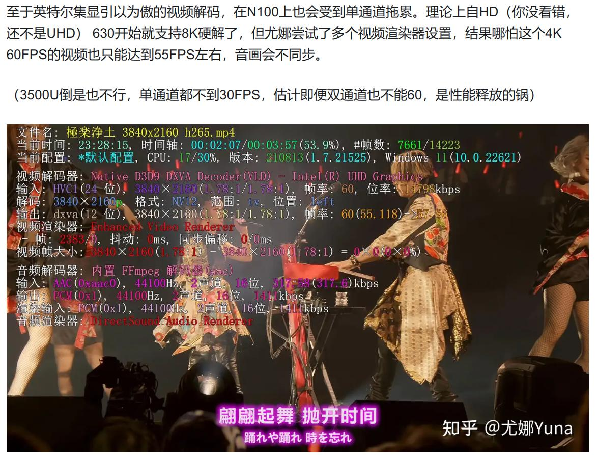

# 20250322
### 1. nixos fcitx5 comparison
sddm:    

| 机型 | 配置 | fcitx5表现 | 视频播放、解码表现 |
| ----------- | ----------- | ------------| --------|
| N100(ADL-N), 32G内存, 双屏1080P | nixos24.11+sddm+awesome  | fcitx5无法在终端模拟器gnome-terminal下输入，在chrome下输入存在漏字现象 | 激活xorg-video-intel后，无法硬件解码，modesetting+fbdev下硬件解码正常 |
| i3-8100, 16G内存， 单屏4K | nixos24.11+sddm+awesome | fcitx5无法在gnome-terminal下输入，chrome下输入正常 | xorg-video-intel下正常|
| NUC11 i7-1165G7, 48G内存, 单屏4K | nixos24.11+sddm+awesome | fcitx5无法在gnome-terminal下输入，chrome下输入正常 | xorg-video-intel下正常|

gdm based:    

| 机型 | 配置 | fcitx5表现 | 视频播放、解码表现 |
| ----------- | ----------- | ------------| --------|
| N100(ADL-N), 32G内存, 双屏1080P | nixos24.11+gdm(xorg)+awesome  | 未验证 | 未验证 |
| i3-8100, 16G内存， 单屏4K | nixos24.11+gdm(xorg)+awesome | fcitx5可在gnome-terminal下输入，chrome下输入正常 | xorg-video-intel下正常|
| NUC11 i7-1165G7, 48G内存, 单屏4K | nixos24.11+gdm(xorg)+awesome | fcitx5可在gnome-terminal下输入，chrome下输入正常 | xorg-video-intel下正常|

### 2. N100 performance issue

