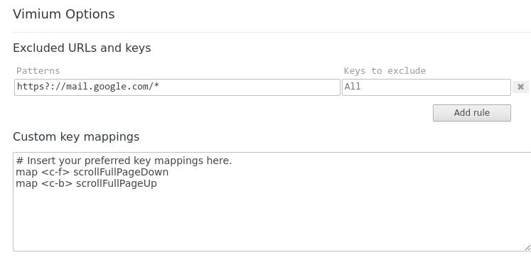

# 20250324
### 1. vimium map keys
Enable ctrl+f for forwardinig and ctrl+b for up:     

```
map <c-f> scrollFullPageDown
map <c-b> scrollFullPageU
```


### 2. vm resume
possible solution:    

```
virsh dompmsuspend win10 disk
win10 is my domain and just virsh start as usual to start the vm.

This is my <pm> block on the xml

<pm>
    <suspend-to-mem enabled='yes'/>
    <suspend-to-disk enabled='yes'/>
</pm>
```
### 3. deb contains files
via :     

```
apt-file list ovmf
```

### 4. managedsave domain
issue:    

```
dash@aiBox:~$ sudo virsh managedsave 0000_test_suspend_ubuntu22.04
error: Failed to save domain '0000_test_suspend_ubuntu22.04' state
error: Operation not supported: cannot migrate a domain with <hostdev mode='subsystem' type='pci'>

```
### 5. hibernate issue
should have seperate swap partition:    

```
vda    253:0    0    60G  0 disk 
├─vda1 253:1    0   512M  0 part /boot/efi
├─vda2 253:2    0  51.5G  0 part /var/snap/firefox/common/host-hunspell
│                                /
└─vda3 253:3    0     8G  0 part [SWAP]
test@testsuspend:~$ free -m
               total        used        free      shared  buff/cache   available
Mem:            7904        1539        5155          33        1208        6096
Swap:           8199           0        8199
test@testsuspend:~$ cat /etc/default/grub | grep resume
GRUB_CMDLINE_LINUX_DEFAULT="quiet splash resume=UUID=9155b004-c472-4eaa-addf-217b13046b5b"
$ cat /etc/fstab  | grep swap
#/swapfile                                 none            swap    sw              0       0
UUID=9155b004-c472-4eaa-addf-217b13046b5b                                 none            swap    sw              0       0
$ sudo update-initramfs -u
```
Then in host:     

```
dash@aiBox:~$ sudo virsh dompmsuspend 0000_test_suspend_ubuntu22.04 disk
Domain '0000_test_suspend_ubuntu22.04' successfully suspended
dash@aiBox:~$ sudo virsh start 0000_test_suspend_ubuntu22.04
Domain '0000_test_suspend_ubuntu22.04' started

```
