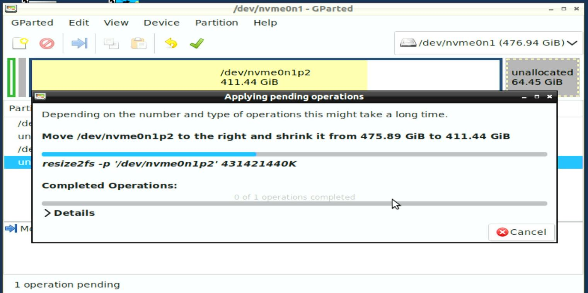

# 20250328
### 1. nvidia vfio host hibernate
Shrink the space for creating a big swap file:     



Under nvidia gpu, the resume runs OK.   
### 2. amdgpu vfio host hibernate
amdgpu vendor-reset issue, won't work after wakeup.     

### 3. cuttlefish on arm64
Steps:     


```
apt install -y git devscripts equivs config-package-dev debhelper-compat golang curl libevent build-essential vim git
git clone https://github.com/google/android-cuttlefish
cd android-cuttlefish
tools/buildutils/build_packages.sh


```
