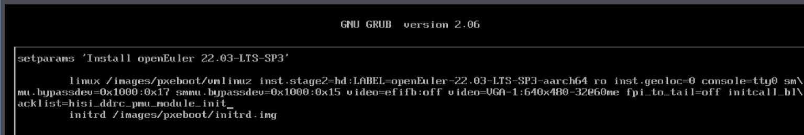

# 20250331
### 1. kbox working tips
Create installation iso:     

```
sudo dd if=/media/nfs/openEuler-22.03-LTS-SP3-aarch64-dvd.iso of=/dev/sda bs=10M && sudo sync 
```
After installation(installation steps could refers to `20250305` workingtips), insert usb ethernet dongle.      

```
sudo yum install -y vim
mkdir kbox_packages
mv 5.10.0-182.0.0.zip kbox_packages/kernel-5.10.0-182.0.0.zip
cp kbox/ExaGear_ARM32-ARM64_V2.5.tar.gz kbox_packages/
cp kbox/linux-firmware-20210919.tar.gz kbox_packages/
cd Kbox-AOSP11/Kbox-AOSP11/deploy_scripts/openEuler_deploy/
 chmod 777 kbox_install_kernel.sh 
./kbox_install_kernel.sh /home/test/kbox_packages/

```

### 2. kbox on kunpeng920
Install with following command:    



```
# cat /etc/default/grub
...
GRUB_CMDLINE_LINUX="video=VGA-1:640x480-32@60me cgroup_disable=files apparmor=0 crashkernel=1024M,high smmu.bypassdev=0x1000:0x17 smmu.bypassdev=0x1000:0x15 console=tty0 cgroup_enable=memory swapaccount=1 initcall_blacklist=hisi_ddrc_pmu_module_init"
...
#  grub2-mkconfig -o /boot/efi/EFI/openEuler/grub.cfg 
```
Start:      

```
./android_kbox.sh start  kbox:demo 1
./android_kbox.sh restart 1
```

### 3. docker for running redroid
Configure docker:     

```
$ cat /etc/docker/daemon.json 
{
    "registry-mirrors": ["https://docker.nju.edu.cn", "https://docker.mirrors.ustc.edu.cn", "https://docker.1ms.run", "https://docker.xuanyuan.me"]
}
$   sudo systemctl daemon-reload
$  sudo systemctl restart docker
$  sudo docker run -itd --rm --privileged     --pull always     -v ~/data:/data     -p 5555:5555     redroid/redroid:12.0.0_64only-latest
$ sudo docker run -itd --name redroid15 --privileged   -p 5555:5555 -v ~/data:/data  redroid/redroid:15.0.0_64only-latest redroid.width=1080 redroid.height=1920 redroid.gpu.mode=host redroid.gpu.node=/dev/dri/renderD128
```
