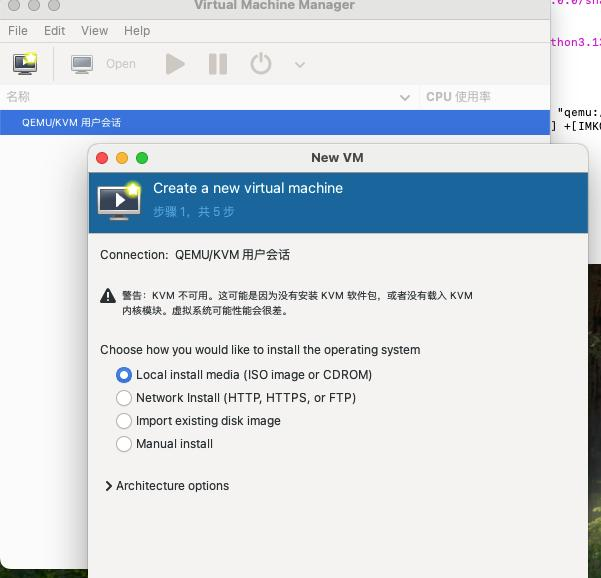
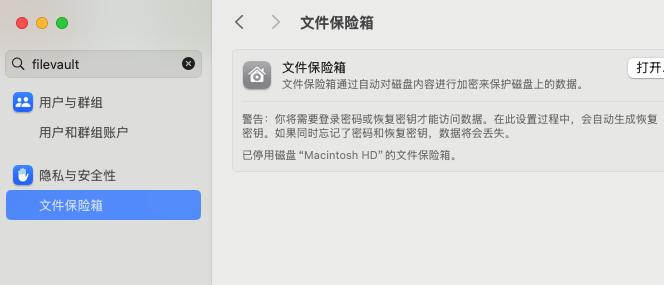

# 20250407
### 1. Beisen
Update the 1st season's conclusion(1.5 hours)
### 2. macos libvirt/virt-manager
Install brew:     

```
export all_proxy=socks5://192.168.1.6:21080
/bin/bash -c "$(curl -fsSL https://raw.githubusercontent.com/Homebrew/install/HEAD/install.sh)"
```
Configure zsh:     

```
echo >> /Users/yangdash/.zprofile
    echo 'eval "$(/opt/homebrew/bin/brew shellenv)"' >> /Users/yangdash/.zprofile
    eval "$(/opt/homebrew/bin/brew shellenv)"
```
relogin with another terminal, then you could use brew.    

Install qemu/libvirt/virt-manager:    

```
brew install libvirt
brew install qemu
brew tap arthurk/homebrew-virt-manager
brew install virt-manager virt-viewer
```
Start libvirt and launch virt-manager:     

```
brew services start libvirt
virt-manager -c "qemu:///session" --no-fork
```



Mount the nfs directory :     

```
sudo mount -t nfs -o resvport,rw  192.168.1.7:/media/big/iso /private/nfs
```

libvirtd 11.2.0 got bug, solved via:      

```
yangdash@yangdeMac-mini ~ % libvirtd --version
libvirtd (libvirt) 11.2.0
yangdash@yangdeMac-mini ~ % brew unlink libvirt
Unlinking /opt/homebrew/Cellar/libvirt/11.2.0... 116 symlinks removed.
export all_proxy=socks5://192.168.1.6:21080
yangdash@yangdeMac-mini ~ % brew install ./libvirt.rb 
yangdash@yangdeMac-mini ~ % libvirtd --version
libvirtd (libvirt) 11.1.0

```
The commit history could be found at:     

`https://github.com/Homebrew/homebrew-core/commits/0a560012cd157ebab89a130c041988288e2a645f/Formula/lib/libvirt.rb`    

### 3. macos autologin
Close filevault:    



Autologin:    


