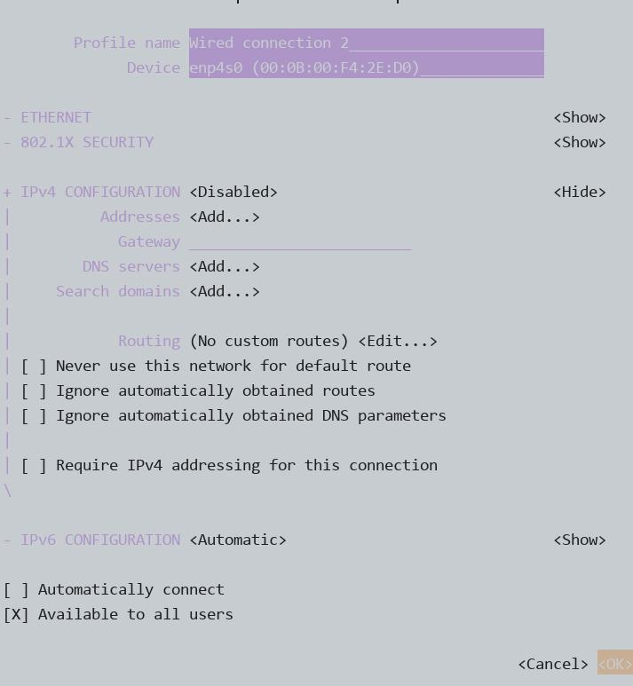
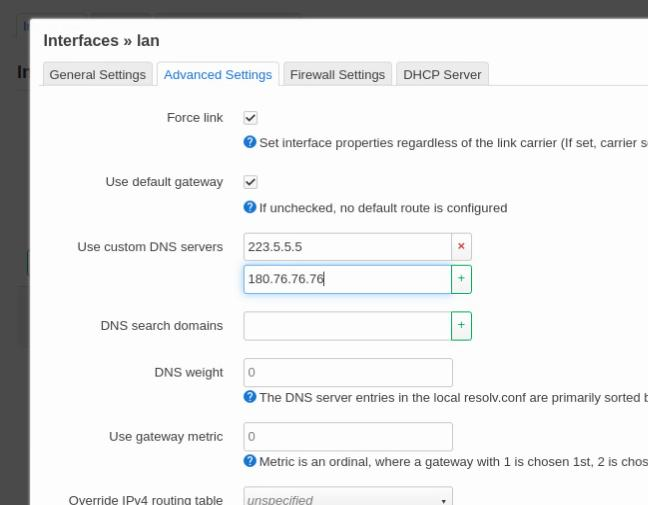
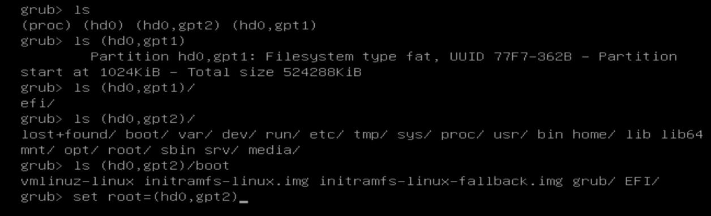
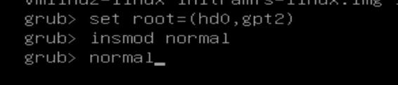
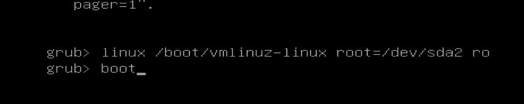
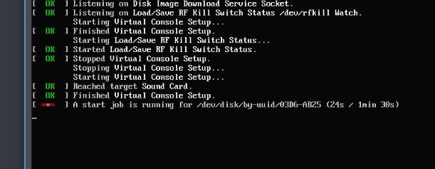
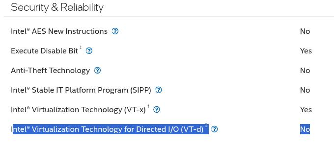

# 20250408
### 1. chromos Installation
Create the installation usb disk via:    

```
$ ls
brunch_r134_stable_20250322.tar.gz  chromeos_16151.61.0_volteer_recovery_stable-channel_VolteerMPKeys-v12.bin.zip
$ tar xzvf brunch_r134_stable_20250322.tar.gz
$ unzip chromeos_16151.61.0_volteer_recovery_stable-channel_VolteerMPKeys-v12.bin.zip
$  sudo apt -y install pv cgpt tar unzip
$ sudo bash ./chromeos-install.sh -src chromeos_16151.61.0_volteer_recovery_stable-channel_VolteerMPKeys-v12.bin -dst chromeos.img
$ sudo dd if=./chromeos.img of=/dev/sdc bs=10M && sudo sync
```

### 2. openwrt working tips
Host configuration:   



Then `pacman -Syu --noconfirm` for updating to the latest version of archlinux.   
Edit the dns server:    



Now replace to ustc repository and opkg udpate:     

```
sed -i 's/downloads.openwrt.org/mirrors.ustc.edu.cn\/openwrt/g' /etc/opkg/distfeeds.conf
opkg update
```
Install diskman for resize root partition:    

```
scp dash@192.168.1.208:~/Downloads/luci-app-diskman_v0.2.11_all.ipk .
opkg install ./luci-app-diskman_v0.2.11_all.ipk 

```
vt-d not supported on j1900, game over. maybe I should switch to lxd or incus?        
### 3. archlinux bootload recovery











