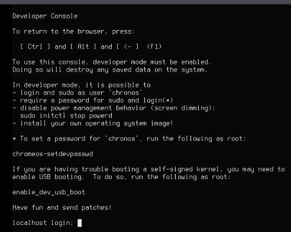
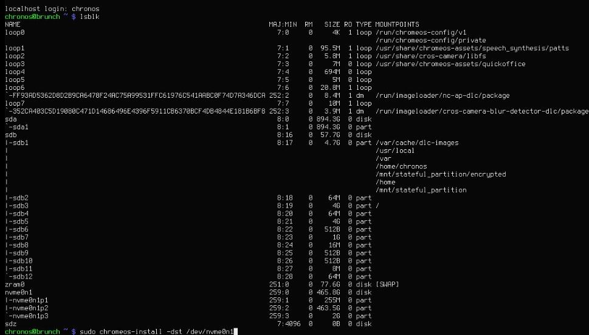
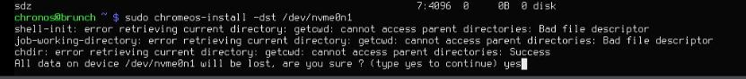
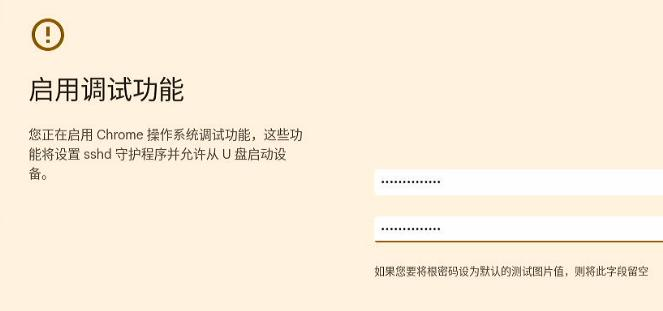
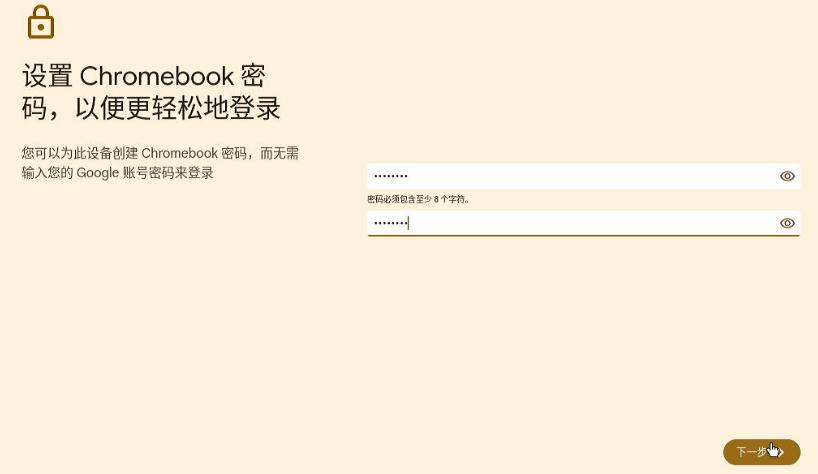
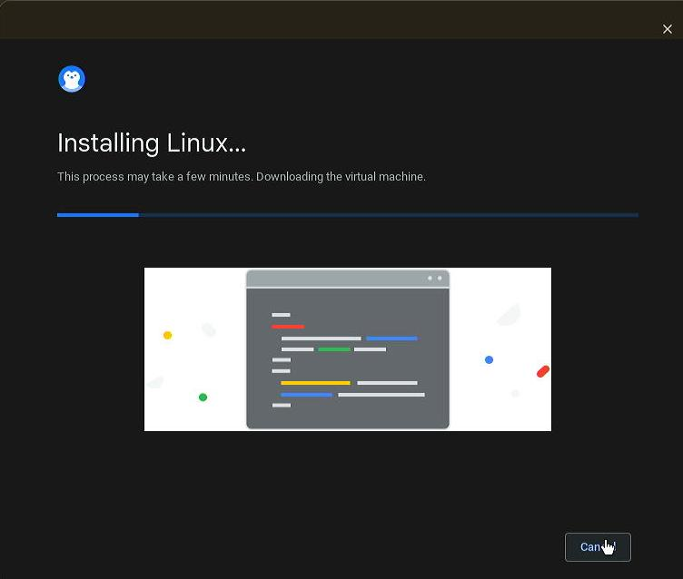
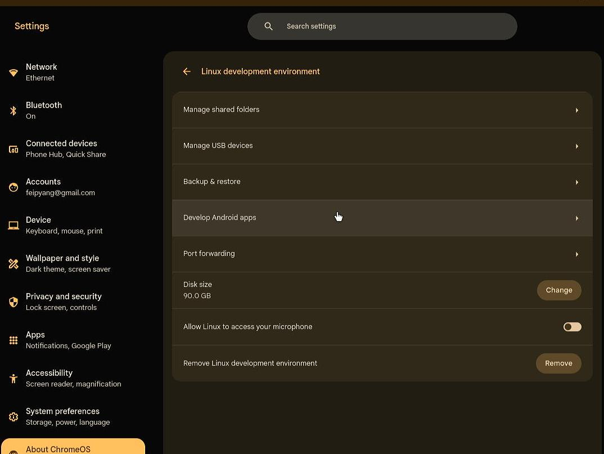
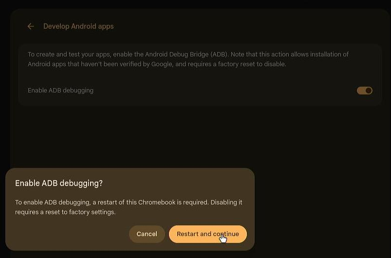
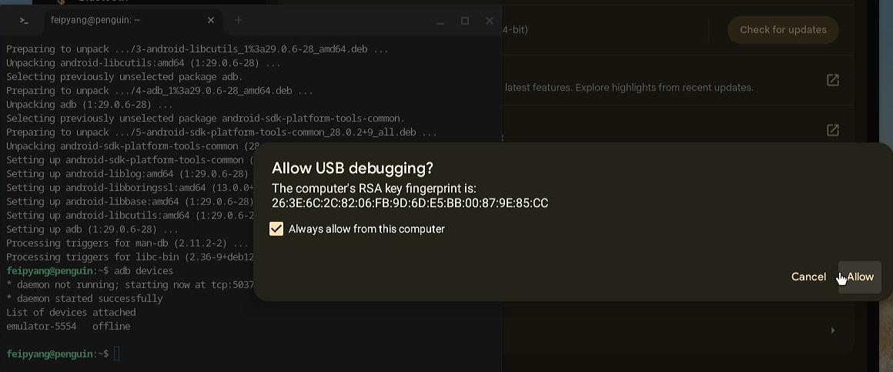
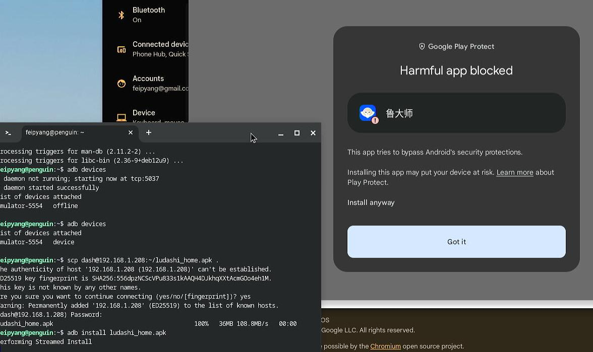

# 20250409
### 1. uefi recovery
Steps:    

```
fs0:\
edit FS0:\startup.nsh
"FS0:\EFI\fuck\grubx64.efi"
Save
exit
reset
```
### 2. openwrt tips
refers to `https://gist.github.com/pjobson/3584f36dadc8c349fac9abf1db22b5dc`.    
Use rescuezilla for writing into the image.   
Use gparted for enlarge the root disk.    

```
sed -i 's/downloads.openwrt.org/mirrors.ustc.edu.cn\/openwrt/g' /etc/opkg/distfeeds.conf
opkg update
opkg install vim-full nano usbutils pciutils
opkg install bash
sed -i 's/ash/bash/' /etc/passwd
opkg install ca-bundle ca-certificates openssl-util
mkdir ~/bin && cd ~/bin
wget https://raw.githubusercontent.com/pjobson/bash-completion/master/bash_completion
chmod +x ~/bin/bash_completion
echo ". ~/bin/bash_completion" >> ~/.profile
opkg install adblock luci-app-adblock
opkg install git git-http ca-bundle wget
opkg install kmod-iwlwifi iwlwifi-firmware-iwl6000g2
``` 
Install passwall:    
`https://github.com/xiaorouji/openwrt-passwall/releases`   

```
$ ls
luci-24.10_luci-app-passwall_25.4.1-r1_all.ipk
luci-24.10_luci-i18n-passwall-zh-cn_25.091.17880.830805a_all.ipk
passwall_packages_ipk_x86_64.zip 
$ unzip *.zip
$ opkg remove dnsmasq
$ mv /etc/config/dhcp /etc/config/dhcp.bak
$ opkg update
$ opkg install kmod-nft-socket kmod-nft-tproxy
$ opkg install *.ipk

```

### 3. chromeos
Boot from usb disk:    


Chrome OS OOBE:    


`Ctrl + Alt + F2`, for entering TTY 2:   



Login with `chronos`, using lsblk for detecting the disks, then install system:   



```
sudo chromeos-install -dst /dev/nvme0n1
```



`sudo reboot` for restarting system.  

Setup:     


Enable debug:    



Personal use:    




Install linux:    




Enable adb:    





Install adb:     




 

### 4. enable ssh wan
enable ssh wan on openwrt:    

```
To /etc/config/firewall add:

config rule                                     
        option name             Allow-SSH-WAN   
        option src              wan             
        option proto            tcp             
        option dest_port        22              
        option target           ACCEPT          
        option family           ipv4
Then:

/etc/init.d/firewall restart
```
