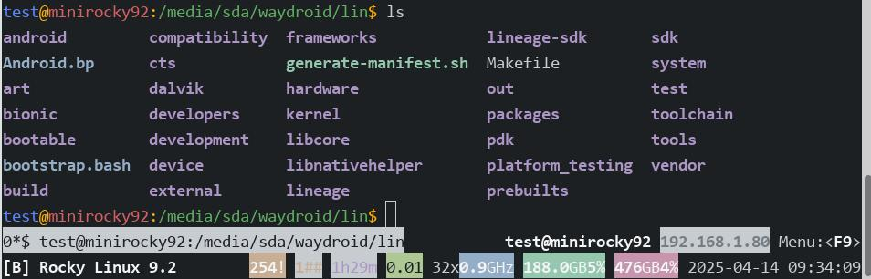
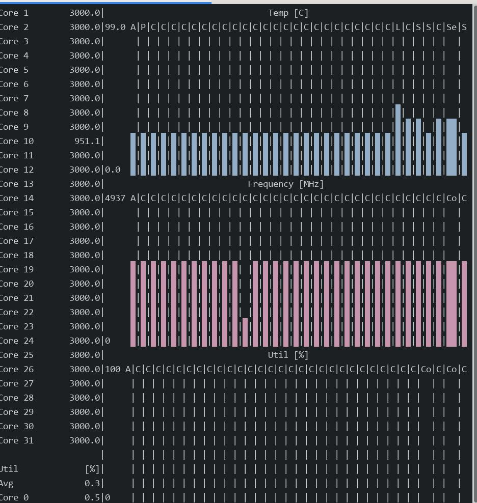
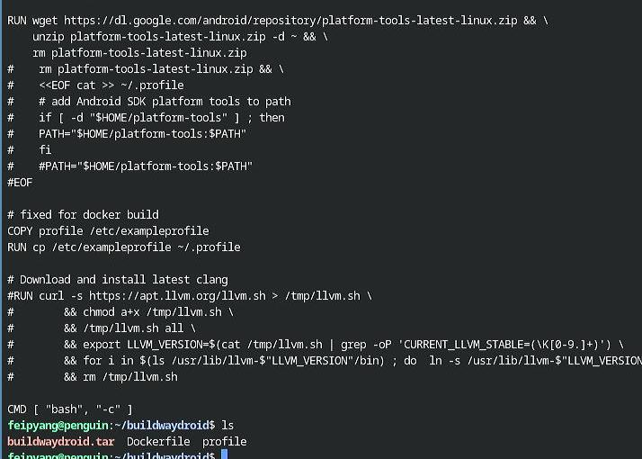

# 20250414
### 1. build waydroid on RockLinux
Install docker:      

```
sudo dnf config-manager --add-repo https://download.docker.com/linux/rhel/docker-ce.repo
# /etc/yum.repos.d/docker-ce.repo change from "download.docker.com" to "mirrors.ustc.edu.cn/docker-ce"
sudo dnf -y install docker-ce docker-ce-cli containerd.io docker-buildx-plugin docker-compose-plugin
```
Change configuration(for crossing gfw) then restart the service:      

```
$ sudo vim /etc/docker/daemon.json
$ sudo systemctl daemon-reload
$ sudo systemctl restart docker
```
Build the docker building image(on chromebook):      

```
$ sudo docker load<buildwaydroid.tar 
[sudo] password for test: 
3abdd8a5e7a8: Loading layer  80.61MB/80.61MB
0536e2561aac: Loading layer  5.632kB/5.632kB
818aa02fabb2: Loading layer  3.194GB/3.194GB
4b8baaba43a9: Loading layer   2.56kB/2.56kB
c81a9fa30d90: Loading layer   2.56kB/2.56kB
278342f56eb6: Loading layer   2.56kB/2.56kB
d8732c5ad43b: Loading layer   2.56kB/2.56kB
1846df12125c: Loading layer   2.56kB/2.56kB
e61f0adf0916: Loading layer   2.56kB/2.56kB
27ef74451959: Loading layer  48.13kB/48.13kB
fba4fcc4b42a: Loading layer  19.43MB/19.43MB
6d91fc990412: Loading layer   2.56kB/2.56kB
d6e6eed9d41d: Loading layer   2.56kB/2.56kB
Loaded image: waydroid-build-24.04:latest
```
Directory structure:      



初始化编译环境:    

```
$ sudo mkdir -p /media/nvme/ccache/lineage-18.1
$ sudo chmod 777 -R /media/nvme/ccache/lineage-18.1/
$ sudo docker create -v /media/nvme/ccache/lineage-18.1:/ccache --name ccache-18.1 waydroid-build-24.04
c1c9bda86567f5a131df3be2ec8a8dd3aa586f1ffe767e91538fd5051a2bf900
$ sudo docker run -e CCACHE_DIR=/ccache --volumes-from ccache-18.1 -v $(pwd):/mnt/lineage -it waydroid-build-24.04 /bin/bash
```
清空上次编译:       

```
在容器中:    
. build/envsetup.sh
make clean
rm -rf out
前后:    
[test@minirocky92 waydroid]$ du -hs lin
239G	lin
[test@minirocky92 waydroid]$ du -hs lin
121G	lin
```
repo sync again:    

```
git config --global http.proxy 'socks5://192.168.1.6:21080'
git config --global --add safe.directory "*"
repo sync
```
Manually patch mesa:      

```
$ cd external/mesa/
$ vim android/Android.mk 
$ vim meson.build 
$ vim src/util/xmlconfig.c 
$ cd ../../
$ cd device/waydroid/waydroid/
$ vim BoardConfig.mk
###### apply patch
. build/envsetup.sh
apply-waydroid-patches
. build/envsetup.sh && lunch lineage_waydroid_x86_64-userdebug &&  time make systemimage -j$(nproc --all)
rm -f external/mesa/subprojects/libarchive.wrap
time make vendorimage -j$(nproc --all)
```
Build system/vendor image:      

```
cd /mnt/lineage && ccache -M 50G
. build/envsetup.sh && lunch lineage_waydroid_x86_64-userdebug
time make systemimage -j$(nproc --all)
```
After building, convert images:    

```
x86:    
simg2img  out/target/product/waydroid_x86_64/system.img ./system.img
simg2img  out/target/product/waydroid_x86_64/vendor.img ./vendor.img
arm64:    
simg2img out/target/product/waydroid_arm64/system.img ./system.img
simg2img out/target/product/waydroid_arm64/vendor.img ./vendor.img
```
### 2. byobu on rocklinux
rocklinux don't have byobu on official repos or epel repos, so build it manually.  Steps(`https://blog.entrostat.com/install-byobu-on-any-linux-distro/`):    

```
yum install -y epel-release
yum install -y tar screen tmux make wget
cat installbyobu.sh

BYOBU_VERSION=5.133

set -e

echo "Please make sure you have the following dependencies installed:"
echo "  [+] tar"
echo "  [+] screen"
echo "  [+] tmux"
echo "  [+] make"

which tar
which screen
which tmux
which make

echo "We are going to download version ${BYOBU_VERSION} of byobu and install it..."


echo "Setting up temporary folder"
UNIQUE_FOLDER=$(date +%s)
cd /tmp
mkdir /tmp/${UNIQUE_FOLDER}
cd /tmp/${UNIQUE_FOLDER}

echo "Downloading source package"
wget "https://launchpad.net/byobu/trunk/${BYOBU_VERSION}/+download/byobu_${BYOBU_VERSION}.orig.tar.gz"

echo "Extracting the source files"
tar -xvf "byobu_${BYOBU_VERSION}.orig.tar.gz"
BYOBU_FOLDER_NAME=$(ls | grep byobu | grep -v .tar.gz)
cd "byobu-${BYOBU_VERSION}"

echo "Configuring and building"
./configure
sudo make install
byobu-select-backend tmux


echo ""
echo ""
echo ""
echo ""
echo "You're ready to go! Just type:"
echo ""
echo ""
echo "byobu"
```
### 3. s-tui on rockylinux
Installation steps:      

```
$ sudo yum install -y python3 python3-pip
$ sudo pip3 install s-tui -i https://pypi.tuna.tsinghua.edu.cn/simple
$ which s-tui
/usr/local/bin/s-tui
```



### 4. waydroid on ubuntu2204 x86
Using customized image for startup:     

```
sudo apt install curl ca-certificates lzip python3 python3-pip
sudo ufw disable
sudo apt install wl-clipboard xclip
sudo pip install pyclip
curl https://repo.waydro.id | sudo bash
sudo apt install waydroid
sudo mkdir -p /etc/waydroid-extra/images/
sudo mv *.img /etc/waydroid-extra/images/
sudo waydroid init -f
sudo systemctl start waydroid-container
sudo systemctl enable waydroid-container
```
Create the conf file for mesa use:    

```
test@test-TS660:~$ sudo ls ~/.local/share/waydroid/data/vendor/
hardware  tombstones
test@test-TS660:~$ sudo mkdir -p ~/.local/share/waydroid/data/vendor/drirc.d/
test@test-TS660:~$ sudo ls ~/.local/share/waydroid/data/vendor/
drirc.d  hardware  tombstones
test@test-TS660:~$ wget https://gitlab.freedesktop.org/mesa/mesa/-/raw/main/src/util/00-mesa-defaults.conf
test@test-TS660:~$ sudo cp 00-mesa-defaults.conf ~/.local/share/waydroid/data/vendor/drirc.d/
```
Add following definitions:       

```
        <application name="Yuanshen" executable="com.miHoYo.Yuanshen">
            <option name="ignore_discard_framebuffer" value="true" />
            <option name="force_gl_renderer" value="Adreno (TM) 630"/>
            <option name="force_gl_vendor" value="Qualcomm"/>
        </application>

        <application name="AIDA64" executable="com.finalwire.aida64">
            <option name="force_gl_renderer" value="Adreno (TM) 630"/>
            <option name="force_gl_vendor" value="Qualcomm"/>
        </application>
```
houdini integration:      

```
git clone https://github.com/casualsnek/waydroid_script
cd waydroid_script
sudo  apt install python3.10-venv
python3 -m venv venv
venv/bin/pip install -r requirements.txt -i https://pypi.tuna.tsinghua.edu.cn/simple
sudo venv/bin/python3 main.py
```
Now restart the machine for letting waydroid take effects.    

```
waydroid show-full-ui
```
### 5. Yuanshen issue
`~/.local/share/waydroid/data/vendor/drirc.d/00-mesa-defaults.conf` definition is outdated, Changed to Yuanshen.     

```
test@test-TS660:~$ sudo waydroid shell
:/ # am start -n com.miHoYo.Yuanshen/com.miHoYo.GetMobileInfo.MainActivity
Starting: Intent { cmp=com.miHoYo.Yuanshen/com.miHoYo.GetMobileInfo.MainActivity }
:/ # GI_pid="$(echo `pidof com.miHoYo.Yuanshen`)"
:/ # for limit_core in $GI_pid; do taskset -ap 1 $limit_core; done
```
After enter game:     

```
GI_pid="$(echo `pidof com.miHoYo.Yuanshen`)"

for limit_core in $GI_pid; do taskset -ap ff $limit_core; done
```
Get the package name via `pm list package | grep miH`.      
### 6. buildtime
5600g, 128G mem:     

```
systemimage
#### build completed successfully (02:14:27 (hh:mm:ss)) ####


real    134m26.626s
user    1463m49.968s
sys     104m12.507s
```
i5-10400 with 40G mem:    

```
[100% 93334/93334] Install system fs image: out/target/product/waydroid_x86_64/system.img

#### build completed successfully (02:32:54 (hh:mm:ss)) ####


real    152m53.196s
user    1728m9.951s
sys     64m29.833s

```
`Intel(R) Core(TM) i9-10900 CPU @ 2.80GHz`:      

```
#### build completed successfully (01:38:09 (hh:mm:ss)) ####


real    98m8.745s
user    1840m27.636s
sys     78m59.847s
```

`13th Gen Intel(R) Core(TM) i5-13400`:     

```
#### build completed successfully (01:33:35 (hh:mm:ss)) ####


real    93m34.873s
user    1333m48.906s
sys     67m54.397s
```
`13900ks`:     

```
#### build completed successfully (36:49 (mm:ss)) ####


real    36m48.873s
user    1013m10.916s
sys     46m58.391s
```
### 99. chromebook workingtips
Build docker images under linux-subsystem:     




