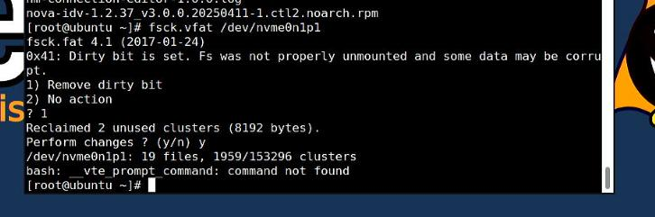

# 20250415
### 1. Build cuttlefish 13
Build cuttlefish 13 with mesa patch from waydroid.    

not available, for waydroid's mesa is newer than cf's.    

also redroid's mesa is prebuilt.    
### 2. xxxOS configuration
Note:   Not ok for amdgpu, only for nvidia     

For display bootup infos:       

```
After install kernel
# grub2-mkconfig -o /boot/efi/xxxxxxx
# cat /etc/dracut.conf.d/vfio.conf 
add_drivers+=" vfio vfio_iommu_type1 vfio_pci vfio_virqfd  "
# dracut -f --kver `uname -r` && reboot
# cat /proc/cmdline
BOOT_IMAGE=/boot/vmlinuz-4.19.90-2102.2.0.0068.ctl2.x86_64 root=UUID=b87c272e-7c6b-4385-bb06-23e98d5e03fd ro crashkernel=512M iommu=pt amd_iommu=on pcie_acs_override=downstream,multifunction net.ifnames=0 biosdevname=0 vga=845
```
Example for using grubby:      

```
grubby --args="vga=845" --update-kernel="$(grubby --default-kernel)"
grubby --update-kernel="$(grubby --default-kernel)"  --remove-args="vfio-pci.ids=1002:6613,1002:aab0,10de:1287,10de:0e0f"
```


### 3.  grub recovery


