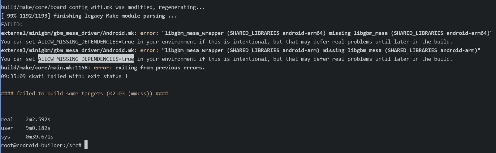

# 20250417
### 1. llm token test
Test via following commands and scripts:     

```
dash@ai:~$ python test.py 
使用的模型: deepseek-r1:70b
输入的提示: 玄武门之变结束的当天，李世民在深夜写下一段独白，你觉得他会写什么？
开始时间: 2025-04-17 09:57:59
结束时间: 2025-04-17 09:58:58
生成时间: 58.51秒
生成 token 数量: 884
每秒生成 token 数量: 15.11
dash@ai:~$ cat test.py
import requests
import time

# ollama 的 API 地址
OLLAMA_API_URL = "http://localhost:11434/api/generate"

# 请求参数
payload = {
    "model": "deepseek-r1:70b",  # 替换为你的模型名称
    "prompt": "玄武门之变结束的当天，李世民在深夜写下一段独白，你觉得他会写什么？",  # 替换为你的输入文本
    "stream": False,  # 设置为 False，一次性返回完整结果
    "max_tokens": 3000  # 设置生成的最大 token 数量
}

# 打印 model 和 prompt 信息
print(f"使用的模型: {payload['model']}")
print(f"输入的提示: {payload['prompt']}")

# 记录开始时间
start_time = time.time()
print(f"开始时间: {time.strftime('%Y-%m-%d %H:%M:%S', time.localtime(start_time))}")

# 发送请求
response = requests.post(OLLAMA_API_URL, json=payload)

# 记录结束时间
end_time = time.time()
print(f"结束时间: {time.strftime('%Y-%m-%d %H:%M:%S', time.localtime(end_time))}")

# 解析响应
if response.status_code == 200:
    result = response.json()
    # print(result)
    generated_text = result.get("response", "")
    generated_tokens = result.get("eval_count", 0)  # 获取生成的 token 数量
    elapsed_time = end_time - start_time

    # 计算每秒生成的 token 数量
    tokens_per_second = generated_tokens / elapsed_time

    print(f"生成时间: {elapsed_time:.2f}秒")
    print(f"生成 token 数量: {generated_tokens}")
    print(f"每秒生成 token 数量: {tokens_per_second:.2f}")
else:
    print(f"请求失败，状态码: {response.status_code}")
    print(f"错误信息: {response.text}")
```
### 2. aosp build issue
Faster sync and save fq-flow:        

```
repo init --depth 1 -u https://mirrors.bfsu.edu.cn/git/AOSP/platform/manifest -b android-14.0.0_r50
repo sync
curl -o .repo/local_manifests/manifest_brcm_rpi.xml -L https://raw.githubusercontent.com/raspberry-vanilla/android_local_manifest/android-14.0/manifest_brcm_rpi.xml --create-dirs
curl -o .repo/local_manifests/remove_projects.xml -L https://raw.githubusercontent.com/raspberry-vanilla/android_local_manifest/android-14.0/remove_projects.xml
 git config --global http.proxy 'socks5://192.168.1.6:21080'
repo sync -j1 --force-sync
```
Then:    

```
source build/envsetup.sh
lunch aosp_cf_arm64_phone-ap2a-userdebug
time m -j$(nproc --all)
```



### 3. repo sync at home
Change to ustc:    

```
export REPO_URL=https://gerrit-googlesource.proxy.ustclug.org/git-repo
root@0e0cea4eee18:/mnt/lineage# repo init --depth 1 -u git://mirrors.ustc.edu.cn/aosp/platform/manifest -b android-14.0.0_r67
Downloading Repo source from https://gerrit-googlesource.proxy.ustclug.org/git-repo

... A new version of repo (2.54) is available.
... You should upgrade soon:
    cp /mnt/lineage/.repo/repo/repo /usr/local/bin/repo


Your identity is: YogSottot <7411302+YogSottot@users.noreply.github.com>
If you want to change this, please re-run 'repo init' with --config-name

repo has been initialized in /mnt/lineage
root@0e0cea4eee18:/mnt/lineage# mkdir .repo/manifests 
manifests/     manifests.git/ 
root@0e0cea4eee18:/mnt/lineage# mkdir .repo/manifests
manifests/     manifests.git/ 
root@0e0cea4eee18:/mnt/lineage# mkdir .repo/manifests/local_manifests/
root@0e0cea4eee18:/mnt/lineage# cp /root/remove_projects.xml .repo/manifests/local_manifests/
repo sync && cp /root/manifest_brcm_rpi.xml .repo/local_manifests/ && git config --global http.proxy 'socks://192.168.1.213:14389' && repo sync -j1 --force-sync && repo sync

```
