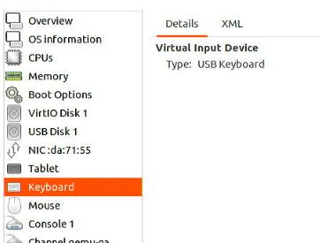
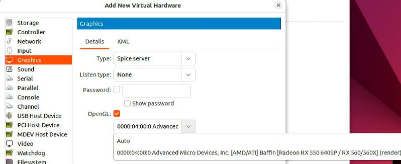
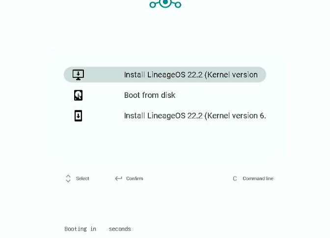
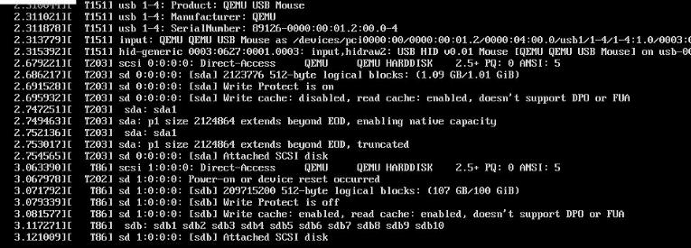

# 20250418
### 1. rpi image building issue
Solved via:     

```
 source build/envsetup.sh 
 lunch aosp_rpi4-ap1a-userdebug
 pip3 install meson mako jinja2 ply pyyaml dataclasses --break-system-packages  -i https://pypi.tuna.tsinghua.edu.cn/simple
 apt install -y genromfs vim dosfstools
 time make bootimage systemimage vendorimage -j$(nproc)
```
### 2. on building lineageOS
Using waydroid docker build image:     

```
apt install -y bc bison build-essential ccache curl flex g++-multilib gcc-multilib git git-lfs gnupg gperf imagemagick lib32readline-dev lib32z1-dev libdw-dev libelf-dev liblz4-tool lz4 libsdl1.2-dev libssl-dev libxml2 libxml2-utils lzop pngcrush rsync schedtool squashfs-tools xsltproc zip zlib1g-dev meson glslang-tools python3-mako nethogs vim
git lfs install

root@068ccd2b2fcb:/mnt/lineage# git config --global http.proxy 'socks5://192.168.1.6:21080'
root@068ccd2b2fcb:/mnt/lineage# breakfast virtio_arm64
m espimage-install -j32

#### build completed successfully (01:12:12 (hh:mm:ss)) ####


5600g: 

[100% 151431/151431] Target UTM VM ZIP archive: out/target/product/virtio_arm64only/VirtualMachine/UTM/UTM-VM-lineage-22.2-2050418-UNOFFICIAL-virtio_arm64only.zip (priority: 2)

#### build completed successfully (04:04:47 (hh:mm:ss)) ####


real    244m47.296s
user    2624m41.207s
sys     224m56.047s

```

build out image:      

```
$ ls -l -h target/product/virtio_arm64/lineage-22.2-20250418-UNOFFICIAL-virtio_arm64.img 
-rw-r--r-- 1 root root 1.1G Apr 18 14:45 target/product/virtio_arm64/lineage-22.2-20250418-UNOFFICIAL-virtio_arm64.img
```
### 3. libvirt verify lineageOS
Using the above img:    


usb keyboard/mouse/tablet:    



virtio with `3D acceleration`:      


spice with OpenGL support:     



sound with AC97:    




usb:    



virtio-disk:    

#### 4. failed build on fedora

```
linux-x86/bin/pahole -C kernel/virt/virtio O=/mnt/lineage/out/target/product/virtio_arm64only/obj/KERNEL_OBJ ARCH=arm64 CC= c
lang VARIANT_DEFCONFIG= SELINUX_DEFCONFIG= olddefconfig                                                                      
20:57:37    → /mnt/lineage/prebuilts/build-tools/linux-x86/bin/make -C /mnt/lineage/out/target/product/virtio_arm64only/obj/K
ERNEL_OBJ -f /mnt/lineage/kernel/virt/virtio/Makefile olddefconfig                                                           
20:57:37     → /mnt/lineage/prebuilts/build-tools/linux-x86/bin/make --no-print-directory -C /mnt/lineage/out/target/product/
virtio_arm64only/obj/KERNEL_OBJ -f /mnt/lineage/kernel/virt/virtio/Makefile olddefconfig                                     
20:57:37      → /mnt/lineage/prebuilts/build-tools/linux-x86/bin/make -f /mnt/lineage/kernel/virt/virtio/scripts/Makefile.bui
ld obj=scripts/kconfig olddefconfig                                                                                          
20:57:37       → scripts/kconfig/conf --olddefconfig Kconfig                                                                 
20:57:37        → sh -c -- { /mnt/lineage/kernel/virt/virtio/scripts/rust_is_available.sh; } >/dev/null 2>&1 && echo "y" || e
cho "n"                                                                                                                      
20:57:37         → /bin/sh /mnt/lineage/kernel/virt/virtio/scripts/rust_is_available.sh                                      
20:57:37          → rustc --version                                                                                          
20:58:55 ninja failed with: exit status 1                                                                                    
There was 1 action that completed after the action that failed. See verbose.log.gz for its output.                           
                                                                                                                             
#### failed to build some targets (04:42:54 (hh:mm:ss)) ####                                                                 
                                                                                                                             
                                                                                                                             
real    282m54.217s                                                                                                          
user    2111m19.887s                                                                                                         
sys     105m21.785s                                                                                                          
root@e77d01be6d83:/mnt/lineage#   
```
