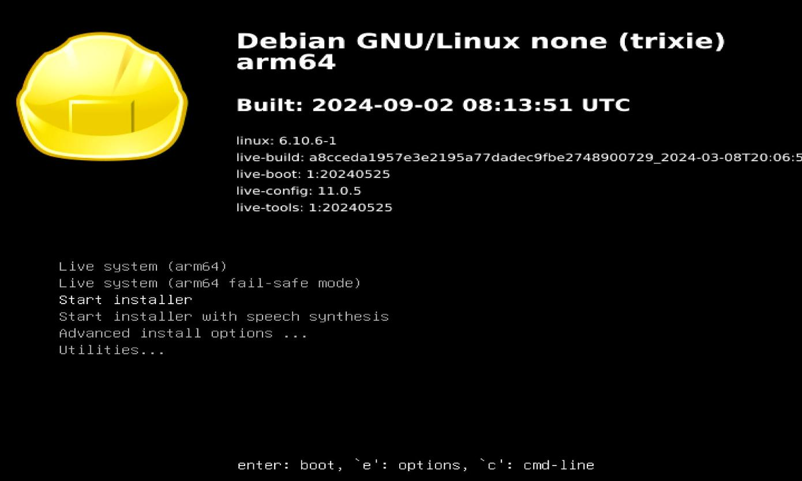
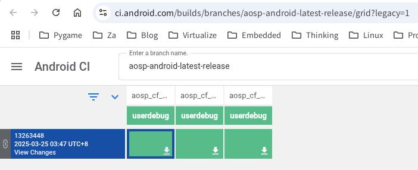
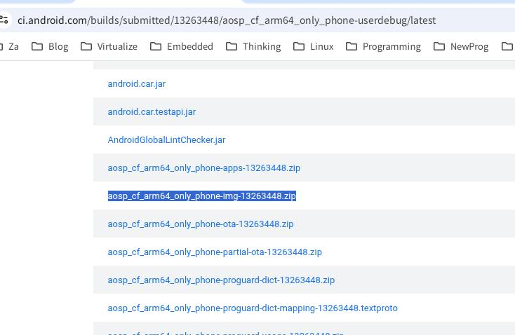

# 20250424
### 1. cuttlefish(Debian testing)
Write image:      

```
sudo dd if=/media/nfs/debian-testing-arm64-DVD-1.iso of=/dev/sda bs=10M && sudo sync
```



Using live cd for text installer.    

After installation, bootloader is not OK. 

```
fs0:
cd EFI\debian
grubaa64.efi
```
Then you could see the grub items and bootup.    

```
apt update -y
apt upgrade -y

# cat /etc/apt/sources.list
# 默认注释了源码仓库，如有需要可自行取消注释
deb http://mirrors.ustc.edu.cn/debian testing main contrib non-free non-free-firmware
# deb-src http://mirrors.ustc.edu.cn/debian testing main contrib non-free non-free-firmware
deb http://mirrors.ustc.edu.cn/debian testing-updates main contrib non-free non-free-firmware
# deb-src http://mirrors.ustc.edu.cn/debian testing-updates main contrib non-free non-free-firmware

# backports 软件源，请按需启用
# deb http://mirrors.ustc.edu.cn/debian testing-backports main contrib non-free non-free-firmware
# deb-src http://mirrors.ustc.edu.cn/debian testing-backports main contrib non-free non-free-firmware
```
For installation OK, do following:       

```
apt remove raspi-firmware
mv  /etc/initramfs/post-update.d/z50-raspi-firmware /root
apt remove plymouth culmus
apt upgrade -y
reboot
```
After reboot, no screen output.       

```
apt install -y lightdm xfce4 xfce4-panel xfce4-session xfce4-settings xfce4-taskmanager xfce4-screenshooter xfce4-goodies xfce4-cpufreq-plugin
# vim /etc/lightdm/lightdm.conf
autologin items. 

#  groupadd -r autologin
# gpasswd -a username autologin
```
Build/Install cuttlefish, then reboot:       

```
root@debian:~# qemu-aarch64 --version
qemu-aarch64 version 9.2.93 (Debian 1:10.0.0~rc3+ds-2)
Copyright (c) 2003-2025 Fabrice Bellard and the QEMU Project developers
root@debian:~# uname -a
Linux debian 6.12.22-arm64 #1 SMP Debian 6.12.22-1 (2025-04-10) aarch64 GNU/Linux
root@debian:~# cat /etc/issue
Debian GNU/Linux trixie/sid \n \l
```

Download image:         



Get the file(`aosp_cf_x86_64_phone-img-xxxxxx.zip`):      



Get the `cvd-host_package.tar.gz` and `aosp_cf_arm64_only_phone-img-13263448.zip`:        

```
scp test@192.168.1.80:/media/sdb/lineage/cf13/./out/host/linux_bionic-arm64/cvd-host_package.tar.gz .
scp dash@192.168.1.208:~/下载/aosp_cf_arm64_only_phone-img-13263448.zip .
```

Extrace the files:       

```
test@debian:~/cf13$ unzip ../aosp_cf_arm64_only_phone-img-13263448.zip 
Archive:  ../aosp_cf_arm64_only_phone-img-13263448.zip
  inflating: android-info.txt        
  inflating: fastboot-info.txt       
  inflating: boot.img                
  inflating: bootloader              
  inflating: init_boot.img           
  inflating: userdata.img            
  inflating: vbmeta.img              
  inflating: vbmeta_system.img       
  inflating: vbmeta_system_dlkm.img  
  inflating: vbmeta_vendor_dlkm.img  
  inflating: vendor_boot.img         
  inflating: super.img  
```
New installation:        

```
test@debian:~$ cd cfown/
test@debian:~/cfown$ ls
bin  etc  lib64  nativetest64  usr
test@debian:~/cfown$ unzip ../aosp_cf_arm64_phone-img-eng.root.zip 
Archive:  ../aosp_cf_arm64_phone-img-eng.root.zip
 extracting: android-info.txt        
  inflating: boot.img                
  inflating: bootloader              
  inflating: init_boot.img           
  inflating: userdata.img            
  inflating: vbmeta.img              
  inflating: vbmeta_system.img       
  inflating: vendor_boot.img         
  inflating: super.img               
test@debian:~/cfown$ ls
android-info.txt  bootloader     lib64         userdata.img  vbmeta_system.img
bin               etc            nativetest64  usr           vendor_boot.img
boot.img          init_boot.img  super.img     vbmeta.img
test@debian:~/cfown$ 
```
Losts of problem under debian testing, switch to ubuntu24.04.    
### 2. cuttlefish ubuntu22.04
Upgrade to ubuntu24.04:       

```
sudo do-release-upgrade
```
Use arm64only.    

### 3. some useful material
Booting a Android Cuttlefish guest directly with QEMU:     

`https://linaro.atlassian.net/wiki/spaces/ORKO/pages/29093823191/Booting+a+Android+Cuttlefish+guest+directly+with+QEMU`   

`start-avm`:     

`https://github.com/slp/start-avm`    

`cvd2img`

`https://github.com/slp/cvd2img`


```
cuttlefish image -> cvd2img -> qemuImageFile -> Qemu(mac mini)

```
