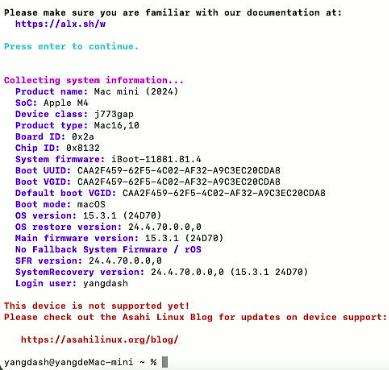

# 20250425
### 1. cf13 arm64only compilation
Build via:     

```
lunch aosp_cf_arm64_only_phone-userdebug && time m dist -j32
```
Verify:      

```
 mkdir cf13arm64only
 cd cf13arm64only/
 tar xzvf ../cvd-host_package.tar.gz 
 unzip ../aosp_cf_arm64_only_phone-img-eng.root.zip
```
Using own built `cvd-host_package.tar.gz`, failed with following infos:      

```
[ERROR:external/crosvm/src/main.rs:2893] invalid value "/home/test/cf13arm64only/cuttlefish/instances/cvd-1/internal/crosvm_control.sock": this socket path already exists
Detected unexpected exit of monitored subprocess /home/test/cf13arm64only/bin/crosvm
Subprocess /home/test/cf13arm64only/bin/crosvm (6594) has exited with exit code 1
Detected unexpected exit of monitored subprocess /home/test/cf13arm64only/bin/crosvm
Subprocess /home/test/cf13arm64only/bin/crosvm (6600) has exited with exit code 1
Detected unexpected exit of monitored subprocess /home/test/cf13arm64only/bin/crosvm
Subprocess /home/test/cf13arm64only/bin/crosvm (6606) has exited with exit code 1
Detected unexpected exit of monitored subprocess /home/test/cf13arm64only/bin/crosvm
Subprocess /home/test/cf13arm64only/bin/crosvm (6612) has exited with exit code 1
Detected unexpected exit of monitored subprocess /home/test/cf13arm64only/bin/crosvm
Subprocess /home/test/cf13arm64only/bin/crosvm (6618) has exited with exit code 1
Detected unexpected exit of monitored subprocess /home/test/cf13arm64only/bin/crosvm
Subprocess /home/test/cf13arm64only/bin/crosvm (6624) has exited with exit code 1
Detected unexpected exit of monitored subprocess /home/test/cf13arm64only/bin/crosvm
Subprocess /home/test/cf13arm64only/bin/crosvm (6630) has exited with exit code 1
^Ctest@d3000:~/cf13arm64only$ Failed to read event buffer size: Success
```
Using the official `cvd-host_package.tar.gz`:     

```
mkdir cf13arm64only_official
cd cf13arm64only_official/
test@d3000:~/cf13arm64only_official$ tar xzvf ../off/cf13/cvd-host_package.tar.gz 
test@d3000:~/cf13arm64only_official$ unzip ../aosp_cf_arm64_only_phone-img-eng.root.zip 
...
also failed.
...
```
all official items:     

```
test@d3000:~/cf13arm64only_official$ tar xzvf ../off/cf13/cvd-host_package.tar.gz && unzip ../off/cf13/aosp_cf_arm64_only_phone-img-13263448.zip 
test@d3000:~/cf13arm64only_official$ adb connect 0.0.0.0:6520
already connected to 0.0.0.0:6520
test@d3000:~/cf13arm64only_official$ adb shell
vsoc_arm64_only:/ $ dumpsys SurfaceFlinger | grep GLES                                       
 ------------RE GLES (Ganesh)------------
GLES: Google (AMD), Android Emulator OpenGL ES Translator (AMD Radeon RX 550 / 550 Series (radeonsi, polaris12, LLVM 19.1.1, DRM 3.57, 6.8.0-58-generic)), OpenGL ES 3.1 (OpenGL ES 3.2 Mesa 24.2.8-1ubuntu1~24.04.1)
```
### 2. ubuntuasahi
Not supported yet:     



Better change back to m1 or m2?   

### 3. repo sync issue
repo sync items:     

```
repo using bfsu
Change:   
.repo/manifests.git/config，
url = https://android.googlesource.com/platform/manifest 
git config proxy
repo sync
```
using android 15 build:        

```
lunch
build_build_var_cache
lunch aosp_cf_arm64_phone-trunk_staging-userdebug
time make dist -j32
```

Home sync:      

```
export REPO_URL='https://mirrors.tuna.tsinghua.edu.cn/git/git-repo'
repo init --depth 1 -u  https://mirrors.tuna.tsinghua.edu.cn/git/AOSP/platform/manifest  -b android-15.0.0_r25
repo sync
```
