# 20250427
### 1. cf on ubuntu2204
cf on ubuntu2204:      

```
cf13: 
crosvm+gfx: fail
crosvm+virgl: fail
qemu+gfx: fail
qemu+virgl: fail

cf14: 
crosvm+gfx: OK
crosvm+virgl: fail
qemu+gfx: OK
qemu+virgl: OK

cf15: 
crosvm+gfx: OK
crosvm+virgl: fail
qemu+gfx: OK
qemu+virgl: fail
```
### 2. cf verification
System information:    

```
test@2004vm:~$ uname -a
Linux 2004vm 5.4.0-214-generic #234-Ubuntu SMP Fri Mar 14 23:50:24 UTC 2025 aarch64 aarch64 aarch64 GNU/Linux
test@2004vm:~$ cat /etc/issue
Ubuntu 20.04.6 LTS \n \l
$ dpkg -l | grep cuttlefish
ii  cuttlefish-base                       0.9.26                               arm64        Cuttlefish Android Virtual Device companion package
ii  cuttlefish-user                       0.9.26                               arm64        Cuttlefish Android Virtual Device companion package
```
#### 2.1 cf13
cf13 materials:       

```
test@2004vm:~/cf13$ ls -l -h /mnt8/cf13/* 
-rw-r--r-- 1 root root 911M Apr 26 14:44 /mnt8/cf13/aosp_cf_arm64_phone-img-eng.root.zip
-rw-r--r-- 1 root root 276M Apr 26 14:44 /mnt8/cf13/cvd-host_package.tar.gz
test@2004vm:~/cf13$ tar xzvf /mnt8/cf13/cvd-host_package.tar.gz && unzip /mnt8/cf13/aosp_cf_arm64_phone-img-eng.root.zi
```
crosvm+gfxstream(failed):     

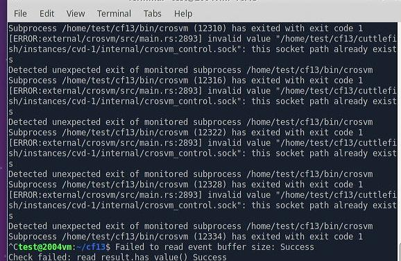

crosvm+virgl(failed):       

```
vsoc_arm64:/ $ getprop | grep boot | grep complete
[sys.bootstat.first_boot_completed]: [0]
vsoc_arm64:/ $ dumpsys SurfaceFlinger
Can't find service: SurfaceFlinger
```
qemu+gfxstreamer(failed):    

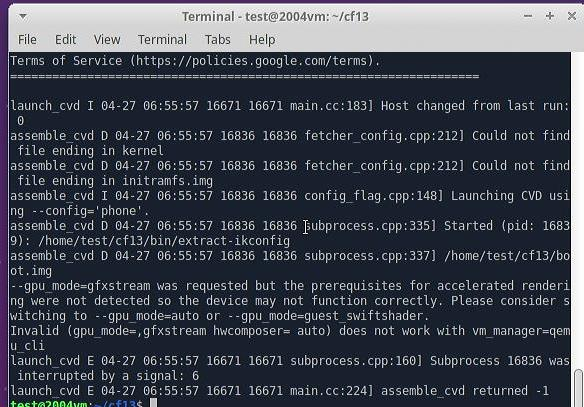

qemu+virgl:     

```
$ sudo apt install -y virt-manager(This will install qemu-system-aarch64)
qemu : 100%, won't start
```
#### 2.2 cf14
cf14 materials:     

```
tar xzvf /mnt8/cf14/cvd-host_package.tar.gz && unzip /mnt8/cf14/aosp_cf_arm64_phone-img-root.zip
$ ls -l -h /mnt8/cf14/
total 1.6G
-rw-r--r-- 1 test test 1.1G Apr 26 14:49 aosp_cf_arm64_phone-img-root.zip
-rw-r--r-- 1 test test 462M Apr 26 14:48 cvd-host_package.tar.gz
```
crosvm+gfxstreamer(OK):     

```
vsoc_arm64:/ $ getprop | grep boot | grep com                                                
[dev.bootcomplete]: [1]
[ro.boot.hardware.hwcomposer.display_finder_mode]: [drm]
[ro.boot.vendor.apex.com.google.emulated.camera.provider.hal]: [com.google.emulated.camera.provider.hal]
[sys.boot_completed]: [1]
[sys.bootstat.first_boot_completed]: [1]
vsoc_arm64:/ $ dumpsys SurfaceFlinger | grep GLES
 ------------RE GLES------------
GLES: Google (AMD), Android Emulator OpenGL ES Translator (Radeon RX550/550 Series (POLARIS12, DRM 3.35.0, 5.4.0-214-generic, LLVM 12.0.0)), OpenGL ES 3.1 (OpenGL ES 3.2 Mesa 21.2.6)
```
crosvm+virgl(failed):      

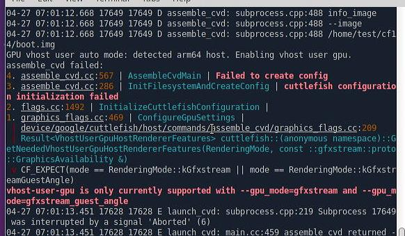

qemu+gfxstream(failed):    

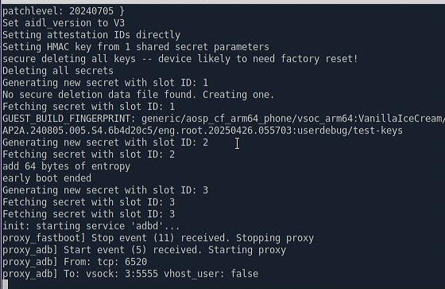

```
vsoc_arm64:/ $ getprop | grep boot | grep com                                                
[ro.boot.hardware.hwcomposer.display_finder_mode]: [drm]
[ro.boot.vendor.apex.com.google.emulated.camera.provider.hal]: [com.google.emulated.camera.provider.hal]
[sys.bootstat.first_boot_completed]: [0]
```
qemu+virgl(OK):    

```
vsoc_arm64:/ $ getprop | grep boot | grep com                                                
[dev.bootcomplete]: [1]
[ro.boot.hardware.hwcomposer.display_finder_mode]: [drm]
[ro.boot.hardware.hwcomposer.mode]: [client]
[ro.boot.vendor.apex.com.google.emulated.camera.provider.hal]: [com.google.emulated.camera.provider.hal]
[sys.boot_completed]: [1]
[sys.bootstat.first_boot_completed]: [1]
vsoc_arm64:/ $ dumpsys SurfaceFlinger | grep GLES
 ------------RE GLES------------
GLES: Mesa/X.org, virgl, OpenGL ES 3.1 Mesa 20.3.4 (git-daa37bee13)
```
### 2.3 cf15
cf15 materials:     

```
# tar xzvf /mnt8/cf15/cvd-host_package.tar.gz && unzip /mnt8/cf15/aosp_cf_arm64_phone-img-root.zip
$ ls -l -h /mnt8/cf15/
total 1.6G
-rw-r--r-- 1 test test 1.1G Apr 26 14:50 aosp_cf_arm64_phone-img-root.zip
-rw-r--r-- 1 test test 478M Apr 26 14:50 cvd-host_package.tar.gz
```
crosvm+gfxstreamer(OK):      

```
vsoc_arm64:/ $ getprop  | grep boot | grep com                                               
[dev.bootcomplete]: [1]
[ro.boot.hardware.hwcomposer.display_finder_mode]: [drm]
[ro.boot.hardware.hwcomposer.display_framebuffer_format]: [rgba]
[ro.boot.vendor.apex.com.android.hardware.gatekeeper]: [com.android.hardware.gatekeeper.nonsecure]
[ro.boot.vendor.apex.com.android.hardware.keymint]: [com.android.hardware.keymint.rust_nonsecure]
[ro.boot.vendor.apex.com.google.emulated.camera.provider.hal]: [com.google.emulated.camera.provider.hal]
[sys.boot_completed]: [1]
[sys.bootstat.first_boot_completed]: [1]
vsoc_arm64:/ $ dumpsys SurfaceFlinger | grep GLES
 ------------RE GLES------------
GLES: Google (AMD), Android Emulator OpenGL ES Translator (Radeon RX550/550 Series (POLARIS12, DRM 3.35.0, 5.4.0-214-generic, LLVM 12.0.0)), OpenGL ES 3.1 (OpenGL ES 3.2 Mesa 21.2.6)
```
crosvm+virgl(failed):    

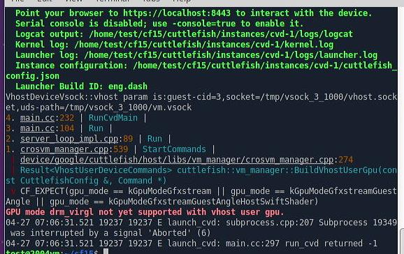

qemu+gfxstreamer(failed):     

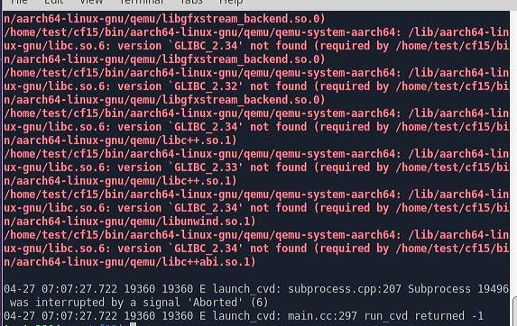

qemu+virgl(failed):      

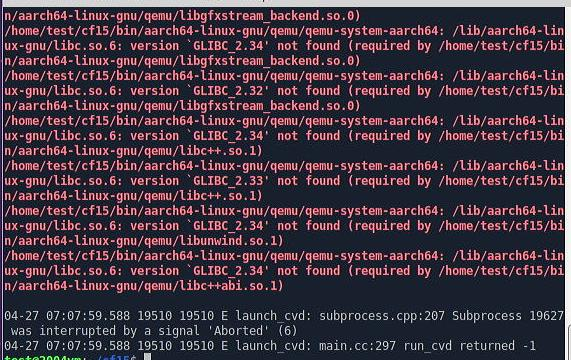

### 3. cf 150 verification(ubuntu2004)
Install:       

```
sudo apt install ./cuttlefish-base_1.5.0_arm64.deb ./cuttlefish-user_1.5.0_arm64.deb 
sudo usermod -aG kvm,cvdnetwork,render $USER
sudo reboot
```
#### 3.1 cf13
crosvm+gfxstreamer:    

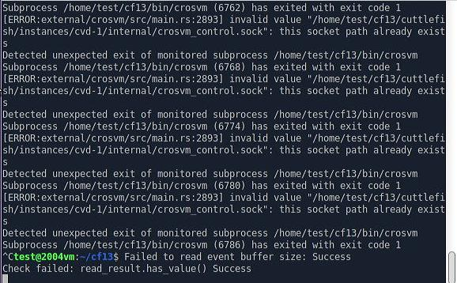

crosvm+virgl:    

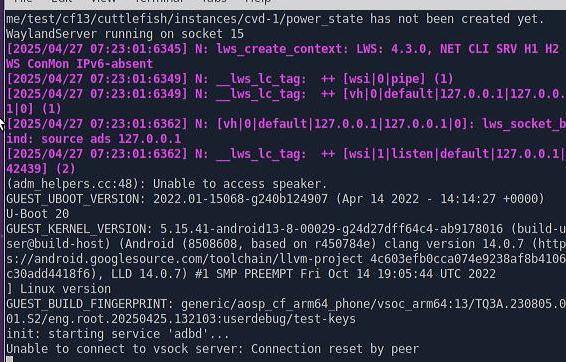

```
vsoc_arm64:/ $ getprop | grep boot | grep com                                                
[ro.boot.hardware.hwcomposer.mode]: [client]
[ro.boot.vendor.apex.com.android.wifi.hal]: [com.google.cf.wifi_hwsim]
[ro.boot.vendor.apex.com.google.emulated.camera.provider.hal]: [com.google.emulated.camera.provider.hal]
[sys.bootstat.first_boot_completed]: [0]
```
qemu+gfxstreamer:     

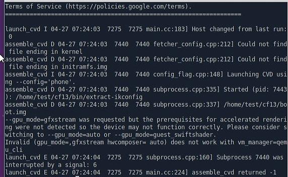

qemu+virgl:    

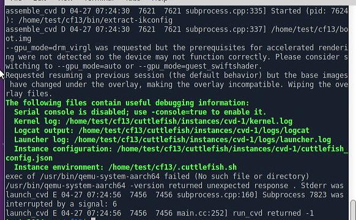

After install qemu:    

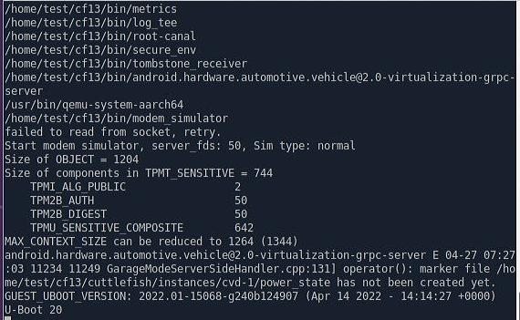

Keep offline(May take a long time):      

```
 adb devices
List of devices attached
192.168.1.78:6520	offline
```

Updated to 5.15 kernel:       

```
vsoc_arm64:/ $ getprop | grep boot | grep com                                                
[dev.bootcomplete]: [1]
[ro.boot.hardware.hwcomposer.mode]: [client]
[ro.boot.vendor.apex.com.android.wifi.hal]: [com.google.cf.wifi_hwsim]
[ro.boot.vendor.apex.com.google.emulated.camera.provider.hal]: [com.google.emulated.camera.provider.hal]
[sys.boot_completed]: [1]
[sys.bootstat.first_boot_completed]: [1]
vsoc_arm64:/ $ dumpsys SurfaceFlinger | grep GLES
GLES: Mesa/X.org, virgl, OpenGL ES 3.1 Mesa 20.3.4 (git-b873e6ad33)

```
#### 3.2 cf14
crosvm+gfxstreamer(OK):     

```
vsoc_arm64:/ $ getprop | grep boot | grep com                                                
[dev.bootcomplete]: [1]
[ro.boot.hardware.hwcomposer.display_finder_mode]: [drm]
[ro.boot.vendor.apex.com.google.emulated.camera.provider.hal]: [com.google.emulated.camera.provider.hal]
[sys.boot_completed]: [1]
[sys.bootstat.first_boot_completed]: [1]
vsoc_arm64:/ $ dumpsys SurfaceFlinger | grep GLES
 ------------RE GLES------------
GLES: Google (AMD), Android Emulator OpenGL ES Translator (Radeon RX550/550 Series (POLARIS12, DRM 3.35.0, 5.4.0-214-generic, LLVM 12.0.0)), OpenGL ES 3.1 (OpenGL ES 3.2 Mesa 21.2.6)
```
crosvm+virgl(failed):    

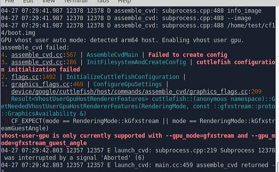

qemu+gfxstreamer(first boot won't boot complete, failed):    

```
vsoc_arm64:/ $ getprop  | grep boot | grep com                                               
[ro.boot.hardware.hwcomposer.display_finder_mode]: [drm]
[ro.boot.vendor.apex.com.google.emulated.camera.provider.hal]: [com.google.emulated.camera.provider.hal]
[sys.bootstat.first_boot_completed]: [0]
```
qemu+virgl(OK):    

```
vsoc_arm64:/ $ getprop | grep boot | grep com                                                
[dev.bootcomplete]: [1]
[ro.boot.hardware.hwcomposer.display_finder_mode]: [drm]
[ro.boot.hardware.hwcomposer.mode]: [client]
[ro.boot.vendor.apex.com.google.emulated.camera.provider.hal]: [com.google.emulated.camera.provider.hal]
[sys.boot_completed]: [1]
[sys.bootstat.first_boot_completed]: [1]
vsoc_arm64:/ $ dumpsys SurfaceFlinger | grep GLES
 ------------RE GLES------------
GLES: Mesa/X.org, virgl, OpenGL ES 3.1 Mesa 20.3.4 (git-daa37bee13)
```

### 3.3 cf15
crosvm+gfxstreamer:     

```
vsoc_arm64:/ $ getprop | grep boot | grep com                                                
[dev.bootcomplete]: [1]
[ro.boot.hardware.hwcomposer.display_finder_mode]: [drm]
[ro.boot.hardware.hwcomposer.display_framebuffer_format]: [rgba]
[ro.boot.vendor.apex.com.android.hardware.gatekeeper]: [com.android.hardware.gatekeeper.nonsecure]
[ro.boot.vendor.apex.com.android.hardware.keymint]: [com.android.hardware.keymint.rust_nonsecure]
[ro.boot.vendor.apex.com.google.emulated.camera.provider.hal]: [com.google.emulated.camera.provider.hal]
[sys.boot_completed]: [1]
[sys.bootstat.first_boot_completed]: [1]
vsoc_arm64:/ $ dumpsys SurfaceFlinger | grep GLES
 ------------RE GLES------------
GLES: Google (AMD), Android Emulator OpenGL ES Translator (Radeon RX550/550 Series (POLARIS12, DRM 3.35.0, 5.4.0-214-generic, LLVM 12.0.0)), OpenGL ES 3.1 (OpenGL ES 3.2 Mesa 21.2.6)
```
crosvm+virgl(failed):     

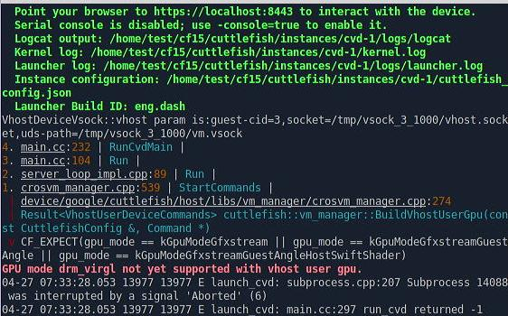

qemu+gfxstreamer(failed):    

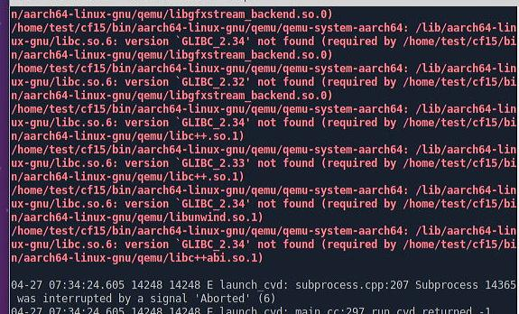

qemu+virgl(failed):     

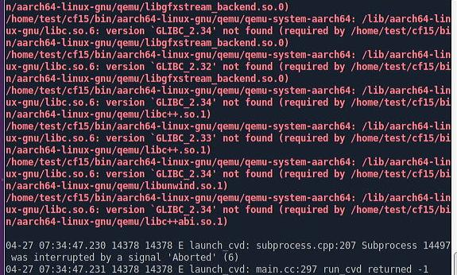

