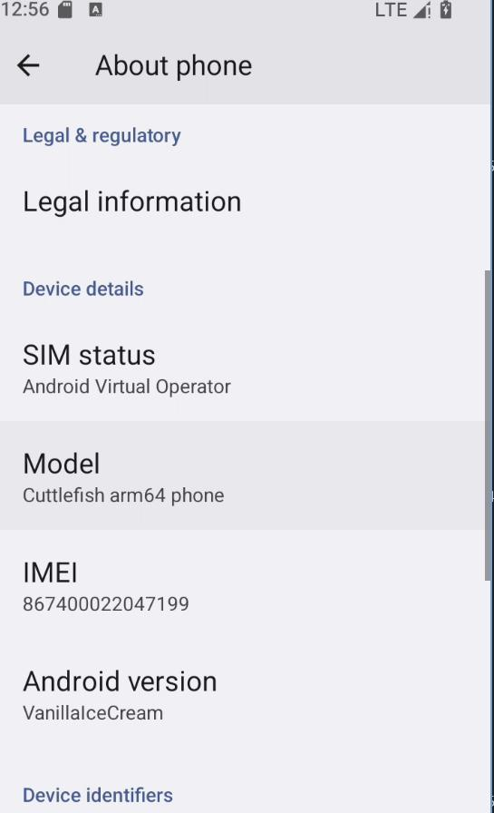
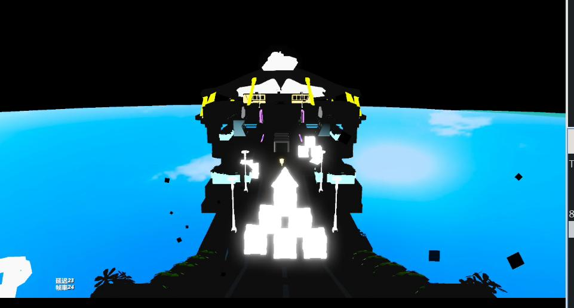
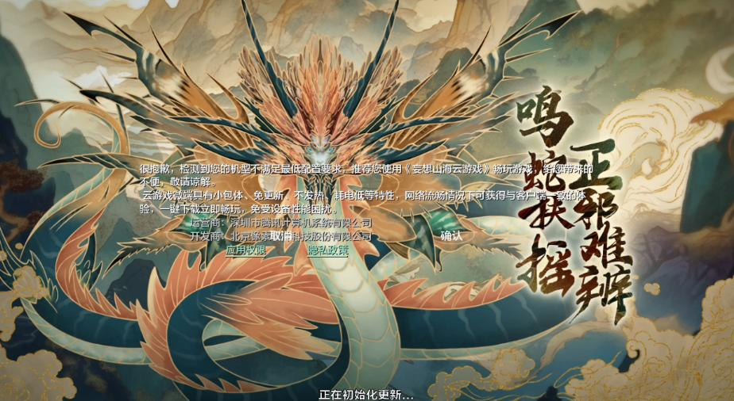
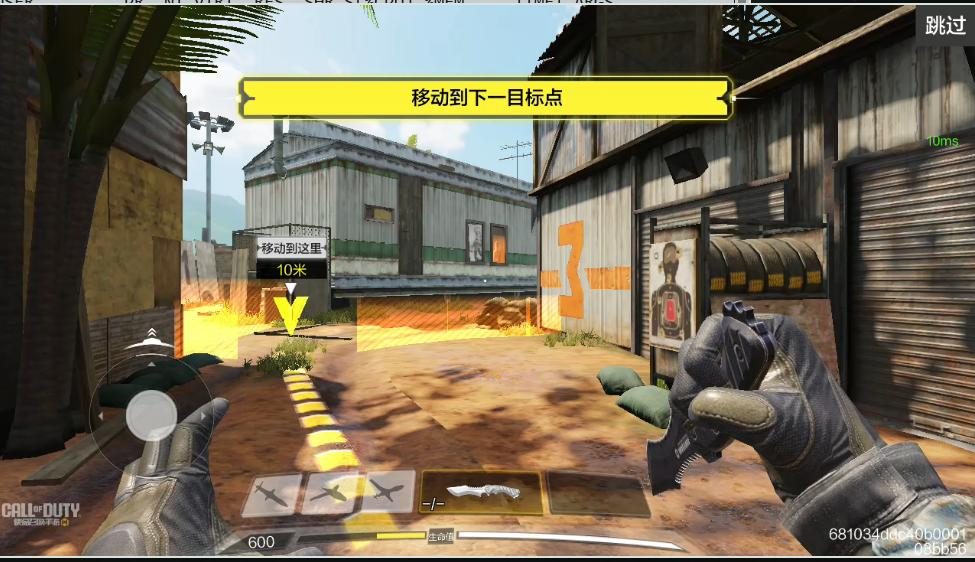
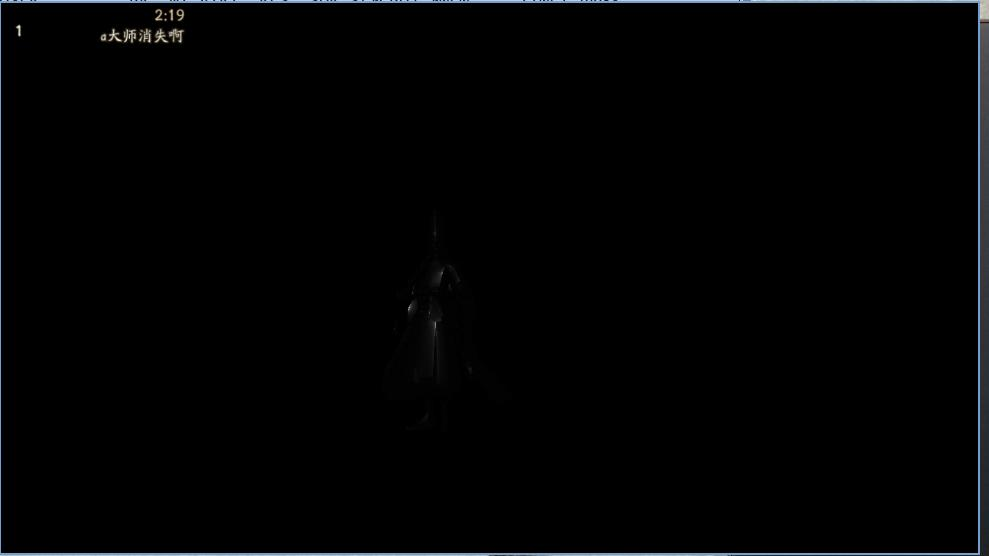
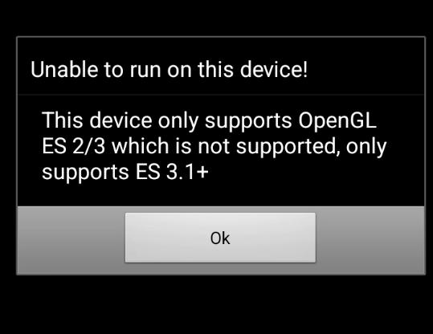
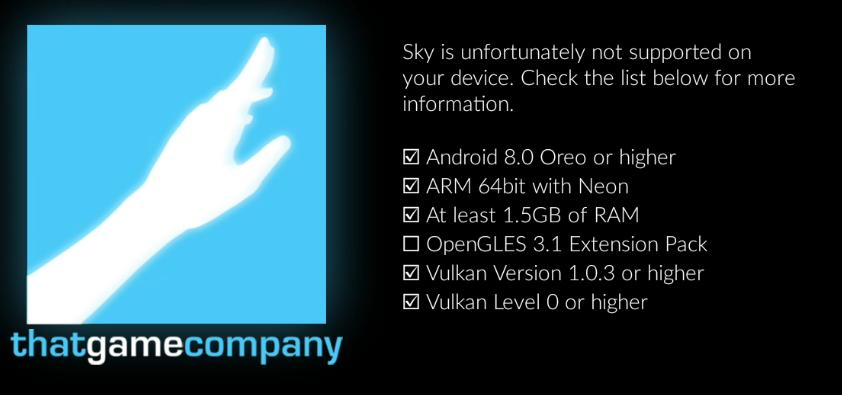
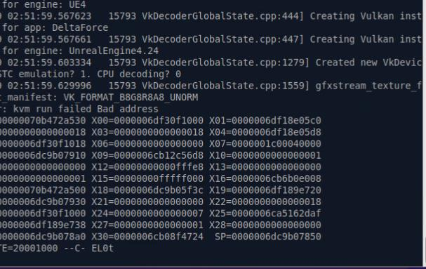

# 20250429
### 1. cf14 verification
Version 14, VannillaIceCream:    



```
vsoc_arm64:/ $  getprop ro.build.version.release
14
```

图形配置:       

```
vsoc_arm64:/ $ getprop | grep vulkan                                                         
[ro.cpuvulkan.version]: [0]
[ro.hardware.vulkan]: [ranchu]
[ro.hwui.use_vulkan]: []
[ro.vulkan.apex]: [com.google.cf.vulkan]
vsoc_arm64:/ $ dumpsys SurfaceFlinger | grep GLES
 ------------RE GLES------------
GLES: Google (AMD), Android Emulator OpenGL ES Translator (AMD Radeon RX 550 / 550 Series (radeonsi, polaris12, ACO, DRM 3.61, 6.14.0-15-generic)), OpenGL ES 3.1 (OpenGL ES 3.2 Mesa 25.0.3-1ubuntu2)
```

| Game | Description |
| ----------- | ----------- |
|蛋仔派队   | 渲染有黑色 |
| 妄想山海 | 不满足配置需求 |
| 逆水寒 | 一直处于初始化 |
| 使命召唤手游 | 正常 |
| 阴阳师 | 渲染异常 |
| 元梦之星 | 直接退出 |
| 乱世王者 | 无法运行，硬件不满足 |
| 决战！平安京 |  |
| 高能英雄 | 提示opengles兼容问题，退出  |
| 光遇 | 提示不满足opengl条件，退出 |
| 三角洲行动 | Qemu退出  |


蛋仔：   



妄想:     



使命召唤:     



阴阳师:     



乱世王者:     



高能英雄:     


光遇:    



三角洲行动:    



### 2. waydroid on ubuntu2504

