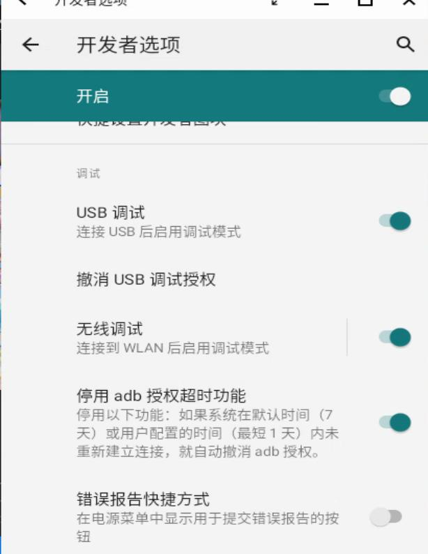
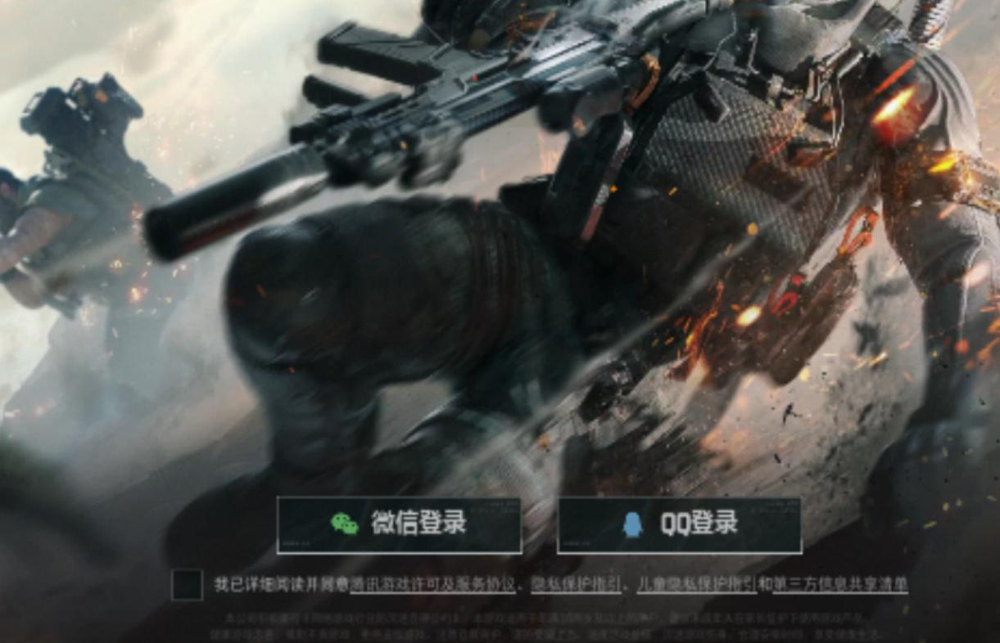
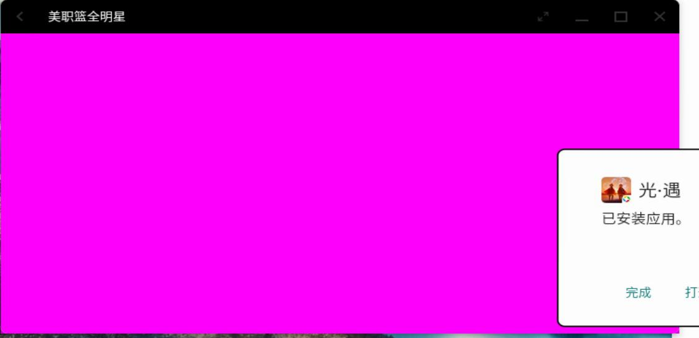
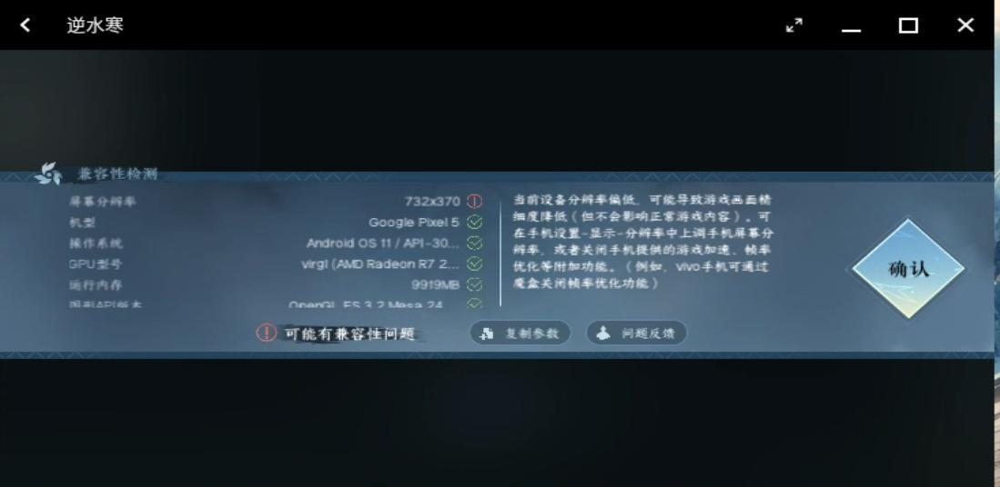

# 20250506
### 1. virgl based openfde
Install via:    

```
sudo apt install -y curl
curl -fsSL https://openfde.com/getopenfde/get-openfde.sh -o get-openfde.sh  
sudo sh ./get-openfde.sh
```
netplan configuration:       

```
test@vm2404:~$ cat /etc/netplan/eth0.yaml 
network:
    version: 2
    ethernets:
        eth0:
            dhcp4: true
test@vm2404:~$ cat /etc/netplan/eth1.yaml 
network:
    version: 2
    ethernets:
        eth1:
            dhcp4: true
```



Testing games:       

```
和平精英, 正常运行
蛋仔派对,  正常运行。
妄想山海, 正常运行。
逆水寒, 正常游戏
使命召唤手游, 正常游戏
阴阳师, 闪退
元梦之星, 正常运行。
乱世王者, 正常运行
决战！平安京
高能英雄: 正常运行
光遇: 看到手型图案后闪退。
三角洲行动, 可正常启动，不崩溃，但因为鼠标无法点击到正确的位置，在openfde下无法点击到正确的位置并开始。（见截图)   
美职篮全明星，正常启动，但启动后画面为紫色背景(见下面截图), 显卡为rx550.    
永恒部落, 正常运行。
英魂之刃, 启动后黑屏(rx550)
崩坏学园2: 正常运行
伏魔录, 正常运行。
巅峰极速
```
三角洲:     



美职:    



逆水寒:    



英魂之刃:    


### 2. 
