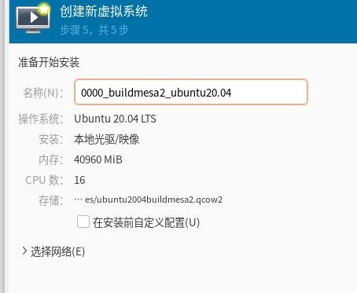
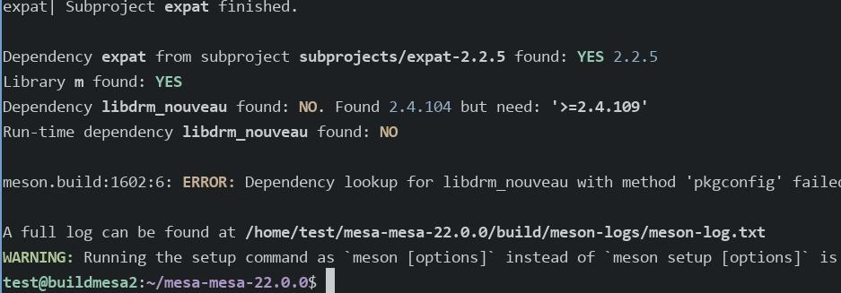
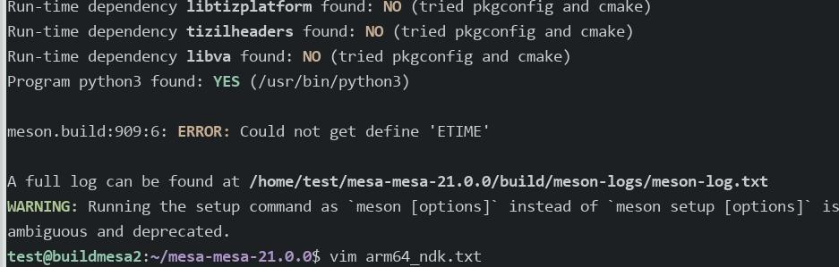

# 20250508
### 1. mesa building
Building aosp 9:    

```
rm -r out/target/common/obj/JAVA_LIBRARIES
```

### 2. ubuntu2004 cross-compilation
qcow2 for installation:    

```
qemu-img create -f qcow2 ubuntu2004buildmesa2.qcow2 80G
```



Install packages:     

```
sudo apt install binutils-aarch64-linux-gnu-dbg binutils-aarch64-linux-gnu cpp-aarch64-linux-gnu \
g++-10-aarch64-linux-gnu g++-9-aarch64-linux-gnu g++-aarch64-linux-gnu g++ \
gcc-10-aarch64-linux-gnu-base gcc-9-aarch64-linux-gnu-base gcc-aarch64-linux-gnu \
pkg-config-aarch64-linux-gnu qemu-efi-aarch64 gcc arch-test qemu-user-static debootstrap vim bison flex
sudo apt install vim libdrm-nouveau2 libdrm-dev libdrm2 libwayland-dev wayland-protocols libmirwayland-bin gir1.2-gtklayershell-0.1 gtk-layer-shell-doc gtk-layer-shell-examples libgtk-layer-shell-dev libgtk-layer-shell0 wayland-scanner++ libwayland-egl-backend-dev libx11-dev libxext-dev libxfixes-dev libxcb-glx0-dev libxcb-shm0-dev libx11-xcb-dev libxcb-dri2-0-dev libxcb-dri3-dev libxcb-present-dev  libxshmfence-dev libxxf86vm-dev libxrandr-dev python3-pip
```
Create sysroot path aarch64 vm:     

```
sudo mkdir -p /mnt/data/arm64
sudo qemu-debootstrap --arch arm64 bullseye /mnt/data/arm64 http://mirrors.ustc.edu.cn/debian/
sudo chroot /mnt/data/arm64/
apt install vim libdrm-nouveau2 libdrm-dev libdrm2 libwayland-dev wayland-protocols libmirwayland-bin gir1.2-gtklayershell-0.1 gtk-layer-shell-doc gtk-layer-shell-examples libgtk-layer-shell-dev libgtk-layer-shell0 wayland-scanner++ libwayland-egl-backend-dev libx11-dev libxext-dev libxfixes-dev libxcb-glx0-dev libxcb-shm0-dev libx11-xcb-dev libxcb-dri2-0-dev libxcb-dri3-dev libxcb-present-dev  libxshmfence-dev libxxf86vm-dev libxrandr-dev python3-pip
apt remove meson
sudo python3 -m pip install meson -i https://pypi.tuna.tsinghua.edu.cn/simple
```
Build(22.0.0 failed):      

```
unzip mesa-mesa-22.0.0.zip
cd  /home/test/mesa-mesa-22.0.0/subprojects
scp test@192.168.1.81:/home/test/mesa-mesa-22.0.0/subprojects/expat.wrap .
scp test@192.168.1.81:/home/test/mesa-mesa-22.0.0/subprojects/zlib.wrap .
```



Build(21.0.0):      

```
unzip mesa-mesa-21.0.0.zip 
cd mesa-mesa-21.0.0/subprojects/
scp test@192.168.1.81:/home/test/mesa-mesa-21.0.0/subprojects/expat.wrap .
scp test@192.168.1.81:/home/test/mesa-mesa-21.0.0/subprojects/zlib.wrap .
```
Create arm64.txt:       

```
[binaries]
c = 'aarch64-linux-gnu-gcc'
cpp = 'aarch64-linux-gnu-g++'
ar = 'aarch64-linux-gnu-gcc-ar'
strip = 'aarch64-linux-gnu-strip'
pkgconfig = 'aarch64-linux-gnu-pkg-config'
ld = 'aarch64-linux-gnu-ld'
pcap-config = ''
cmake = 'cmake'

[properties]
skip_sanity_check = true
sys_root = '/mnt/data/arm64'
# Generate binaries that are portable across all Armv8 machines
platform = 'generic'
pkg_config_libdir ='/mnt/data/arm64/usr/lib/aarch64-linux-gnu/pkgconfig:/mnt/data/arm64/usr/share/pkgconfig'

[built-in options]
c_args = ['--sysroot', '/mnt/data/arm64']
c_link_args = ['-Wl,-rpath', '/mnt/data/arm64/usr/lib/aarch64-linux-gnu/', '-Wl,--as-needed']

[host_machine]
system = 'linux'
cpu_family = 'aarch64'
cpu = 'armv8-a'
endian = 'little'

test@buildmesa2:~/mesa-mesa-21.0.0$ pwd
/home/test/mesa-mesa-21.0.0
test@buildmesa2:~/mesa-mesa-21.0.0$ ls arm64.txt 
arm64.txt
```
Build and install:       

```
/usr/local/bin/meson build  --prefix=/opt/local --cross-file arm64.txt
ninja -C build
ninja -C build install
```
Directory content:       

```
test@buildmesa2:/opt/local/lib$ tree 
.
├── dri
│   ├── armada-drm_dri.so
│   ├── etnaviv_dri.so
│   ├── exynos_dri.so
│   ├── hx8357d_dri.so
│   ├── ili9225_dri.so
│   ├── ili9341_dri.so
│   ├── imx-dcss_dri.so
│   ├── imx-drm_dri.so
│   ├── ingenic-drm_dri.so
│   ├── kgsl_dri.so
│   ├── kms_swrast_dri.so
│   ├── lima_dri.so
│   ├── mcde_dri.so
│   ├── mediatek_dri.so
│   ├── meson_dri.so
│   ├── mi0283qt_dri.so
│   ├── msm_dri.so
│   ├── mxsfb-drm_dri.so
│   ├── nouveau_dri.so
│   ├── panfrost_dri.so
│   ├── pl111_dri.so
│   ├── repaper_dri.so
│   ├── rockchip_dri.so
│   ├── st7586_dri.so
│   ├── st7735r_dri.so
│   ├── stm_dri.so
│   ├── sun4i-drm_dri.so
│   ├── swrast_dri.so
│   ├── tegra_dri.so
│   ├── v3d_dri.so
│   ├── vc4_dri.so
│   └── virtio_gpu_dri.so
├── libEGL.so -> libEGL.so.1
├── libEGL.so.1 -> libEGL.so.1.0.0
├── libEGL.so.1.0.0
├── libexpat.so -> libexpat.so.1
├── libexpat.so.1 -> libexpat.so.1.6.7
├── libexpat.so.1.6.7
├── libgbm.so -> libgbm.so.1
├── libgbm.so.1 -> libgbm.so.1.0.0
├── libgbm.so.1.0.0
├── libglapi.so -> libglapi.so.0
├── libglapi.so.0 -> libglapi.so.0.0.0
├── libglapi.so.0.0.0
├── libGLESv1_CM.so -> libGLESv1_CM.so.1
├── libGLESv1_CM.so.1 -> libGLESv1_CM.so.1.1.0
├── libGLESv1_CM.so.1.1.0
├── libGLESv2.so -> libGLESv2.so.2
├── libGLESv2.so.2 -> libGLESv2.so.2.0.0
├── libGLESv2.so.2.0.0
├── libGL.so -> libGL.so.1
├── libGL.so.1 -> libGL.so.1.2.0
├── libGL.so.1.2.0
├── libvulkan_lvp.so
├── libxatracker.so -> libxatracker.so.2
├── libxatracker.so.2 -> libxatracker.so.2.5.0
├── libxatracker.so.2.5.0
├── libz.so
└── pkgconfig
    ├── dri.pc
    ├── egl.pc
    ├── gbm.pc
    ├── glesv1_cm.pc
    ├── glesv2.pc
    ├── gl.pc
    ├── xatracker.pc
    └── zlib.pc
```

Change to ndk:     

```
scp dash@192.168.1.208:~/android-ndk-r21e-linux-x86_64.zip .
unzip android-ndk-r21e-linux-x86_64.zip


$ cat arm64_ndk.txt 
[binaries]
ar = '/home/test/android-ndk-r21e/toolchains/llvm/prebuilt/linux-x86_64/bin/aarch64-linux-android-ar'
c = ['ccache', '/home/test/android-ndk-r21e/toolchains/llvm/prebuilt/linux-x86_64/bin/aarch64-linux-android26-clang']
cpp = ['ccache', '/home/test/android-ndk-r21e/toolchains/llvm/prebuilt/linux-x86_64/bin/aarch64-linux-android26-clang++', '-fno-exceptions', '-fno-unwind-tables', '-fno-asynchronous-unwind-tables', '-static-libstdc++']
strip = '/home/test/android-ndk-r21e/toolchains/llvm/prebuilt/linux-x86_64/bin/aarch64-linux-android-strip'
#c = 'aarch64-linux-gnu-gcc'
#cpp = 'aarch64-linux-gnu-g++'
#ar = 'aarch64-linux-gnu-gcc-ar'
#strip = 'aarch64-linux-gnu-strip'
pkgconfig = 'aarch64-linux-gnu-pkg-config'
ld = 'aarch64-linux-gnu-ld'
pcap-config = ''
cmake = 'cmake'

[properties]
skip_sanity_check = true
sys_root = '/mnt/data/arm64'
# Generate binaries that are portable across all Armv8 machines
platform = 'generic'
pkg_config_libdir ='/mnt/data/arm64/usr/lib/aarch64-linux-gnu/pkgconfig:/mnt/data/arm64/usr/share/pkgconfig'

[built-in options]
c_args = ['--sysroot', '/mnt/data/arm64']
c_link_args = ['-Wl,-rpath', '/mnt/data/arm64/usr/lib/aarch64-linux-gnu/', '-Wl,--as-needed']

[host_machine]
system = 'linux'
cpu_family = 'aarch64'
cpu = 'armv8-a'
endian = 'little'

```
Build via `/usr/local/bin/meson build  --prefix=/opt/local --cross-file arm64_ndk.txt` failed with:    



