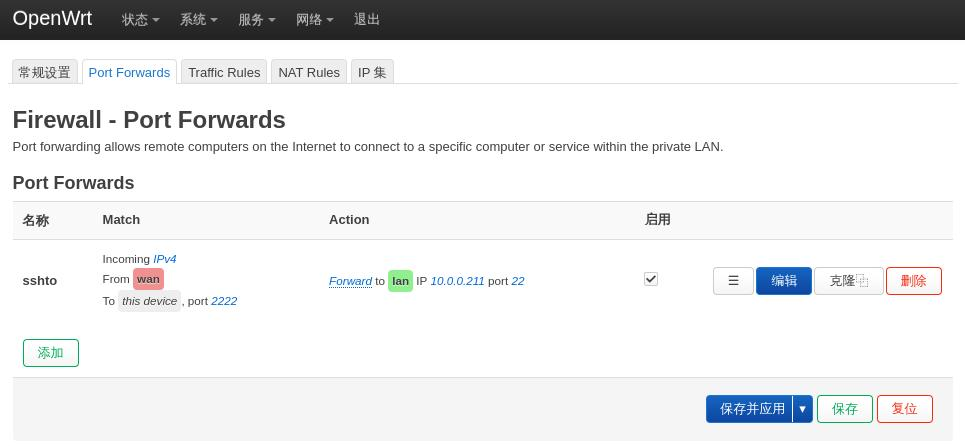

# 20250514
### 1. openwrt issue
via following command I could not reached the openwrt's intranet:     

```
sudo route add -net 10.0.0.0/24 gw 192.168.1.146
```
solved via:    



### 2. kolla-ansible
two nics with each node:    

```
openstack1 enp1s0(192.168.168.2) enp7s0
openstack2 enp1s0(192.168.168.3) enp7s0
openstack3 enp1s0(192.168.168.4) enp7s0
```
On each node:     

```
rm -f /etc/resolv.conf
echo "nameserver 223.5.5.5">/etc/resolv.conf
apt install -y dnscrypt-proxy
echo "nameserver 127.0.2.1">/etc/resolv.conf
chattr +i /etc/resolv.conf
```
On each node:      

```
# vim /etc/hosts
......
192.168.168.2 openstack1
192.168.168.3 openstack2
192.168.168.4 openstack3
# ssh-keygen
# ssh-copy-id root@openstack1
# ssh-copy-id root@openstack2
# ssh-copy-id root@openstack3
```
On deploy node(openstack1):       

```
mkdir -p /root/Code/venv
python3 -m venv /root/Code/venv/
source /root/Code/venv/bin/activate
pip install -U pip
pip install 'ansible>=4,<6'
git clone https://github.com/openstack/kolla-ansible -b stable/2024.2
cd kolla-ansible
pip install kolla-ansible
pip isntall -r kolla-ansible/requirements.txt
sudo mkdir -p /etc/kolla
sudo chown $USER:$USER /etc/kolla
cp -r kolla-ansible/etc/kolla/* /etc/kolla
kolla-ansible install-deps
```
inventory:      

```
mkdir deploy
cp kolla-ansible/ansible/inventory/* deploy/
```
`vim deploy/multinode`:      

```
[control]
openstack1
openstack2
openstack3

[network]
openstack1
openstack2
openstack3

[compute]
openstack1
openstack2
openstack3

[monitoring]
openstack1
openstack2
openstack3
```
Generate the password for kolla environment:       

```
# kolla-genpwd
# vim  /etc/kolla/passwords.yml
......
keystone_admin_password: 123456hhh
......

```

