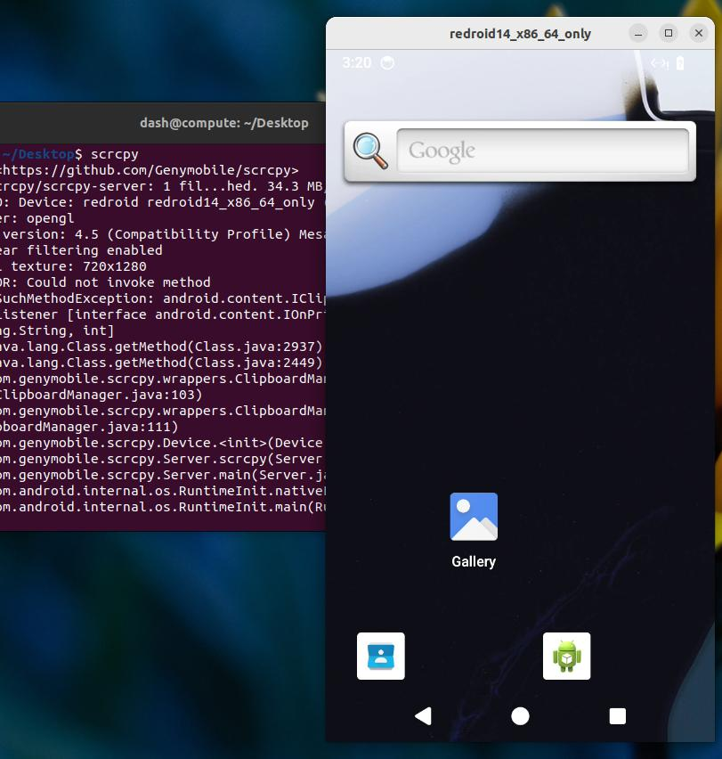

# 20250517
### 1. redroidlxcubuntu2204
Install:      

```
apt install -y lxc docker.io  skopeo umoci jq
systemctl --no-pager status lxc-net
sed -i 's/set -eu/set -u/g' /usr/share/lxc/templates/lxc-oci
  lxc-create -n redroid11 -t oci -- -u docker://swr.cn-north-4.myhuaweicloud.com/ddn-k8s/docker.io/redroid/redroid:12.0.0_64only-latest
  mkdir $HOME/data-redroid11
  sed -i '/lxc.include/d' /var/lib/lxc/redroid11/config
  <<EOF cat >> /var/lib/lxc/redroid11/config
### hacked
lxc.init.cmd = /init androidboot.hardware=redroid androidboot.redroid_gpu_mode=guest
lxc.apparmor.profile = unconfined
lxc.autodev = 1
lxc.autodev.tmpfs.size = 25000000
lxc.mount.entry = $HOME/data-redroid11 data none bind 0 0
EOF

  rm /var/lib/lxc/redroid11/rootfs/vendor/bin/ipconfigstore
  lxc-start -l debug -o redroid11.log -n redroid11
```
Connect:      

```
adb connect `lxc-info redroid11 -i | awk '{print $2}'`:5555
connected to 10.0.3.169:5555
```
scrcpy failed.    

### 2. redroid lxc scrcpy issue
redroid runned via docker could be attached via scrcpy:     

```
redroid_x86_64_only:/ $ ls /dev/dm
dm-user/   dma_heap/
redroid_x86_64_only:/ $ ls /dev/dma_heap/
system
redroid_x86_64_only:/ $ ls /dev/dma_heap/ -l -h
total 0
cr--r--r-- 1 system system 249,   0 2025-05-17 03:06 system
redroid_x86_64_only:/ $ file /dev/dma_heap/system
/dev/dma_heap/system: character special (249/0)
```
So maybe in lxc we have to mount more `/dev` items.     

Solved via add `dma_heap` mounted:      

```
# vim /var/lib/lxc/redroid11/config
......
lxc.mount.entry = /root/data-redroid11 data none bind 0 0
+ lxc.mount.entry = /dev/dma_heap dev/dma_heap none bind,optional,create=dir
```



