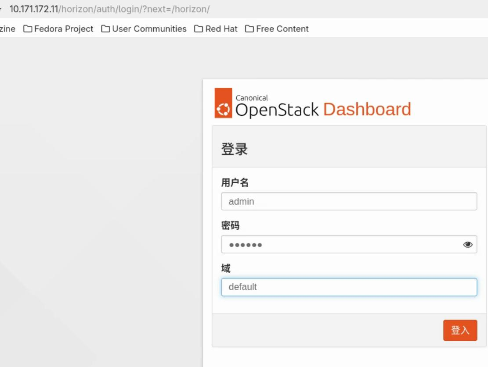

# 20250524
### 1. arm64-nova-libvirt-lxc
Working tips:       

machine configuration, compute/controller node:      

```
# crontab -e
@reboot sleep 10 && modprobe binder_linux devices="binder,hwbinder,vndbinder" && modprobe nbd
```

Image test:   

```
wget https://cloud-images.ubuntu.com/jammy/current/jammy-server-cloudimg-arm64.tar.gz
source /etc/keystone/admin-openrc.sh 
openstack image create "lxc_ubuntu_22.04" --file jammy-server-cloudimg-arm64.img --disk-format raw --container-format bare --public

# openstack image list
+--------------------------------------+------------------+--------+
| ID                                   | Name             | Status |
+--------------------------------------+------------------+--------+
| a0011671-0e42-416e-87bc-eead6ee5431d | lxc_ubuntu_22.04 | active |
+--------------------------------------+------------------+--------+
```
Compute node install lxc:       

```
apt install -y nova-compute-lxc
...
Configuration file '/etc/nova/nova-compute.conf'
 ==> Modified (by you or by a script) since installation.
 ==> Package distributor has shipped an updated version.
   What would you like to do about it ?  Your options are:
    Y or I  : install the package maintainer's version
    N or O  : keep your currently-installed version
      D     : show the differences between the versions
      Z     : start a shell to examine the situation
 The default action is to keep your current version.
*** nova-compute.conf (Y/I/N/O/D/Z) [default=N] ? Y
...

service nova-compute restart
```
After installation of `nova-compute-lxc`:       

```
openstack compute service list
+--------------------------------------+----------------+------------+----------+---------+-------+----------------------------+
| ID                                   | Binary         | Host       | Zone     | Status  | State | Updated At                 |
+--------------------------------------+----------------+------------+----------+---------+-------+----------------------------+
| d23f2977-5a64-4161-81aa-56bc57470a38 | nova-scheduler | controller | internal | enabled | up    | 2025-05-24T01:46:06.000000 |
| 41520a5c-740f-4922-b0d1-50b671408bca | nova-conductor | controller | internal | enabled | up    | 2025-05-24T01:45:58.000000 |
| 8e25e510-9a39-433f-bd0f-4737e0082121 | nova-compute   | compute    | nova     | enabled | up    | 2025-05-24T01:45:48.000000 |
+--------------------------------------+----------------+------------+----------+---------+-------+----------------------------+
openstack flavor create --vcpus 4 --ram 6124 --disk 25 C4-6124MB-25G

```
Replace the lxc package:       

```
apt remove libvirt-daemon-driver-lxc --purge
apt install -y ./libvirt-daemon-driver-lxc_8.0.0-1ubuntu7.11_arm64.deb 
reboot
```

### 2. build libvirt with lxc patch
Steps:      

```
# vim /etc/apt/sources.list
uncomment all of the "# deb-src"
# apt update -y
mkdir libvirt
cd libvirt/
apt source libvirt-daemon-driver-lxc
apt install -y build-essential pbuilder
apt-get build-dep libvirt-daemon-driver-lxc
```
Code modification:      

```
libvirt-8.0.0# cat src/lxc/lxc_controller.c | grep -i 25000000 -B1 -A1
    /*opts = g_strdup_printf("mode=755,size=65536%s", mount_options);*/
    opts = g_strdup_printf("mode=755,size=25000000%s", mount_options);
```
Build deb:     

```
root@compute:~/Code/libvirt/libvirt-8.0.0# pwd
/root/Code/libvirt/libvirt-8.0.0
root@compute:~/Code/libvirt/libvirt-8.0.0# ls
AUTHORS.rst     configmake.h.in   docs                 libvirt-lxc.pc.in   meson.build            README.rst  tools
AUTHORS.rst.in  CONTRIBUTING.rst  examples             libvirt.pc.in       meson_options.txt      run.in
build-aux       COPYING           gitdm.config         libvirt-qemu.pc.in  mingw-libvirt.spec.in  scripts
ci              COPYING.LESSER    include              libvirt.spec        NEWS.rst               src
config.h        debian            libvirt-admin.pc.in  libvirt.spec.in     po                     tests
root@compute:~/Code/libvirt/libvirt-8.0.0# dpkg-source --commit
root@compute:~/Code/libvirt/libvirt-8.0.0# debuild -us -uc
# ls ../*.deb
../libnss-libvirt_8.0.0-1ubuntu7.11_arm64.deb
../libvirt0_8.0.0-1ubuntu7.11_arm64.deb
../libvirt-clients_8.0.0-1ubuntu7.11_arm64.deb
../libvirt-daemon_8.0.0-1ubuntu7.11_arm64.deb
../libvirt-daemon-config-network_8.0.0-1ubuntu7.11_all.deb
../libvirt-daemon-config-nwfilter_8.0.0-1ubuntu7.11_all.deb
../libvirt-daemon-driver-lxc_8.0.0-1ubuntu7.11_arm64.deb
../libvirt-daemon-driver-qemu_8.0.0-1ubuntu7.11_arm64.deb
../libvirt-daemon-driver-storage-gluster_8.0.0-1ubuntu7.11_arm64.deb
../libvirt-daemon-driver-storage-iscsi-direct_8.0.0-1ubuntu7.11_arm64.deb
../libvirt-daemon-driver-storage-rbd_8.0.0-1ubuntu7.11_arm64.deb
../libvirt-daemon-driver-storage-zfs_8.0.0-1ubuntu7.11_arm64.deb
../libvirt-daemon-driver-xen_8.0.0-1ubuntu7.11_arm64.deb
../libvirt-daemon-system_8.0.0-1ubuntu7.11_arm64.deb
../libvirt-daemon-system-systemd_8.0.0-1ubuntu7.11_all.deb
../libvirt-daemon-system-sysv_8.0.0-1ubuntu7.11_all.deb
../libvirt-dev_8.0.0-1ubuntu7.11_arm64.deb
../libvirt-doc_8.0.0-1ubuntu7.11_all.deb
../libvirt-login-shell_8.0.0-1ubuntu7.11_arm64.deb
../libvirt-sanlock_8.0.0-1ubuntu7.11_arm64.deb
../libvirt-wireshark_8.0.0-1ubuntu7.11_arm64.deb

```
Install deb steps see above
### 3. generate arm64 lxc image
Create lxc instance:    

```
modprobe binder_linux devices="binder,hwbinder,vndbinder"
apt install -y skopeo umoci jq
sed -i 's/set -eu/set -u/g' /usr/share/lxc/templates/lxc-oci
lxc-create -n redroid12 -t oci -- -u docker://docker.io/redroid/redroid:12.0.0_64only-latest
rm /var/lib/lxc/redroid12/rootfs/vendor/bin/ipconfigstore
```
added patched:      

```
$ sed -i '/lxc.include/d' /var/lib/lxc/redroid12/config
$ vim /var/lib/lxc/redroid12/config
......
### hacked
lxc.init.cmd = /init androidboot.hardware=redroid androidboot.redroid_gpu_mode=host androidboot.redroid_gpu_node=/dev/dri/ren
derD128
lxc.apparmor.profile = unconfined
#lxc.autodev = 1
lxc.autodev.tmpfs.size = 25000000
lxc.mount.entry = /dev/dma_heap dev/dma_heap none bind,optional,create=dir
lxc.mount.entry = /dev/dri dev/dri none bind,optional,create=dir
lxc.mount.entry = /dev/dri/renderD128 dev/dri/renderD128 none bind,optional,create=file
lxc.mount.entry = /dev/fuse dev/fuse none bind,optional,create=file

```
After examine the lxc instance, convert it into openstack img:       

```
dd if=/dev/null of=redroid12.img bs=1M seek=10240
mkfs.ext4 -F redroid12.img 
mount redroid12.img  /mnt8
rsync -av /var/lib/lxc/redroid12/rootfs/* /mnt8
sync
umount /mnt8
```
Create openstack usable disk image:       

```
openstack image create "redroid12" --file redroid12.img --disk-format raw --container-format bare --public
```

### 4. docker issue
Ubuntu22.04 5.15 kernel, install docker cause:     

```
May 24 10:56:41 compute dockerd[32267]: failed to start daemon: Error initializing network controller: error creating default "bridge" network: Failed to program NAT chain: failed to inject DOCKER in PREROUTING chain: iptables failed: iptables --wait -t nat -A PREROUTING -m addrtype --dst-type LOCAL -j DOCKER: iptables v1.8.7 (nf_tables): Couldn't load match `addrtype':No such file or directory
May 24 10:56:41 compute dockerd[32267]: Try `iptables -h' or 'iptables --help' for more information.
May 24 10:56:41 compute dockerd[32267]:  (exit status 2)
May 24 10:56:41 compute dockerd[32267]: time="2025-05-24T10:56:41.210508600+08:00" level=info msg="stopping event stream following graceful shutdown" error="context canceled" module=libcontainerd namespace=plugins.moby
May 24 10:56:41 compute systemd[1]: docker.service: Main process exited, code=exited, status=1/FAILURE
```
Solved via:    

```
echo "blacklist x_tables>>/etc/modprobe.d/blacklist.conf
``
### 5. horizon 



