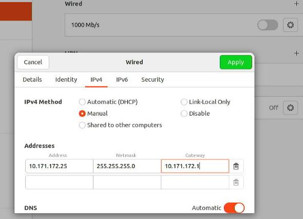

# 20250605
### 1. rk3588 lxc issue
Write image to sd card:      

```
# xz -d < Rock5_Ubuntu22.img.xz - | dd of=/dev/sdb && sync
```



Update:      

```
use  ubuntu-22.04-preinstalled-desktop-arm64-rock-5b-plus.img
```

In ubuntu2204:    

```
apt update -y
apt install -y docker.io
test@rk3588:~$ ls /dev/dri/ -l -h
total 0
drwxr-xr-x  2 root root        120  6月  5 16:05 by-path
crw-rw----+ 1 root video  226,   0  6月  5 16:05 card0
crw-rw----+ 1 root video  226,   1  6月  5 16:05 card1
crw-rw----+ 1 root render 226, 128  6月  5 16:05 renderD128
crw-rw----+ 1 root render 226, 129  6月  5 16:05 renderD129
```
Run docker instance:      

```
sudo docker run -d -p 5555:5555 -v ~/redroid-data:/data --restart unless-stopped --name redroid --privileged cnflysky/redroid-rk3588:lineage-20 androidboot.redroid_height=1920 androidboot.redroid_width=1080
sudo docker ps
sudo docker exec -it redroid sh

Result:   

a91141efc267:/ # getprop | grep boot | grep com                                                                                                                                              
[dev.bootcomplete]: [1]
[ro.boottime.vendor.hwcomposer-2-1]: [1297258137855]
[sys.boot_completed]: [1]
[sys.bootstat.first_boot_completed]: [1]
a91141efc267:/ # dumpsys SurfaceFlinger | grep GLES
GLES: ARM, Mali-G610, OpenGL ES 3.2 v1.g18p0-01eac0.2d5e200a1514bdef1a4909db66e37e28
```
lxc related steps:     

```
$     sudo vim /etc/docker/daemon.json
{
	       "insecure-registries": ["192.168.1.7:5000"]
}
$     sudo apt install -y lxc docker.io  skopeo umoci jq
$ sudo docker tag cnflysky/redroid-rk3588:lineage-20 192.168.1.7:5000/cnflysky/redroid-rk3588:lineage-20
$ sudo docker push 192.168.1.7:5000/cnflysky/redroid-rk3588:lineage-20
$ sudo sed -i 's/set -eu/set -u/g' /usr/share/lxc/templates/lxc-oci

$  cat /etc/containers/registries.conf
[[registry]]
prefix = "192.168.1.7:5000"
location = "192.168.1.7:5000"
insecure = true
$ sudo su
# lxc-create -n redroid3588 -t oci -- -u docker://192.168.1.7:5000/cnflysky/redroid-rk3588:lineage-20
# vim /var/lib/lxc/redroid3588/config

lxc.init.cmd = /init  androidboot.hardware=redroid 
lxc.apparmor.profile = unconfined
#lxc.autodev = 1
lxc.autodev.tmpfs.size = 25000000
lxc.mount.entry = /dev/dma_heap dev/dma_heap none bind,optional,create=dir
#lxc.mount.entry = /dev/ dev none bind,optional,create=dir
lxc.mount.entry = /dev/dri dev/dri none bind,optional,create=dir
lxc.mount.entry = /dev/dri/renderD128 dev/dri/renderD128 none bind,optional,create=file
lxc.mount.entry = /dev/dri/renderD129 dev/dri/renderD129 none bind,optional,create=file
lxc.mount.entry = /dev/dri/card0 dev/dri/card0 none bind,optional,create=file
lxc.mount.entry = /dev/dri/card1 dev/dri/card1 none bind,optional,create=file
lxc.mount.entry = /dev/fuse dev/fuse none bind,optional,create=file
lxc.mount.entry = /dev/mali0 dev/mali0 none bind,optional,create=file
lxc.mount.entry = /dev/mpp_service dev/mpp_service none bind,optional,create=file


# rm /var/lib/lxc/redroid3588/rootfs/vendor/bin/ipconfigstore
# apt remove apparmor --purge
```
