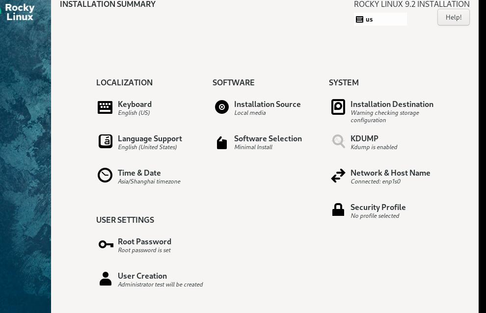

# 20250609
### 1. rk3588 container verification
Steps:      

```
 docker tag iceblacktea/redroid-arm64:12.0.0-250116 192.168.1.7:5000/iceblacktea/redroid-arm64:12.0.0-250116
docker push 192.168.1.7:5000/iceblacktea/redroid-arm64:12.0.0-250116
lxc-create -n  iceblacktea3588 -t oci -- -u docker://192.168.1.7:5000/iceblacktea/redroid-arm64:12.0.0-250116

modification of lxc.    

lxc-attach -n iceblacktea3588,   
REsult:    

 getprop | grep boot | grep com                                                                                                                                                                                                                                           
[ro.boottime.vendor.hwcomposer-2-1]: [4441550169946]
[sys.bootstat.first_boot_completed]: [0]
```
### 2. rocky92 verification
Install via:     



autossh configuration:      

```
# cat /lib/systemd/system/autossh.service
[Unit]
Description=Auto SSH Tunnel
After=network-online.target
[Service]
User=test
Type=simple
ExecStart=/usr/bin/autossh -M 28800 -NR '*:21022:0.0.0.0:22' xxxx@192.168.1.xx -i ~/.ssh/id_rsa
ExecReload=/bin/kill -HUP $MAINPID
KillMode=process
StartLimitIntervalSec=5
StartLimitBurst=12
Restart=always
[Install]
WantedBy=multi-user.target
WantedBy=graphical.target
# systemctl daemon-reload
# systemctl enable autossh --now
```
On 192.168.1.xx, sshd should be configurated via:      

```
$ sudo vim /etc/ssh/sshd_config
GetewayPorts yes
TCPKeepAlive yes
ClientAliveInterval 60
ClientAliveCountMax 3
```
### 3. flex170 redroid issue
redroid won't start, maybe missing the driver in aosp.   
