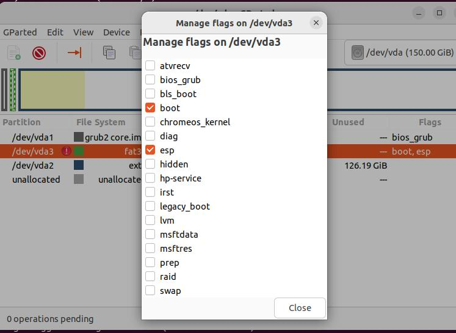

# 20250610
### 1. otii with w5100
change w5100 to vfio mode:     

```
# grubby --update-kernel="/boot/vmlinuz-5.14.284-1_rc2.zdyun.x86_64" --args="vfio-pci.ids=1002:67c7,1002:aaf0"
[root@minirocky92 ~]# cat /etc/modprobe.d/vfio.conf
options vfio-pci ids=1002:67c7,1002:aaf0
[root@minirocky92 ~]# cat /etc/modules-load.d/vfio.conf
vfio-pci
[root@minirocky92 ~]# cat /etc/dracut.conf.d/vfio.conf
add_drivers+=" vfio vfio_iommu_type1 vfio_pci vfio_virqfd  "
# dracut -f --kver `uname -r`
# reboot
```
after reboot:      

```
[root@minirocky92 ~]# lspci -nn | grep 6f:00
6f:00.0 VGA compatible controller [0300]: Advanced Micro Devices, Inc. [AMD/ATI] Ellesmere [Radeon Pro WX 5100] [1002:67c7]
6f:00.1 Audio device [0403]: Advanced Micro Devices, Inc. [AMD/ATI] Ellesmere HDMI Audio [Radeon RX 470/480 / 570/580/590] [1002:aaf0]
[root@minirocky92 ~]# lspci -vvnn -s 6f:00.0 | grep -i 'in use'
	Kernel driver in use: vfio-pci
[root@minirocky92 ~]# lspci -vvnn -s 6f:00.1 | grep -i 'in use'
	Kernel driver in use: vfio-pci
```
Add gpu to vm:    


### 2. jumper configuration
os info:     

```
test@debian:~$ cat /etc/issue
Debian GNU/Linux 12 \n \l
test@debian:~$ uname -a
Linux debian 6.1.0-35-amd64 #1 SMP PREEMPT_DYNAMIC Debian 6.1.137-1 (2025-05-07) x86_64 GNU/Linux
```
Steps:     

```
# vim /etc/apt/sources.list
    # 默认注释了源码仓库，如有需要可自行取消注释
    deb http://mirrors.ustc.edu.cn/debian bookworm main contrib non-free non-free-firmware
    # deb-src http://mirrors.ustc.edu.cn/debian bookworm main contrib non-free non-free-firmware
    deb http://mirrors.ustc.edu.cn/debian bookworm-updates main contrib non-free non-free-firmware
    # deb-src http://mirrors.ustc.edu.cn/debian bookworm-updates main contrib non-free non-free-firmware
    
    # backports 软件源，请按需启用
    # deb http://mirrors.ustc.edu.cn/debian bookworm-backports main contrib non-free non-free-firmware
    # deb-src http://mirrors.ustc.edu.cn/debian bookworm-backports main contrib non-free non-free-firmware
# apt update -y
# apt install -y vim nethogs iotop s-tui xrdp autossh
# apt install -y adb
manually import scrcpy
```
### 3 lab environment
(br0)10.171.172.3: otii server
(br0)10.171.172.31: d3000no1

### 4. mbr to uefi


failed with :    


add an iso:    


try ubuntu:    


In gparted:   





Use bootrepair for uefi installation:      

```
sudo add-apt-repository ppa:yannubuntu/boot-repair && sudo apt update
sudo apt install -y boot-repair
sudo boot-repair
```
Follow the hints for repairing,      

```
sudo chroot "/mnt/boot-sav/vda2" dpkg --configure -a
sudo chroot "/mnt/boot-sav/vda2" apt-get install -fy
sudo chroot "/mnt/boot-sav/vda2" apt-get purge --allow-remove-essential -y grub-com*
sudo chroot "/mnt/boot-sav/vda2" apt-get purge --allow-remove-essential -y grub2-com*
sudo chroot "/mnt/boot-sav/vda2" apt-get purge --allow-remove-essential -y shim-signed
sudo chroot "/mnt/boot-sav/vda2" apt-get purge --allow-remove-essential -y grub-common:*
sudo chroot "/mnt/boot-sav/vda2" apt-get purge --allow-remove-essential -y grub2-common:*
sudo chroot "/mnt/boot-sav/vda2" apt-get install -y grub-efi

```


```
Boot successfully repaired.

Please write on a paper the following URL:
https://paste.ubuntu.com/p/JNvZGtyMP8/


In case you still experience boot problem, indicate this URL to:
boot.repair@gmail.com or to your favorite support forum.

Locked-NVram detected. Please do not forget to make your UEFI firmware boot on the Ubuntu 22.04.5 LTS entry (vda3/efi/ubuntu/grubx64.efi file) !
```
After reboot:   


