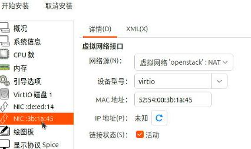

# 20250611
### 1. wx5100 issue
Won't start, should remove the `rom file`:     

```
    <hostdev mode='subsystem' type='pci' managed='yes'>
      <source>
        <address domain='0x0000' bus='0x6f' slot='0x00' function='0x0'/>
      </source>
      <rom file='/usr/share/OVMF/AMD.WX5100.8192.180902.rom'/>
      <address type='pci' domain='0x0000' bus='0x06' slot='0x00' function='0x0'/>
    </hostdev>

```
Switch to hwe kernel:      

```
sudo apt install linux-generic-hwe-22.04
```
update firmware:      

```
git clone https://kernel.googlesource.com/pub/scm/linux/kernel/git/firmware/linux-firmware.git
   sudo cp linux-firmware/amdgpu/* /lib/firmware/amdgpu
dracut --regenerate-all -f
# case ubuntu   sudo update-initramfs -k all -u -v
```
vendor reset:     

```
 grep -E 'CONFIG_FTRACE|CONFIG_KPROBES|CONFIG_PCI_QUIRKS|CONFIG_KALLSYMS|CONFIG_KALLSYMS_ALL|CONFIG_FUNCTION_TRACER' /boot/config-$(uname -r)
git clone https://github.com/gnif/vendor-reset.git
cd vendor-reset
dkms install .
or: 
make 
make install
# cat /etc/modules-load.d/vfio.conf 
vfio-pci
vendor-reset
```
### 2. i9 for android
Del for bios configuration:      


Display:     


Choose USB for boot:     


Choose ubuntu-24.04.2-desktop-amd64.iso for boot:       


layout:    


user/password:     


startup sequence:    


setup ip:    


```
sudo apt install -y vim iotop virt-manager nethogs s-tui
sudo apt install -y linux-headers-6.8.0-41-generic linux-headers-6.8.0-41 linux-image-6.8.0-41-generic linux-modules-6.8.0-41-generic linux-tools-6.8.0-41-generic linux-modules-extra-6.8.0-41-generic 
sudo mv /usr/bin/linux-check-removal /usr/bin/linux-check-removal.orig
echo -e '#!/bin/sh\necho "Overriding default linux-check-removal script!"\nexit 0' | sudo tee /usr/bin/linux-check-removal
sudo chmod +x /usr/bin/linux-check-removal
sudo apt remove -y linux-headers-$(uname -r) linux-image-$(uname -r) linux-modules-$(uname -r) linux-tools-$(uname -r) linux-modules-extra-$(uname -r)
echo "options i915 force_probe=7d55 enable_guc=3" | sudo tee -a /etc/modprobe.d/i915.conf
sudo mkdir -p /lib/firmware/i915
sudo wget https://github.com/intel-gpu/intel-gpu-firmware/raw/main/firmware/mtl_gsc_102.0.0.1511.bin -O /lib/firmware/i915/mtl_gsc_102.0.0.1511.bin
sudo wget https://github.com/intel-gpu/intel-gpu-firmware/raw/main/firmware/mtl_guc_70.6.4.bin -O /lib/firmware/i915/mtl_guc_70.6.4.bin
sudo wget https://github.com/intel-gpu/intel-gpu-firmware/raw/main/firmware/mtl_huc_8.4.3_gsc.bin -O /lib/firmware/i915/mtl_huc_8.4.3_gsc.bin
sudo shutdown -r now &
git clone https://github.com/strongtz/i915-sriov-dkms
sudo apt install build-* dkms -y
cd i915-sriov-dkms && sudo dkms add .
cd i915-sriov-dkms && sudo dkms install -m i915-sriov-dkms -v $(cat VERSION) --force
sudo update-initramfs -u
sudo shutdown -r now &
```
adjust to:      

```
sudo dkms install -m i915-sriov-dkms -v 2025.05.18 --force
vim /etc/default/grub
GRUB_CMDLINE_LINUX_DEFAULT="quiet splash intel_iommu=on i915.enable_guc=3 i915.max_vfs=7 module_blacklist=xe"

sudo update-grub2 && sudo reboot
```


Create vfs:       

```
test@i9workstation:~$ sudo lspci | grep -i vga  | grep -i uhd
00:02.0 VGA compatible controller: Intel Corporation Raptor Lake-S GT1 [UHD Graphics 770] (rev 04)
test@i9workstation:~$ sudo su
root@i9workstation:/home/test# echo 4 > /sys/devices/pci0000:00/0000:00:02.0/sriov_numvfs
root@i9workstation:/home/test# lspci | grep -i vga | grep -i uhd
00:02.0 VGA compatible controller: Intel Corporation Raptor Lake-S GT1 [UHD Graphics 770] (rev 04)
00:02.1 VGA compatible controller: Intel Corporation Raptor Lake-S GT1 [UHD Graphics 770] (rev 04)
00:02.2 VGA compatible controller: Intel Corporation Raptor Lake-S GT1 [UHD Graphics 770] (rev 04)
00:02.3 VGA compatible controller: Intel Corporation Raptor Lake-S GT1 [UHD Graphics 770] (rev 04)
00:02.4 VGA compatible controller: Intel Corporation Raptor Lake-S GT1 [UHD Graphics 770] (rev 04)
```
Create network:     


Import controller:    


uefi:    


specify mac address:    



Import compute:     


specify uefi, mac address, etc.    


add 1 vf:    


Boot to uefi , disable secure boot    


compute vm :     

```
apt install build-* dkms linux-headers-$(uname -r) linux-modules-extra-$(uname -r)
wget -O /tmp/i915-sriov-dkms_2025.05.18_amd64.deb "https://github.com/strongtz/i915-sriov-dkms/releases/download/2025.05.18/i915-sriov-dkms_2025.05.18_amd64.deb"
dpkg -i /tmp/i915-sriov-dkms_2025.05.18_amd64.deb
GRUB_CMDLINE_LINUX_DEFAULT="intel_iommu=on i915.enable_guc=3 module_blacklist=xe"
update-grub
update-initramfs -u
```
After reboot vm:     

```
root@compute:~# uname -a
Linux compute 6.8.0-60-generic #63~22.04.1-Ubuntu SMP PREEMPT_DYNAMIC Tue Apr 22 19:00:15 UTC 2 x86_64 x86_64 x86_64 GNU/Linux
root@compute:~# ls /dev/dri/
by-path  card0  renderD128
root@compute:~# lspci | grep -i vga
06:00.0 VGA compatible controller: Intel Corporation Device a780 (rev 04)
root@compute:~# lspci -vvnn -s 06:00.0 | grep -i 'in use'
	Kernel driver in use: i915
```

host machine, install:    

```
sudo apt install -y adb scrcpy net-tools bridge-utils
```
bridge:     

```
 nmcli con show
 nmcli connection add type bridge ifname br0 stp no
 nmcli con add type bridge-slave ifname enp11s0 master br0
 nmcli con up  bridge-slave-enp11s0
```

### 3. vfVM to virglVM
Create virgl based vm qcow2:    

```
qemu-img create -f qcow2 -b openstack2.qcow2.bak openstack2.qcow2
qemu-img create -f qcow2 -b openstack2.qcow2.bak -F qcow2 openstack2.qcow2
qemu-img create -f qcow2 -b openstack2.qcow2.bak -F qcow2 openstackvirgl.qcow2
```
virgl:   


nvidiavirgl:     


virgl:    


2 nics:     


change ip to `10.171.172.26`, hostname to `nvidiavirgl`.      

```
# cat /etc/hosts
127.0.0.1	localhost
127.0.1.1	nvidiavirgl
...
10.171.172.21 controller
10.171.172.22 compute
```
Change openstack related items:      

```
root@nvidiavirgl:/etc# diff nova/nova.conf ./nova/nova.conf.bak
6c6
< my_ip = 10.171.172.26
---
> my_ip = 192.168.200.50
106c106
< novncproxy_base_url = http://10.171.172.21:6080/vnc_auto.html
---
> novncproxy_base_url = http://192.168.200.40:6080/vnc_auto.html
root@nvidiavirgl:/etc# diff ./neutron/plugins/ml2/openvswitch_agent.ini.bak ./neutron/plugins/ml2/openvswitch_agent.ini
10c10
< local_ip = 192.168.200.50
---
> local_ip = 10.171.172.26
```
### 4. virgl vm(user mode)
Steps:     

```
chmod u+s /usr/libexec/qemu-bridge-helper
mkdir -p /etc/qemu
echo "allow br0" > /etc/qemu/bridge.conf
```
refers to `https://bbs.archlinux.org/viewtopic.php?id=299452`
