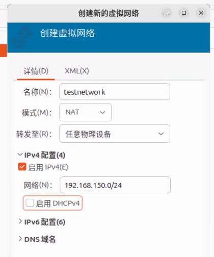
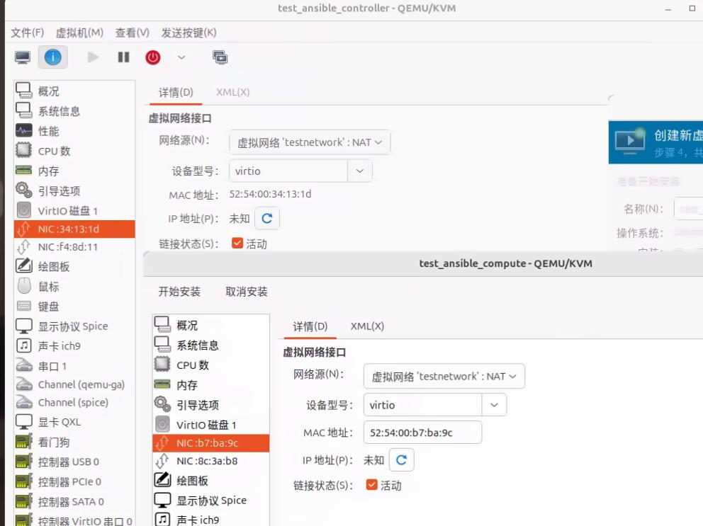
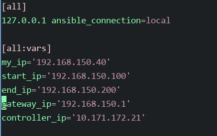

# 20250613
### 1. ansible for openstack deployment
Test network environment:    



```
qemu-img create -f qcow2 -b ubuntu220405openstackcompute_autodeploy1.qcow2 -F qcow2 testansible_controller.qcow2
qemu-img create -f qcow2 -b ubuntu220405openstackcompute_autodeploy1.qcow2 -F qcow2 testansible_compute.qcow2
```
Create vms:    



Manually setup ip addr on controller(192.168.150.40), then transfer deploy materials to controller.      

```
test@compute:~$ tar xzvf openstack_deployment.tar.gz 
root@compute:/etc/netplan# cat /etc/netplan/eth0.yaml 
network:
  version: 2
  ethernets:
    eth0:
#      dhcp4: true
      dhcp4: false
      addresses: [192.168.150.40/24]
      gateway4: 192.168.150.1
    eth1:
      dhcp4: false
root@compute:/etc/netplan# netplan apply --debug
### Change  `192.168.200`->`192.168.150` in Controller_0.sh
./Controller_0.sh
### Relogin
test@controller:~$ sudo vim /etc/hosts
127.0.1.1 controller
```
Change inventory definitions:     



should add mykey:      

```
 ssh-keygen -N ""
 openstack keypair create --public-key ~/.ssh/id_rsa.pub mykey

openstack image create "redroid12" --file redroid12.img --disk-format raw --container-format bare --public
```

Compute node:   

```
GRUB_CMDLINE_LINUX_DEFAULT="net.ifnames=0 biosdevname=0 i915.force_probe=* i915.enable_guc=7 module_blacklist=xe"
# uname -a
Linux compute 5.15.113-lts2021-iotg #1 SMP Fri May 30 16:09:38 CST 2025 x86_64 x86_64 x86_64 GNU/Linux
```

network, create security group:      

```
openstack security group rule create --protocol tcp --dst-port 20:65535 --remote-ip 0.0.0.0/0 --ingress default
openstack security group rule create --protocol tcp --dst-port 20:65535 --remote-ip 0.0.0.0/0 --egress default
openstack security group rule create --protocol udp --dst-port 20:65535 --remote-ip 0.0.0.0/0 --egress default
openstack security group rule create --protocol udp --dst-port 20:65535 --remote-ip 0.0.0.0/0 --ingress default
openstack security group rule create --protocol icmp --dst-port 20:65535 --remote-ip 0.0.0.0/0 --ingress default
openstack security group rule create --protocol icmp --dst-port 20:65535 --remote-ip 0.0.0.0/0 --egress default
```
