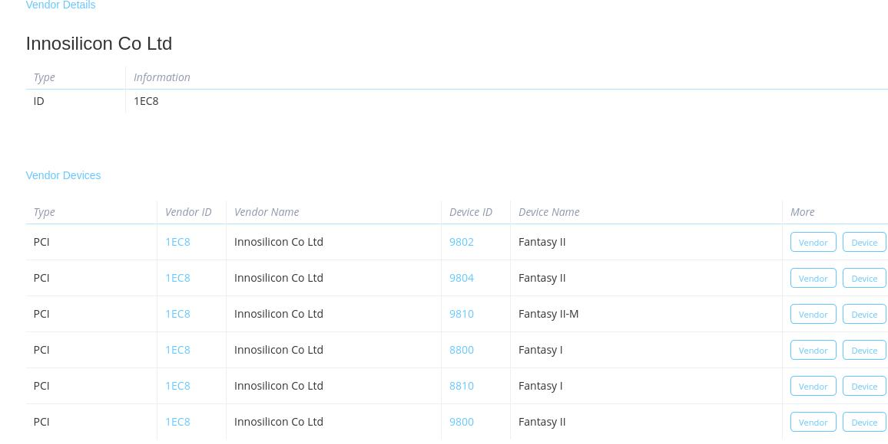

# 20250616
### 1. fantancy gpu
Install ubuntu20.04.3 arm64 iso.    

fantancy-II, no arm64 gpu driver.    

should use fantancy -I 

### 2. zkfd(fantancyII)
Changed to zkfd, the /dev/dri works well, but could not install binder/binderfs.    

### 3. bbb debian
Write sd card:       

```
$ sudo dd if=./am335x-debian-12.11-base-vscode-v6.12-armhf-2025-05-29-4gb.img of=/dev/sda bs=10M && sudo sync

```
### 4. uos(fantancyII)
kernel info:      

```
root@test-PC:~# dmesg | grep PVR
[    2.922011] PVR_K:  263: Read BVNC 35.4.1632.23 from HW device registers
[    2.922128] PVR_K:  263: RGX Device registered BVNC 35.4.1632.23 with 1 core in the system
[    5.276161] PVR_K:  954: AXI fabric coherency (RGX_CR_SOC_AXI): 0xc
[    5.279720] PVR_K:  954: RGX Firmware image 'innogpu/fh2m.fw' loaded
[    5.287702] PVR_K:  954: Shader binary image 'innogpu/fh2m.sh' loaded
root@test-PC:~# ls /dev/dri/
by-path  card0	renderD128
root@test-PC:~# find /dev | grep -i pvr
```

### 5. modinfo result
fantancy II:     

```
root@test-PC:~# modinfo /lib/modules/5.10.0-arm64-desktop/kernel/drivers/gpu/drm/innogpu//innogpu.ko  | grep -i 1ec8
alias:          pci:v00001EC8d00009810sv*sd*bc*sc*i*
alias:          pci:v00001EC8d00001EB8sv*sd*bc*sc*i*
alias:          pci:v00001EC8d00001EA8sv*sd*bc*sc*i*
root@test-PC:~# lspci -nn | grep -i vga
07:00.0 VGA compatible controller [0300]: Innosilicon Co Ltd Fantasy II-M [1ec8:9810] (rev 01)
```
While the dkms tree built:      

```
root@test-PC:~# modinfo innogpu | grep -i 1ec8
alias:          pci:v00001EC8d00008811sv*sd*bc*sc*i*
alias:          pci:v00001EC8d00008810sv*sd*bc*sc*i*
alias:          pci:v00001EC8d00001EB8sv*sd*bc*sc*i*
alias:          pci:v00001EC8d00001EA8sv*sd*bc*sc*i*
```



