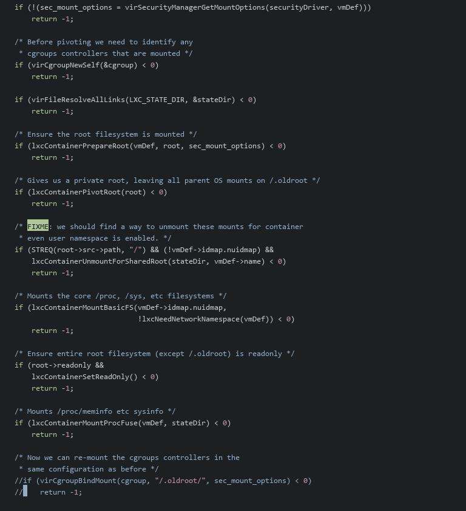
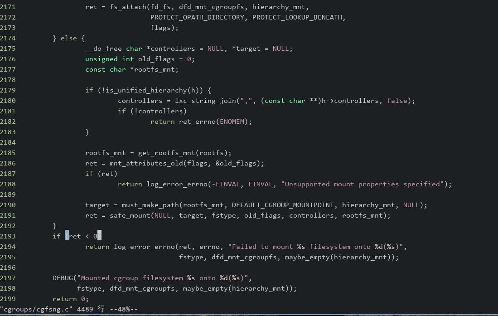

# 20250625
### 1. main difference on fs
Comparison on mount:     

```
lxc(redroid11): 
devpts on /dev/console type devpts (rw,nosuid,noexec,relatime,gid=5,mode=620,ptmxmode=000)
none on /dev type tmpfs (rw,relatime,size=24416k,mode=755,inode64)

libvirt_lxc(redroid11): 
devpts on /dev/pts type devpts (rw,nosuid,relatime,gid=5,mode=620,ptmxmode=666)
devfs on /dev type tmpfs (rw,nosuid,relatime,size=24416k,mode=755,inode64)

libvirt_lxc(redroid12): 
devpts on /dev/pts type devpts (rw,nosuid,relatime,gid=5,mode=620,ptmxmode=666)
devfs on /dev type tmpfs (rw,nosuid,relatime,size=24416k,mode=755,inode64)
```
Related code:       

```
int
virFileSetupDev(const char *path,
                const char *mount_options)
{
    const unsigned long mount_flags = MS_NOSUID;
    //const char *mount_fs = "tmpfs";
    const char *mount_fs = "none";

    if (g_mkdir_with_parents(path, 0777) < 0) {
        virReportSystemError(errno,
                             _("Failed to make path %s"), path);
        return -1;
    }

    VIR_DEBUG("Mount devfs on %s type=tmpfs flags=0x%lx, opts=%s",
              path, mount_flags, mount_options);
    if (mount("devfs", path, mount_fs, mount_flags, mount_options) < 0) {
        virReportSystemError(errno,
                             _("Failed to mount devfs on %s type %s (%s)"),
                             path, mount_fs, mount_options);
        return -1;
    }
```

lxc implementation:       

```

ret = safe_mount("none", "dev", "tmpfs", 0, mount_options, NULL);
int safe_mount(const char *src, const char *dest, const char *fstype,
		unsigned long flags, const void *data, const char *rootfs)

```

### 2. enable libvirtd log
Edit:     

```
# vim /etc/libvirt/libvirtd.conf
log_level = 1
log_outputs="1:file:/var/log/libvirt/libvirtd.log"

```

### 3. Possible modification
libvirt ways:    



lxc ways:   



### 4. rebuild lxc
Steps:     

```
mkdir -p Code/lxc
apt-get source
apt-get install -y build-essential pbuilder
apt build-dep lxc-utils
apt-get source lxc-utils
 dpkg-source --no-check -x lxc_5.0.0~git2209-g5a7b9ce67-0ubuntu1.1.dsc 
cd /root/Code/lxc/lxc-5.0.0~git2209-g5a7b9ce67
debuild -us -uc
```

